# CORE-EVENTY — Katalog eventów domenowych (silniki G1–G13)

```mermaid
flowchart LR
    subgraph REZ["Domena: rezerwacje"]
        PUB_A5["A5: pacjent ukończył checkout - powstała rezerwacja"]
        PUB_B3["B3: pacjent odwołuje wizytę linkiem z wiadomości"]
        PUB_E56["E5/E6: specjalista odwołuje wizytę (pojedynczo lub hurtowo, np. urlop)"]
        PUB_E7["E7: specjalista zgłasza nieobecność pacjenta (no-show)"]
        EV_CREATED(["booking.created"])
        EV_CANC(["booking.cancelled"])
        EV_LATE(["booking.cancelled_late"])
        EV_NOSHOW(["visit.no_show"])
        EV_SLOT(["slot.released — robocza"])
        ENG_G1["G1: silnik powiadomień - wysyłka SMS/e-mail (retry, dedup, opt-out)"]
        ENG_G2["G2: przypomnienie o wizycie 24 h przed terminem"]
        ENG_G6["G6: silnik waitlisty - kaskada propozycji zwolnionego terminu"]
        ENG_G7["G7: silnik scoringu - zlicza no-show i późne odwołania"]
        ENG_G8["G8: wykrywanie nadużyć (multikonta, podejrzane serie rezerwacji)"]
        ENG_G10["G10: dwustronna synchronizacja z kalendarzem Google"]
        EFF_MSG["skutek: SMS/e-mail do pacjenta i specjalisty"]
        EFF_GATE["skutek: dodatkowa bariera (gate) w checkoucie (A5)"]
        EFF_E4["skutek: wskaźnik no-show pacjenta w panelu specjalisty (E4)"]
        EFF_F4["skutek: podejrzane konta trafiają do przeglądu admina (F4)"]
    end

    subgraph OPI["Domena: wizyty i opinie"]
        PUB_E8["E8: specjalista ręcznie potwierdza, że wizyta się odbyła"]
        PUB_B6["B6: pacjent otwiera spór o oznaczoną nieobecność ('byłem')"]
        PUB_F2["F2: admin moderuje i zatwierdza opinię pacjenta"]
        ENG_G4["G4: automat uznaje wizytę za odbytą 48 h po terminie"]
        EV_APPR(["visit.approved — robocza"])
        EV_DISP(["dispute.opened — robocza"])
        EV_REVOK(["review.approved"])
        ENG_G3["G3: prośba o opinię 2 h po odbytej wizycie"]
        EFF_OPUB["skutek: opinia pojawia się publicznie na profilu specjalisty (A4)"]
        EFF_F3["skutek: zgłoszenie sporu trafia do rozstrzygnięcia przez admina (F3)"]
    end

    subgraph PAYD["Domena: płatności (Flaga 2)"]
        PUB_PAY["procesor płatności - zewnętrzny operator wysyłający webhooki"]
        PUB_A6T["A6: job anuluje rezerwację po ok. 30 min bez wpłaty"]
        EV_PAYOK(["payment.succeeded — robocza"])
        EV_PAYRF(["payment.refunded — robocza"])
        ENG_G9["G9: obsługa webhooków płatności (potwierdzenia wpłat, zwroty)"]
        EFF_RECON["skutek: reconciliation - uzgadnianie wpłat z rezerwacjami"]
    end

    subgraph ROPS["Domena: RODO / SEO"]
        PUB_B9["B9: pacjent wnioskuje o usunięcie konta lub eksport danych"]
        PUB_F5["F5: admin obsługuje wniosek RODO użytkownika"]
        PUB_A5Z["A5: pacjent zaznacza zgody RODO w checkoucie"]
        PUB_D3["D3: profil specjalisty startuje publicznie (go-live)"]
        EV_ERAS(["rodo.erasure_requested — robocza"])
        EV_CONS(["consent.recorded — robocza"])
        EV_PROF(["profile.published — robocza"])
        ENG_G11["G11: joby RODO (usuwanie danych, rejestr zgód, retencja logów)"]
        ENG_G12["G12: joby SEO (dane dla wyszukiwarek)"]
        EFF_SMAP["skutek: odświeżenie sitemapy i danych schema.org dla Google"]
        EFF_AUD["skutek: zapis operacji na danych w audit logu (F10)"]
    end

    PUB_A5 --> EV_CREATED
    ENG_G6 -->|"automatyczna rezerwacja z waitlisty (auto-book, B4)"| EV_CREATED
    ENG_G9 -->|"wpłata potwierdza rezerwację: pending_payment -> confirmed"| EV_CREATED
    EV_CREATED --> ENG_G1
    EV_CREATED -->|"planuje przypomnienie na 24 h przed wizytą"| ENG_G2
    EV_CREATED -->|"ustawia timer 48 h po terminie wizyty"| ENG_G4
    EV_CREATED -->|"analiza wzorców i limitów rezerwacji"| ENG_G8
    EV_CREATED --> ENG_G10

    PUB_B3 -->|"odwołanie w dozwolonym czasie"| EV_CANC
    PUB_B3 -->|"odwołanie za późno (po dozwolonym czasie)"| EV_LATE
    PUB_E56 --> EV_CANC
    PUB_A6T --> EV_CANC
    EV_CANC --> ENG_G1
    EV_CANC --> ENG_G10
    EV_CANC --> EV_SLOT
    EV_LATE --> ENG_G7
    EV_LATE --> ENG_G1
    EV_LATE --> EV_SLOT
    EV_SLOT --> ENG_G6
    ENG_G6 -->|"powiadomienie oczekującego, okno 2 h na potwierdzenie"| ENG_G1

    PUB_E7 --> EV_NOSHOW
    EV_NOSHOW --> ENG_G7
    EV_NOSHOW -->|"blokuje automatyczne uznanie wizyty (Flaga 3)"| ENG_G4
    EV_NOSHOW -->|"komunikat o sankcji dla pacjenta"| ENG_G1

    ENG_G1 --> EFF_MSG
    ENG_G2 -->|"wysyłka przypomnienia 24 h przed wizytą"| ENG_G1
    ENG_G7 --> EFF_GATE
    ENG_G7 --> EFF_E4
    ENG_G8 --> EFF_F4

    PUB_E8 --> EV_APPR
    ENG_G4 -->|"po 48 h, jeśli nic nie blokuje (Flaga 3)"| EV_APPR
    EV_APPR --> ENG_G3
    ENG_G3 -->|"wysyłka prośby o opinię z tokenem (B5)"| ENG_G1
    PUB_B6 --> EV_DISP
    EV_DISP -->|"otwarty spór blokuje automatyczne uznanie (Flaga 3)"| ENG_G4
    EV_DISP --> EFF_F3
    PUB_F2 --> EV_REVOK
    EV_REVOK --> EFF_OPUB
    EV_REVOK -->|"powiadomienie specjalisty o nowej opinii"| ENG_G1

    PUB_PAY --> EV_PAYOK
    PUB_PAY --> EV_PAYRF
    EV_PAYOK --> ENG_G9
    EV_PAYRF --> ENG_G9
    ENG_G9 --> EFF_RECON
    ENG_G9 -->|"powiadomienia o wpłacie lub zwrocie"| ENG_G1

    PUB_B9 --> EV_ERAS
    PUB_F5 --> EV_ERAS
    EV_ERAS --> ENG_G11
    PUB_A5Z --> EV_CONS
    EV_CONS -->|"zapis do rejestru zgód"| ENG_G11
    ENG_G11 --> EFF_AUD
    PUB_D3 --> EV_PROF
    EV_PROF --> ENG_G12
    ENG_G12 --> EFF_SMAP

    classDef fe fill:#e8f4fd
    classDef be fill:#fdf2e8
    class PUB_A5,PUB_B3,PUB_E56,PUB_E7,PUB_E8,PUB_B6,PUB_F2,PUB_B9,PUB_F5,PUB_A5Z,PUB_D3 fe
    class EV_CREATED,EV_CANC,EV_LATE,EV_NOSHOW,EV_SLOT,EV_APPR,EV_DISP,EV_REVOK,EV_PAYOK,EV_PAYRF,EV_ERAS,EV_CONS,EV_PROF be
    class ENG_G1,ENG_G2,ENG_G3,ENG_G4,ENG_G6,ENG_G7,ENG_G8,ENG_G9,ENG_G10,ENG_G11,ENG_G12 be
    class EFF_MSG,EFF_GATE,EFF_E4,EFF_F4,EFF_OPUB,EFF_F3,EFF_RECON,EFF_SMAP,EFF_AUD,PUB_PAY,PUB_A6T be
```

## Notatki

**Konwencja diagramu (wyjątek od CLAUDE.md):** grupa G nie ma FE, więc WYJĄTKOWO brak subgraphów FE/BE — subgraphy grupują per domena (rezerwacje / wizyty i opinie / płatności / RODO-SEO). ClassDef `fe` (niebieski) oznacza flowy publikujące z udziałem człowieka (pacjent/specjalista/admin), `be` (pomarańczowy) — eventy, silniki i skutki backendowe. Eventy = kształt stadionu.

**Nazwy eventów:** kanoniczne z mapy/CLAUDE.md: `booking.created`, `booking.cancelled`, `booking.cancelled_late`, `visit.no_show`, `review.approved`. Pozostałe (`slot.released`, `visit.approved`, `dispute.opened`, `payment.succeeded`, `payment.refunded`, `rodo.erasure_requested`, `consent.recorded`, `profile.published`) — **nazwy robocze**, mapa nie definiuje pełnego katalogu; zgłoszone w rozbieżnościach.

**Charakterystyki silników bez własnego mini-diagramu:**
- **G1 Notification engine (P0):** kolejka email/SMS, szablony PL, retry, dedup, opt-out (preferencje B10); quiet hours — z promptu S4, poza mapą (założenie). Zasilany przez: A7/booking.created, odwołania, G2, G3, G6, G7 (komunikaty o sankcji), G9.
- **G2 Reminder T−24 h (P0):** scheduler przypomnień planowany na booking.created, wysyłka przez G1; działa tylko dla `confirmed` — odwołanie/zmiana terminu anuluje/przeplanowuje przypomnienie (założenie minimalne).
- **G3 Review ask T+2 h (P0):** timer po approvalu wizyty (`visit.approved` z E8/G4) → przez G1 SMS/email z single-use tokenem opinii (B5).
- **G8 Fraud detection (P1):** wzorce multikont, limity per numer/IP/device; konsumuje booking.created (serie rezerwacji); flagi → kolejka F4; P0 min. = ręczna blokada w F4.
- **G9 Payment webhooks (wg Flagi 2):** potwierdzenia (`pending_payment → confirmed`), zwroty, reconciliation; pełny flow płatności: [[a5-checkout-wariant-przedplata]].
- **G10 Calendar sync 2-way (P1/P2):** Google API po progu aktywnych specjalistów; konsumuje booking.created/cancelled.
- **G11 RODO joby (P0):** retencja logów IP/UA (job cykliczny, bez eventu), erasure job (B9, F5), rejestr zgód (A5, B9); dostęp do danych logowany w audit F10.
- **G12 SEO joby (P0):** sitemap + schema.org refresh; trigger: D3 go-live; refresh także cykliczny/przy zmianach profilu — założenie minimalne.
- **G13 Ops (P0):** backupy, monitoring, alerting — infrastrukturalny, nie event-driven; poza diagramem (metryki/alerty per silnik — prompt S4).
- **G5 Slot lock (P0):** timerowy (TTL 10 min), nie publikuje eventów domenowych (założenie) — szczegóły [[g5-slot-lock]].

**Flaga 2 (OTWARTA, decyzja z 2026-07-15 — dokumentujemy oba warianty):** domena płatności (G9, A6, `pending_payment`) aktywna tylko w wariancie z płatnościami online; bez nich sankcją scoringu G7 pozostaje wyłącznie akceptacja specjalisty ([[a5-checkout-wariant-akceptacja]]).

**Flaga 3:** `visit.no_show` i `dispute.opened` blokują G4 (auto-approval) — szczegóły [[g4-auto-approval]].

**Powiązania:** [[00-stany-rezerwacji]] (CORE-STANY — eventy przy przejściach stanów), [[g4-auto-approval]], [[g5-slot-lock]], [[g6-waitlist-engine]], [[g7-scoring-engine]], A5, A6, A7, B3, B4, B5, B6, B9, D3, E5, E6, E7, E8, F2, F3, F4, F5, F10.

## Co opisuje ten diagram

To zbiorcza mapa "układu nerwowego" systemu: pokazuje, jakie zdarzenia (eventy) powstają w wyniku działań pacjentów, specjalistów i adminów oraz które automatyczne silniki na nie reagują — wysyłką powiadomień, naliczaniem sankcji, obsługą płatności, jobami RODO czy odświeżaniem danych dla wyszukiwarek. Diagram nie ma jednego początku ani końca — działa jak katalog: każde zdarzenie (np. utworzenie lub odwołanie rezerwacji) uruchamia własną kaskadę automatycznych skutków. Dokumentuje też silniki G1–G3 i G8–G13, które nie mają osobnych diagramów.

## Aktorzy w tym flow

| Rola | Kto to jest | Co robi w tym flow |
|---|---|---|
| **System** (Backend + silniki G1–G13) | serwer platformy i jego automaty — główny "aktor" katalogu: eventy konsumują wyłącznie automaty, a ludzie jedynie wyzwalają zdarzenia swoimi działaniami | publikuje i konsumuje eventy: wysyła powiadomienia, nalicza scoring, prowadzi waitlistę, obsługuje płatności, joby RODO i SEO |
| **Joby/Kolejka** | zadania działające w tle serwera: timery, harmonogramy, zadania cykliczne | odmierzają czasy: 24 h przed wizytą (przypomnienie), 2 h po wizycie (prośba o opinię), 48 h po terminie (automatyczne uznanie wizyty), ok. 30 min (timeout płatności) |
| **Pacjent** | użytkownik strony; u logopedów najczęściej rodzic rezerwujący wizytę dla dziecka | wyzwala eventy: kończy checkout, odwołuje wizytę, otwiera spór o no-show, składa wnioski RODO, zaznacza zgody |
| **Specjalista** | logopeda/lekarz przyjmujący wizyty, właściciel kalendarza | wyzwala eventy: odwołuje wizyty, zgłasza nieobecność pacjenta, potwierdza odbycie wizyty; jego profil przechodzi go-live |
| **Admin** | operator platformy (back office) | wyzwala eventy: moderuje opinie, obsługuje wnioski RODO; odbiera skutki: spory i flagi nadużyć do rozstrzygnięcia |
| **SMS/Email** | bramka powiadomień — system wysyłający wiadomości w imieniu platformy | jest końcowym skutkiem wielu eventów: dostarcza wiadomości pacjentom i specjalistom |
| **Procesor płatności** | zewnętrzna firma obsługująca płatności online (domena aktywna wg Flagi 2) | publikuje webhooki — automatyczne sygnały o udanej wpłacie lub wykonanym zwrocie |

## Objaśnienie bloków

Jak czytać diagram: **publisherzy** (prostokąty, z lewej strony strzałek) to flowy i systemy, które ogłaszają zdarzenie; **eventy** (owalne "stadiony") to same zdarzenia — techniczne komunikaty "coś się stało"; **silniki** (G1–G12) to automaty-konsumenci, które na eventy reagują; **skutki** to widoczne efekty ich pracy.

| Blok | Co to znaczy w praktyce | Kto tu działa |
|---|---|---|
| A5: pacjent ukończył checkout | Publisher: pacjent przeszedł cały formularz rezerwacji do końca — powstała nowa rezerwacja, o czym system ogłasza eventem `booking.created`. | Pacjent |
| B3: pacjent odwołuje wizytę | Publisher: pacjent klika link "odwołaj" z wiadomości. Zależnie od tego, czy zrobił to w dozwolonym czasie, powstaje `booking.cancelled` (bez kary) albo `booking.cancelled_late` (z karą w scoringu). | Pacjent |
| E5/E6: specjalista odwołuje wizytę | Publisher: specjalista odwołuje pojedynczą wizytę (E5) albo hurtowo wiele naraz, np. z powodu urlopu lub choroby (E6). | Specjalista |
| E7: specjalista zgłasza no-show | Publisher: specjalista oznacza w panelu, że pacjent nie pojawił się na wizycie bez odwołania. | Specjalista |
| E8: ręczne potwierdzenie wizyty | Publisher: specjalista potwierdza w panelu, że wizyta się odbyła. | Specjalista |
| B6: pacjent otwiera spór | Publisher: pacjent kwestionuje oznaczoną nieobecność ("byłem na wizycie"). | Pacjent |
| F2: admin moderuje opinię | Publisher: admin sprawdza treść opinii pacjenta i zatwierdza ją do publikacji. | Admin |
| procesor płatności | Publisher zewnętrzny: firma obsługująca płatności wysyła webhooki — automatyczne sygnały o wpłacie lub zwrocie. | Procesor płatności |
| A6: job anuluje po ok. 30 min | Publisher automatyczny: zadanie w tle anuluje rezerwację, za którą pacjent nie zapłacił w oknie ok. 30 minut. | Joby/Kolejka |
| B9: usunięcie konta / eksport | Publisher: pacjent samodzielnie wnioskuje o usunięcie konta lub eksport swoich danych (samoobsługa RODO). | Pacjent |
| F5: admin obsługuje wniosek RODO | Publisher: admin rejestruje wniosek RODO złożony innym kanałem (np. e-mailem). | Admin |
| A5: zgody RODO w checkoucie | Publisher: pacjent zaznacza zgody podczas rezerwacji — każda udzielona zgoda musi zostać trwale odnotowana. | Pacjent |
| D3: go-live profilu | Publisher: profil specjalisty przeszedł weryfikację i staje się publicznie widoczny. | Specjalista, System |
| `booking.created` | Event "powstała nowa rezerwacja" — najważniejszy w katalogu: uruchamia potwierdzenia, planuje przypomnienie, ustawia timer automatycznego uznania wizyty, zasila analizę nadużyć i synchronizację kalendarza. | System |
| `booking.cancelled` | Event "rezerwacja odwołana w dozwolonym czasie" — bez kary; uruchamia powiadomienia, aktualizuje kalendarz i zwalnia termin. | System |
| `booking.cancelled_late` | Event "rezerwacja odwołana za późno" — jak wyżej, ale dodatkowo zasila scoring (przewinienie pacjenta). | System |
| `visit.no_show` | Event "pacjent nie stawił się na wizycie" — zasila scoring, blokuje automatyczne uznanie wizyty (Flaga 3) i wysyła pacjentowi komunikat o sankcji. | System |
| `slot.released` (robocza) | Event "zwolnił się termin" — sygnał startowy dla silnika waitlisty; nazwa robocza (mapa projektu jej nie definiuje). | System |
| `visit.approved` (robocza) | Event "wizyta uznana za odbytą" — ręcznie przez specjalistę (E8) albo automatem po 48 h (G4); startuje prośbę o opinię. | System |
| `dispute.opened` (robocza) | Event "pacjent otworzył spór o no-show" — tworzy zgłoszenie dla admina i blokuje automatyczne uznanie wizyty. | System |
| `review.approved` | Event "opinia zatwierdzona przez moderację" — można ją opublikować na profilu i powiadomić specjalistę. | System |
| `payment.succeeded` (robocza) | Event "wpłata doszła" — webhook od procesora płatności; potwierdza czekającą rezerwację. | Procesor płatności |
| `payment.refunded` (robocza) | Event "zwrot wykonany" — webhook od procesora płatności o zwróconych pieniądzach. | Procesor płatności |
| `rodo.erasure_requested` (robocza) | Event "ktoś zażądał usunięcia danych" — uruchamia joby usuwania danych osobowych. | System |
| `consent.recorded` (robocza) | Event "zgoda została udzielona" — do trwałego zapisania w rejestrze zgód. | System |
| `profile.published` (robocza) | Event "profil specjalisty wystartował publicznie" — sygnał dla jobów SEO. | System |
| G1: silnik powiadomień | Konsument-rozdzielnia: wspólna "skrzynka nadawcza" platformy. Kolejkuje i wysyła SMS-y/e-maile, ponawia nieudane wysyłki (**retry**), pilnuje, by nie wysłać dwa razy tego samego (**dedup** — możliwy dzięki idempotencji), respektuje rezygnacje z powiadomień (opt-out). | System |
| G2: przypomnienie 24 h przed | Konsument: na 24 godziny przed wizytą wysyła (przez G1) przypomnienie — tylko dla wizyt wciąż umówionych (`confirmed`). | Joby/Kolejka |
| G3: prośba o opinię 2 h po | Konsument: 2 godziny po uznaniu wizyty za odbytą wysyła pacjentowi link do wystawienia opinii (B5). | Joby/Kolejka |
| G4: automat uznaje wizytę po 48 h | Konsument: jeśli 48 h po terminie wizyty nikt nie zgłosił problemu, automat uznaje ją za odbytą; blokują go zgłoszony no-show i otwarty spór (Flaga 3). | Joby/Kolejka |
| G6: silnik waitlisty | Konsument eventu `slot.released`: proponuje zwolniony termin kolejnym osobom z listy oczekujących (**kaskada** w porządku **FIFO** — kto pierwszy się zapisał, ten pierwszy dostaje propozycję), każdej dając **okno 2 h** na potwierdzenie. | System |
| G7: silnik scoringu | Konsument: zlicza przewinienia pacjenta (no-show, późne odwołania) i po przekroczeniu progów nakłada **sankcje progresywne** — od ostrzeżenia, przez gate w checkoucie, po blokadę konta. | System |
| G8: wykrywanie nadużyć | Konsument: analizuje wzorce rezerwacji (multikonta, serie, limity per numer telefonu/IP/urządzenie) i flaguje podejrzane przypadki do ręcznego przeglądu. | System |
| G9: obsługa webhooków płatności | Konsument webhooków: udana wpłata potwierdza rezerwację (`pending_payment` → `confirmed`), zwrot jest księgowany; prowadzi też reconciliation. | System |
| G10: synchronizacja kalendarza | Konsument: dwustronna wymiana z kalendarzem Google specjalisty — nowe i odwołane wizyty trafiają do jego prywatnego kalendarza i odwrotnie. | System |
| G11: joby RODO | Konsument: realizuje żądania usunięcia danych, prowadzi rejestr zgód i pilnuje retencji (ograniczonego czasu przechowywania) logów. | Joby/Kolejka |
| G12: joby SEO | Konsument: po publikacji profilu odświeża dane dla wyszukiwarek, żeby Google szybciej zaindeksował stronę specjalisty. | Joby/Kolejka |
| skutek: SMS/e-mail do stron | Końcowy efekt większości eventów: wiadomości dostarczone pacjentowi i specjaliście. | SMS/Email |
| skutek: gate w checkoucie (A5) | Dodatkowa bariera przy rezerwacji (przedpłata albo akceptacja specjalisty) nakładana przez scoring na pacjentów z przewinieniami. | System, Pacjent |
| skutek: wskaźnik no-show (E4) | Specjalista widzi przy rezerwacji historię nieobecności danego pacjenta. | Specjalista |
| skutek: flagi do przeglądu (F4) | Podejrzane konta i zachowania czekają w kolejce na ręczną decyzję admina. | Admin |
| skutek: publikacja opinii (A4) | Zatwierdzona opinia pojawia się publicznie na profilu specjalisty. | System |
| skutek: ticket sporu (F3) | Spór pacjenta trafia jako zgłoszenie do rozstrzygnięcia przez admina. | Admin |
| skutek: reconciliation | Uzgadnianie płatności: porównanie wpłat zaksięgowanych u procesora z rezerwacjami w systemie, żeby nic nie zginęło. | System |
| skutek: sitemap + schema.org | Odświeżone dane dla wyszukiwarek — lepsza widoczność profili specjalistów w Google. | System |
| skutek: audit log (F10) | Trwały zapis operacji na danych osobowych, prowadzony do celów kontroli i zgodności z RODO. | System |

## Powiązane diagramy

| ID | Diagram | Jak się łączy |
|---|---|---|
| CORE-STANY | [00-stany-rezerwacji.md](00-stany-rezerwacji.md) | eventy z katalogu odpowiadają przejściom między stanami rezerwacji |
| A5 | [a5-checkout.md](../a-pacjent-public/a5-checkout.md) | ukończony checkout publikuje booking.created; zgody RODO zapisuje consent.recorded |
| A6 | [a5-checkout-wariant-przedplata.md](../a-pacjent-public/a5-checkout-wariant-przedplata.md) | timeout płatności publikuje booking.cancelled; pełny flow płatności i webhooków |
| A5 (wariant akceptacji) | [a5-checkout-wariant-akceptacja.md](../a-pacjent-public/a5-checkout-wariant-akceptacja.md) | fallback sankcji scoringu, gdy płatności online są wyłączone (Flaga 2) |
| A7 | [a7-potwierdzenie.md](../a-pacjent-public/a7-potwierdzenie.md) | booking.created zasila wysyłkę potwierdzenia przez G1 |
| A4 | [a4-profil-specjalisty.md](../a-pacjent-public/a4-profil-specjalisty.md) | zatwierdzona opinia (review.approved) jest publikowana na profilu |
| B3 | [b3-odwolanie-tokenem.md](../b-pacjent-konto/b3-odwolanie-tokenem.md) | odwołanie pacjenta publikuje booking.cancelled lub booking.cancelled_late |
| B4 | [b4-waitlista.md](../b-pacjent-konto/b4-waitlista.md) | auto-book z waitlisty (G6) tworzy nowy booking.created |
| B5 | [b5-wystawienie-opinii.md](../b-pacjent-konto/b5-wystawienie-opinii.md) | G3 wysyła prośbę o opinię z jednorazowym tokenem |
| B6 | [b6-spor-no-show.md](../b-pacjent-konto/b6-spor-no-show.md) | otwarcie sporu publikuje dispute.opened i blokuje G4 |
| B9 | [b9-rodo-self-service.md](../b-pacjent-konto/b9-rodo-self-service.md) | wniosek o usunięcie konta/eksport publikuje rodo.erasure_requested |
| B10 | [b10-preferencje-powiadomien.md](../b-pacjent-konto/b10-preferencje-powiadomien.md) | opt-out z preferencji respektowany przez notification engine (G1) |
| D3 | [d3-go-live.md](../cd-specjalista-onboarding/d3-go-live.md) | go-live profilu publikuje profile.published dla SEO jobów (G12) |
| E4 | [e4-rezerwacje.md](../e-panel/e4-rezerwacje.md) | scoring (G7) zasila wskaźnik no-show pacjenta widoczny przy rezerwacjach |
| E5 | [e5-odwolanie-pojedyncze.md](../e-panel/e5-odwolanie-pojedyncze.md) | odwołanie specjalisty publikuje booking.cancelled |
| E6 | [e6-tryb-urlop.md](../e-panel/e6-tryb-urlop.md) | hurtowe odwołania (urlop) publikują booking.cancelled |
| E7 | [e7-no-show.md](../e-panel/e7-no-show.md) | oznaczenie nieobecności publikuje visit.no_show |
| E8 | [e8-approval-opinie.md](../e-panel/e8-approval-opinie.md) | ręczny approval wizyty publikuje visit.approved i startuje timer G3 |
| F2 | [f2-moderacja-opinii.md](../f-backoffice/f2-moderacja-opinii.md) | moderacja publikuje review.approved → publikacja opinii |
| F3 | [f3-spory.md](../f-backoffice/f3-spory.md) | dispute.opened tworzy ticket sporu do rozstrzygnięcia |
| F4 | [f4-anty-abuse.md](../f-backoffice/f4-anty-abuse.md) | flagi fraud detection (G8) trafiają do kolejki przeglądu |
| F5 | [f5-uzytkownicy.md](../f-backoffice/f5-uzytkownicy.md) | wnioski RODO obsługiwane przez admina publikują rodo.erasure_requested |
| F10 | [f10-audit-log.md](../f-backoffice/f10-audit-log.md) | joby RODO (G11) zapisują operacje na danych w audit logu |
| G4 | [g4-auto-approval.md](../g-silniki/g4-auto-approval.md) | auto-approval T+48 h publikuje visit.approved; blokowany przez no-show/spór (Flaga 3) |
| G5 | [g5-slot-lock.md](../g-silniki/g5-slot-lock.md) | lock slotu jest timerowy i nie publikuje eventów domenowych (założenie) |
| G6 | [g6-waitlist-engine.md](../g-silniki/g6-waitlist-engine.md) | slot.released uruchamia kaskadę waitlisty z oknem 2 h |
| G7 | [g7-scoring-engine.md](../g-silniki/g7-scoring-engine.md) | booking.cancelled_late i visit.no_show zasilają scoring i gate w checkoucie |

## Słownik

| Pojęcie | Wyjaśnienie |
|---|---|
| Event (zdarzenie domenowe) | Sygnał "coś się stało" (np. booking.created), na który automatycznie reagują inne części systemu. |
| Publisher | Flow lub system zewnętrzny, który emituje zdarzenie (np. checkout publikuje booking.created). |
| Silnik (konsument) | Automatyczny proces backendowy reagujący na zdarzenie — np. wysyłka powiadomień czy naliczanie sankcji. |
| Webhook | Sygnał od zewnętrznego procesora płatności o wyniku transakcji (wpłata, zwrot). |
| Reconciliation | Uzgadnianie płatności — porównanie wpłat u procesora z rezerwacjami w systemie. |
| Scoring | Punktowa ocena wiarygodności pacjenta budowana z nieobecności i późnych odwołań. |
| Waitlista | Lista oczekujących, którym system automatycznie proponuje zwolnione terminy. |
| Opt-out | Rezygnacja użytkownika z danego kanału powiadomień, respektowana przez silnik wysyłki. |
| RODO | Przepisy o ochronie danych osobowych — stąd joby usuwania danych, rejestr zgód i retencja logów. |
| Sitemap / schema.org | Dane dla wyszukiwarek odświeżane po publikacji profilu, żeby poprawić widoczność w Google. |
| Audit log | Trwały zapis operacji na danych wrażliwych, prowadzony do celów kontroli. |
| Nazwa robocza | Event, którego nazwy mapa projektu nie definiuje — zaproponowany tymczasowo i zgłoszony w rozbieżnościach. |
| Retry | Automatyczne ponawianie nieudanej operacji (np. wysyłki SMS-a), aż się powiedzie albo wyczerpie się limit prób. |
| Dedup (deduplikacja) | Ochrona przed podwójnym wykonaniem tej samej operacji — np. wysłaniem dwóch identycznych wiadomości, gdy event dotrze do silnika powtórnie. |
| Idempotencja | Cecha operacji, którą można bezpiecznie powtórzyć bez podwójnego skutku — fundament mechanizmów retry i dedup przy przetwarzaniu eventów. |
| FIFO | "First in, first out" — kolejka obsługiwana w kolejności zapisów: kto pierwszy się zapisał, ten pierwszy dostaje propozycję. |
| Kaskada | Automatyczne przechodzenie propozycji terminu do kolejnych osób z kolejki, gdy poprzednia nie zareaguje (G6). |
| Okno 2 h | Czas, jaki osoba z waitlisty ma na potwierdzenie zaproponowanego terminu, zanim propozycja przejdzie dalej (G6). |
| Gate | Dodatkowa bariera w checkoucie (przedpłata albo akceptacja specjalisty) nakładana przez scoring (G7). |
| Sankcje progresywne | Kary rosnące z kolejnymi przewinieniami pacjenta: ostrzeżenie → gate w checkoucie → blokada konta (G7). |
| Próg scoringu | Wartość licznika przewinień, po której przekroczeniu włącza się sankcja; konfigurowana przez operatora (F8). |
| No-show | Nieobecność pacjenta na umówionej wizycie bez wcześniejszego odwołania. |
| Job / timer / scheduler | Zadanie wykonywane w tle serwera: timer odlicza czas od zdarzenia, scheduler planuje wykonanie na konkretny moment. |
| T−24 h / T+2 h / T+48 h | Zapis czasu względem terminu wizyty (T): 24 godziny przed nią, 2 godziny po niej, 48 godzin po niej. |
| P0 / P1 / P2 | Priorytety wdrożenia silników: P0 = niezbędne na start platformy, P1/P2 = kolejne etapy rozwoju. |
| Flaga 2 / Flaga 3 | Otwarte decyzje projektowe: Flaga 2 — czy platforma startuje z płatnościami online; Flaga 3 — blokada automatycznego uznania wizyty przy no-show lub sporze. |
| Retencja | Ograniczony czas przechowywania danych (np. logów z adresami IP), po którym system automatycznie je usuwa. |
