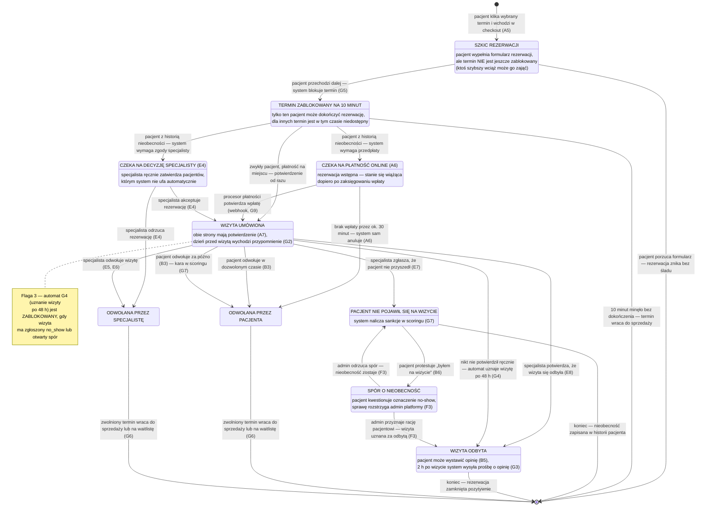

# CORE-STANY — Cykl życia rezerwacji (stany kanoniczne)

## Notatki

**TTL-e i timery:**
- Lock slotu: **TTL 10 min** od wejścia w checkout (silnik [[G5]]); wygaśnięcie = koniec rezerwacji, slot natychmiast wraca do puli dostępności (A3/A4).
- Okno płatności online: **~30 min** (benchmark ZL, mapa A6) → auto-anulacja przez job.
- Auto-approval: **T+48 h** po terminie wizyty ([[G4]]) — zablokowany przy `no_show`/`disputed` (Flaga 3).
- Przypomnienie T−24 h ([[G2]]) działa tylko w `confirmed`; prośba o opinię T+2 h ([[G3]]) tylko po `completed`.

**Eventy emitowane przy przejściach:**
- `confirmed` (wejście): `booking.created` → A7 (potwierdzenie, tokeny samoobsługi, .ics), enqueue [[G1]], scheduler [[G2]].
- `cancelled_by_patient` w terminie: `booking.cancelled` → powiadomienia obu stron ([[G1]]), zwolniony slot → waitlista ([[G6]]).
- `cancelled_by_patient` po terminie: `booking.cancelled_late` → scoring ([[G7]]) + waitlista ([[G6]]).
- `cancelled_by_specialist`: `booking.cancelled` + licznik odwołań specjalisty ([[E5]]/[[E6]]), slot → waitlista ([[G6]]).
- `no_show`: `visit.no_show` → scoring/sankcje progresywne ([[G7]]); 2. no-show = gate przedpłaty/akceptacji w A5.
- `completed`: `visit.approved` (nazwa robocza — założenie) → timer [[G3]] (review ask T+2 h), token opinii [[B5]].

**Założenia minimalne (mapa nie rozstrzyga):**
- Timeout płatności mapowany na `cancelled_by_patient` (brak wpłaty = rezygnacja pacjenta); stany kanoniczne nie mają osobnego `expired`/`cancelled_by_system`.
- Wygaśnięcie locka (TTL) kończy rezerwację bez stanu kanonicznego "expired" — modelowane jako przejście do stanu końcowego.
- Odrzucenie w `pending_approval` mapowane na `cancelled_by_specialist`.
- Ścieżka `locked → confirmed` (płatność na miejscu, brak gate scoringu) — mapa A5 dopuszcza płatność na miejscu, a łańcuch kanoniczny jej wprost nie pokazuje; przyjęto przejście bezpośrednie.
- Rozstrzygnięcie sporu (F3): uznany → `completed`, odrzucony → powrót do `no_show` — założenie minimalne.

**Flaga 2 (OTWARTA, decyzja z 2026-07-15 — dokumentujemy oba warianty):** gałąź `pending_payment` (przedpłata online, A6 + G9) i gałąź `pending_approval` ("rezerwacja za akceptacją specjalisty") współistnieją na diagramie; jeśli POC ruszy bez płatności online, gałąź `pending_payment` jest nieaktywna, a sankcją scoringu pozostaje wyłącznie akceptacja specjalisty.

**Odwołania:** [[a5-checkout]] (A5), A6, A7, [[b3-odwolanie-tokenem]] (B3), B5, B6, E4, E5, E6, E7, E8, G2, G3, G4, G5, G6, G7, G9.

## Co opisuje ten diagram

Ten diagram pokazuje pełny cykl życia pojedynczej rezerwacji wizyty — od momentu, gdy pacjent wchodzi w proces rezerwacji, aż po jej zakończenie. Każdy prostokąt to jeden **stan**, w którym rezerwacja może się znajdować (zawsze dokładnie w jednym naraz), a każda strzałka to **zdarzenie**, które przenosi ją do kolejnego stanu — z opisem, kto lub co je wywołuje. Flow uruchamia się przy wejściu w checkout, a kończy w jednym ze stanów końcowych: wizyta odbyta, odwołana przez którąś ze stron albo nieobecność pacjenta. To diagram-fundament — wszystkie pozostałe flowy rezerwacyjne używają dokładnie tych nazw stanów.

## Aktorzy w tym flow

| Rola | Kto to jest | Co robi w tym flow |
|---|---|---|
| **Pacjent** (użytkownik) | osoba korzystająca ze strony; u logopedów najczęściej rodzic rezerwujący wizytę dla dziecka (B7) | rozpoczyna rezerwację, wpłaca przedpłatę (gdy wymagana), odwołuje wizytę (B3), może zakwestionować oznaczoną nieobecność (B6) |
| **Specjalista** (logopeda / lekarz) | usługodawca przyjmujący wizyty, właściciel kalendarza | akceptuje lub odrzuca rezerwacje warunkowe (E4), odwołuje wizyty (E5, E6), potwierdza że wizyta się odbyła (E8), zgłasza nieobecność pacjenta (E7) |
| **Admin** (operator platformy) | zespół prowadzący serwis — back office; rozstrzyga sprawy sporne | rozpatruje spory o nieobecność i wydaje decyzję (F3) |
| **System** (automaty platformy) | joby, timery i silniki działające bez udziału człowieka | blokuje termin na 10 min (G5), anuluje rezerwację po braku wpłaty (A6), uznaje wizytę po 48 h (G4), wysyła powiadomienia i przypomnienia (G1, G2, G3), nalicza scoring (G7), zarządza waitlistą (G6) |

## Objaśnienie bloków — stan po stanie

| Blok na diagramie | Co to znaczy w praktyce | Kto tu działa |
|---|---|---|
| `[*]` (czarna kropka u góry) | Punkt startu — moment, w którym rezerwacja zaczyna istnieć. Wszystko przed nią (szukanie specjalisty, przeglądanie profilu) to inne flowy (A1–A4). | — |
| `draft` | Pacjent kliknął konkretny termin na profilu specjalisty i otworzył formularz rezerwacji (checkout). To dopiero **szkic**: system niczego jeszcze nie rezerwuje ani nie blokuje — wpisywane dane żyją tylko w formularzu, a termin cały czas jest widoczny dla innych pacjentów. Wcześniejsze określenie „koszyk rezerwacji, bez locka" znaczyło dokładnie to: formularz w trakcie wypełniania, zanim system zablokuje termin. Jeśli pacjent zamknie stronę, nic się nie dzieje — szkic po prostu znika. | Pacjent |
| `locked` | Pacjent przeszedł do dalszych kroków formularza, więc system **zablokował wybrany termin na 10 minut wyłącznie dla niego** — przez ten czas nikt inny nie może go zarezerwować. To zapobiega sytuacji, w której dwie osoby „kupują" ten sam termin. Jeśli pacjent nie zdąży dokończyć w 10 minut, blokada wygasa i termin wraca do sprzedaży. | Pacjent, System (G5) |
| `pending_payment` | Rezerwacja wstępnie złożona, ale system zażądał **przedpłaty online** (bo pacjent ma w historii nieobecności — tzw. scoring gate). Wizyta potwierdzi się dopiero, gdy procesor płatności zgłosi zaksięgowaną wpłatę. Na wpłatę jest ok. 30 minut — potem system sam anuluje rezerwację. | Pacjent, Procesor płatności, System (A6, G9) |
| `pending_approval` | Rezerwacja wstępnie złożona, ale wymaga **ręcznej zgody specjalisty** (drugi wariant scoring gate — stosowany np. gdy platforma działa bez płatności online). Specjalista widzi prośbę w swoim panelu i akceptuje ją albo odrzuca. | Specjalista (E4) |
| `confirmed` | **Wizyta umówiona** — stan docelowy szczęśliwej ścieżki. Obie strony dostały potwierdzenie (e-mail/SMS z linkami do zarządzania rezerwacją), a dzień przed wizytą system wysyła przypomnienie. Z tego stanu wizyta może się jeszcze: odbyć, zostać odwołana przez którąś ze stron albo zakończyć nieobecnością pacjenta. | Pacjent, Specjalista, System (A7, G2) |
| `completed` | **Wizyta się odbyła** — potwierdził to specjalista ręcznie albo automat po 48 h (gdy nikt nie zgłosił problemu). Dopiero ten stan odblokowuje pacjentowi możliwość wystawienia opinii — dzięki temu opinie pochodzą wyłącznie od osób, które naprawdę były na wizycie. | Specjalista (E8) lub System (G4) |
| `cancelled_by_patient` | Pacjent odwołał wizytę. Diagram rozróżnia odwołanie **w dozwolonym czasie** (bez konsekwencji) i **za późno** (liczy się do scoringu jako zachowanie nieuczciwe wobec specjalisty). Tu trafia też rezerwacja, za którą pacjent nie zapłacił w terminie. | Pacjent (B3), System |
| `cancelled_by_specialist` | Specjalista odwołał wizytę — pojedynczo (E5) albo hurtowo, np. z powodu urlopu lub choroby (E6). Platforma liczy takie odwołania, bo częste odwoływanie psuje doświadczenie pacjentów. | Specjalista (E5, E6) |
| `no_show` | Specjalista zgłosił, że **pacjent nie pojawił się na wizycie** bez odwołania. System nalicza pacjentowi punkty karne (scoring) — przy kolejnej rezerwacji może zostać wymagana przedpłata lub zgoda specjalisty. | Specjalista (E7), System (G7) |
| `disputed` | Pacjent nie zgadza się z oznaczeniem nieobecności („byłem na wizycie") i otworzył **spór**. Sprawa czeka na decyzję admina: uznanie racji pacjenta zamienia stan na `completed` (wizyta odbyta), odrzucenie sporu przywraca `no_show`. | Pacjent (B6), Admin (F3) |
| `[*]` (czarna kropka na dole) | Punkt końca — rezerwacja przestaje być aktywna. Strzałki do tego punktu opisują, co dzieje się z terminem: wraca do sprzedaży albo system proponuje go osobom z waitlisty (G6). | — |

## Powiązane diagramy

| ID | Diagram | Jak się łączy |
|---|---|---|
| A5 | [a5-checkout.md](../a-pacjent-public/a5-checkout.md) | wejście w checkout tworzy stan draft i uruchamia lock slotu |
| A6 | [a5-checkout-wariant-przedplata.md](../a-pacjent-public/a5-checkout-wariant-przedplata.md) | płatność online domyka pending_payment; timeout ~30 min = auto-anulacja |
| A7 | [a7-potwierdzenie.md](../a-pacjent-public/a7-potwierdzenie.md) | po wejściu w confirmed pacjent dostaje potwierdzenie i tokeny samoobsługi |
| A3 | [a3-lista-wynikow.md](../a-pacjent-public/a3-lista-wynikow.md) | slot po wygaśnięciu locka lub anulacji wraca do puli widocznej na liście wyników |
| A4 | [a4-profil-specjalisty.md](../a-pacjent-public/a4-profil-specjalisty.md) | zwolniony slot jest znów widoczny na profilu specjalisty |
| B3 | [b3-odwolanie-tokenem.md](../b-pacjent-konto/b3-odwolanie-tokenem.md) | odwołanie pacjenta (w terminie lub po) prowadzi do cancelled_by_patient |
| B5 | [b5-wystawienie-opinii.md](../b-pacjent-konto/b5-wystawienie-opinii.md) | stan completed odblokowuje wystawienie opinii |
| B6 | [b6-spor-no-show.md](../b-pacjent-konto/b6-spor-no-show.md) | spór pacjenta "byłem" przenosi no_show w disputed |
| E4 | [e4-rezerwacje.md](../e-panel/e4-rezerwacje.md) | akceptacja lub odrzucenie przez specjalistę rozstrzyga pending_approval |
| E5 | [e5-odwolanie-pojedyncze.md](../e-panel/e5-odwolanie-pojedyncze.md) | odwołanie pojedynczej wizyty przez specjalistę daje cancelled_by_specialist |
| E6 | [e6-tryb-urlop.md](../e-panel/e6-tryb-urlop.md) | hurtowe odwołania (urlop/choroba) również prowadzą do cancelled_by_specialist |
| E7 | [e7-no-show.md](../e-panel/e7-no-show.md) | oznaczenie nieobecności przenosi wizytę w no_show |
| E8 | [e8-approval-opinie.md](../e-panel/e8-approval-opinie.md) | ręczny approval wizyty zamyka ją jako completed |
| F3 | [f3-spory.md](../f-backoffice/f3-spory.md) | rozstrzygnięcie sporu decyduje: completed albo powrót do no_show |
| G1 | [00-katalog-eventow.md](00-katalog-eventow.md) | powiadomienia SMS/email wysyłane przy przejściach stanów |
| G2 | [00-katalog-eventow.md](00-katalog-eventow.md) | przypomnienie T−24 h działa tylko w stanie confirmed |
| G3 | [00-katalog-eventow.md](00-katalog-eventow.md) | prośba o opinię T+2 h wysyłana dopiero po completed |
| G4 | [g4-auto-approval.md](../g-silniki/g4-auto-approval.md) | auto-approval T+48 h przenosi confirmed w completed (blokowany Flagą 3) |
| G5 | [g5-slot-lock.md](../g-silniki/g5-slot-lock.md) | lock slotu z TTL 10 min tworzy stan locked |
| G6 | [g6-waitlist-engine.md](../g-silniki/g6-waitlist-engine.md) | zwolniony slot po anulacji trafia do kaskady waitlisty |
| G7 | [g7-scoring-engine.md](../g-silniki/g7-scoring-engine.md) | późne odwołania i no-show zasilają scoring i sankcje |
| G9 | [00-katalog-eventow.md](00-katalog-eventow.md) | webhook płatności potwierdza rezerwację czekającą w pending_payment |

## Słownik

| Pojęcie | Wyjaśnienie |
|---|---|
| Stan kanoniczny | Ustalona, wspólna dla całego projektu nazwa etapu życia rezerwacji (np. confirmed, no_show), używana we wszystkich diagramach. |
| Checkout | Proces rezerwacji od kliknięcia terminu do potwierdzenia — wieloetapowy formularz (wybór usługi, dane, weryfikacja SMS, płatność). Opisany w A5. |
| Slot | Konkretny termin wizyty w kalendarzu specjalisty, który pacjent może zarezerwować. |
| Lock | Tymczasowa blokada slotu na czas checkoutu, żeby dwie osoby nie zarezerwowały tego samego terminu. |
| TTL | „Time to live" — czas życia blokady; po 10 minutach bez dokończenia rezerwacji slot automatycznie wraca do puli. |
| Scoring | Wewnętrzna punktacja wiarygodności pacjenta prowadzona przez system: nieobecności i późne odwołania obniżają ocenę, co skutkuje sankcjami. |
| Scoring gate | Dodatkowy warunek w checkoucie (przedpłata albo akceptacja specjalisty) nakładany na pacjentów z historią nieobecności. |
| Webhook | Automatyczne powiadomienie od procesora płatności, że wpłata doszła — potwierdza rezerwację bez udziału człowieka. |
| No-show | Sytuacja, w której pacjent nie pojawia się na umówionej wizycie bez odwołania. |
| Auto-approval | Automatyczne uznanie wizyty za odbytą 48 godzin po jej terminie, jeśli specjalista nie zrobił tego ręcznie. |
| Waitlista | Lista oczekujących pacjentów, którym system proponuje zwolniony termin. |
| Spór (disputed) | Zgłoszenie pacjenta kwestionujące oznaczenie nieobecności, rozstrzygane przez admina. |
| Event | Zdarzenie domenowe (np. booking.cancelled_late) emitowane przy przejściu między stanami, uruchamiające automatyczne silniki systemu. |
| Flaga | Otwarta decyzja projektowa oznaczona numerem (Flaga 2: płatności online w POC, Flaga 3: blokada auto-approvalu) — opisana w mapie flowów. |
