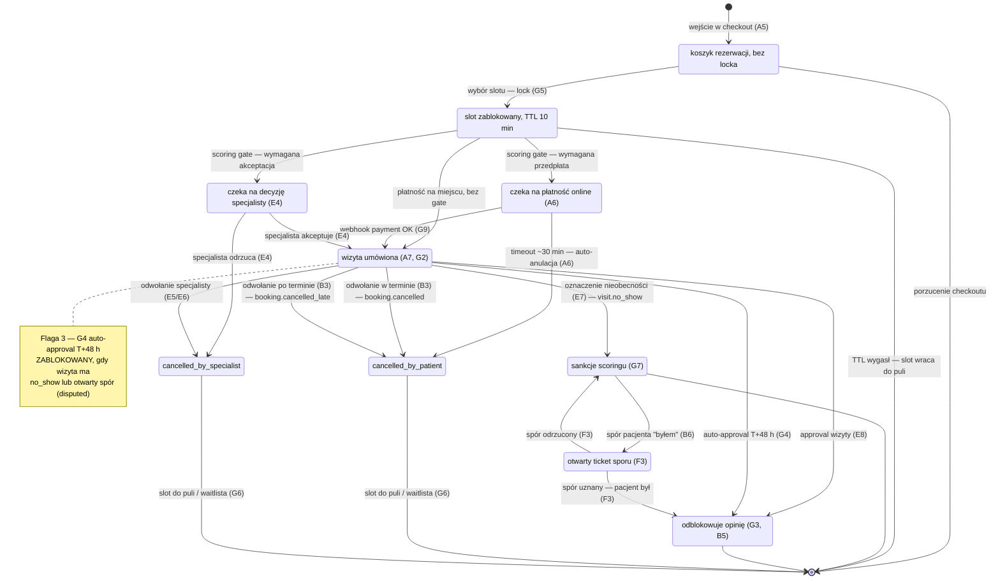

# CORE-STANY — Cykl życia rezerwacji (stany kanoniczne)

## Notatki

**TTL-e i timery:**
- Lock slotu: **TTL 10 min** od wejścia w checkout (silnik [[G5]]); wygaśnięcie = koniec rezerwacji, slot natychmiast wraca do puli dostępności (A3/A4).
- Okno płatności online: **~30 min** (benchmark ZL, mapa A6) → auto-anulacja przez job.
- Auto-approval: **T+48 h** po terminie wizyty ([[G4]]) — zablokowany przy `no_show`/`disputed` (Flaga 3).
- Przypomnienie T−24 h ([[G2]]) działa tylko w `confirmed`; prośba o opinię T+2 h ([[G3]]) tylko po `completed`.

**Eventy emitowane przy przejściach:**
- `confirmed` (wejście): `booking.created` → A7 (potwierdzenie, tokeny samoobsługi, .ics), enqueue [[G1]], scheduler [[G2]].
- `cancelled_by_patient` w terminie: `booking.cancelled` → powiadomienia obu stron ([[G1]]), zwolniony slot → waitlista ([[G6]]).
- `cancelled_by_patient` po terminie: `booking.cancelled_late` → scoring ([[G7]]) + waitlista ([[G6]]).
- `cancelled_by_specialist`: `booking.cancelled` + licznik odwołań specjalisty ([[E5]]/[[E6]]), slot → waitlista ([[G6]]).
- `no_show`: `visit.no_show` → scoring/sankcje progresywne ([[G7]]); 2. no-show = gate przedpłaty/akceptacji w A5.
- `completed`: `visit.approved` (nazwa robocza — założenie) → timer [[G3]] (review ask T+2 h), token opinii [[B5]].

**Założenia minimalne (mapa nie rozstrzyga):**
- Timeout płatności mapowany na `cancelled_by_patient` (brak wpłaty = rezygnacja pacjenta); stany kanoniczne nie mają osobnego `expired`/`cancelled_by_system`.
- Wygaśnięcie locka (TTL) kończy rezerwację bez stanu kanonicznego "expired" — modelowane jako przejście do stanu końcowego.
- Odrzucenie w `pending_approval` mapowane na `cancelled_by_specialist`.
- Ścieżka `locked → confirmed` (płatność na miejscu, brak gate scoringu) — mapa A5 dopuszcza płatność na miejscu, a łańcuch kanoniczny jej wprost nie pokazuje; przyjęto przejście bezpośrednie.
- Rozstrzygnięcie sporu (F3): uznany → `completed`, odrzucony → powrót do `no_show` — założenie minimalne.

**Flaga 2 (OTWARTA, decyzja z 2026-07-15 — dokumentujemy oba warianty):** gałąź `pending_payment` (przedpłata online, A6 + G9) i gałąź `pending_approval` ("rezerwacja za akceptacją specjalisty") współistnieją na diagramie; jeśli POC ruszy bez płatności online, gałąź `pending_payment` jest nieaktywna, a sankcją scoringu pozostaje wyłącznie akceptacja specjalisty.

**Odwołania:** [[a5-checkout]] (A5), A6, A7, [[b3-odwolanie-tokenem]] (B3), B5, B6, E4, E5, E6, E7, E8, G2, G3, G4, G5, G6, G7, G9.
