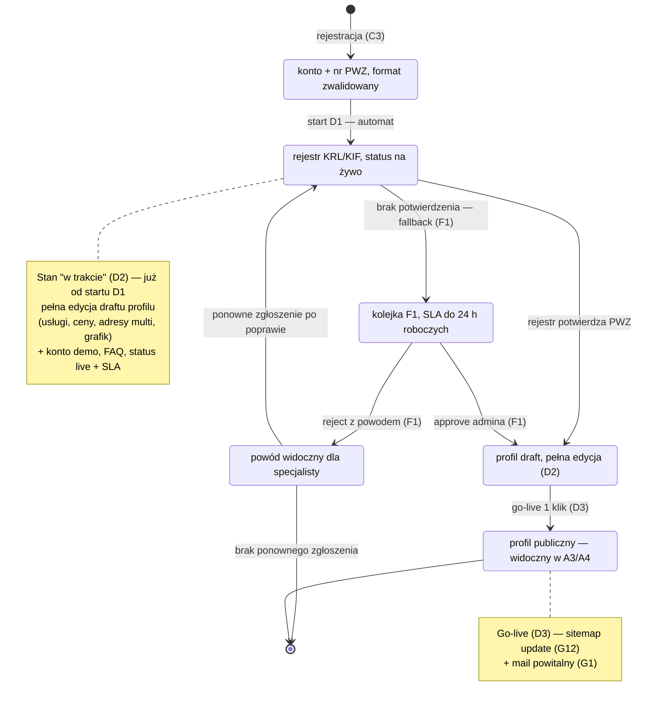

# CORE-WERYFIKACJA — Cykl weryfikacji specjalisty (C3 → D1 → D3)

## Notatki

**Kroki cyklu wg mapy:**
- [[C3]] rejestracja: email + telefon (OTP), nr PWZ; BE waliduje **format** PWZ i startuje D1. Błąd formatu zatrzymuje się na formularzu rejestracji (walidacja FE/BE), nie tworzy osobnego stanu.
- [[D1]] weryfikacja: najpierw automat (rejestr KRL/KIF), przy braku jednoznacznego dopasowania fallback do kolejki ręcznej [[F1]] (zgłoszenia, dane + dowody, approve/reject z powodem, timer SLA **do 24 h roboczych**); FE pokazuje status na żywo + SLA.
- [[D2]] stan "w trakcie": draft profilu (niepubliczny) z pełną edycją (usługi, ceny, adresy multi, zdjęcia, grafik), FAQ i **konto demo** (demo dataset) — dostępne już w trakcie weryfikacji, nie dopiero po niej.
- [[D3]] go-live: **1 klik** po weryfikacji → publikacja profilu, sitemap update ([[G12]]), mail powitalny ([[G1]]); specjalista staje się widoczny w A3/A4 i może przyjmować rezerwacje (E4).

**Założenia minimalne (mapa nie rozstrzyga):**
- Ścieżka ponownego zgłoszenia po odrzuceniu: specjalista poprawia dane (np. numer PWZ) i zgłasza się ponownie → proces wraca do automatu D1 (nie bezpośrednio do kolejki F1); mapa nie opisuje tej ścieżki wprost.
- Odrzucenie występuje tylko w kolejce ręcznej F1 (automat przy niepewności robi fallback, nie odrzuca sam) — założenie.
- Brak stanu "cofnięcie publikacji" (unpublish/blokada po go-live) — poza zakresem C3→D3; blokady konta obsługuje F5.
- Weryfikacja automatyczna: rejestr KRL/KIF wg mapy (D1: "rejestr KRL/KIF/wet." — dla wertykalu logopedycznego przyjęto KRL/KIF).

**Odwołania:** [[C3]], [[D1]], [[D2]], [[D3]], [[F1]], [[F5]], [[G1]], [[G12]], A3/A4, E2/E3 (dalszy ciąg ścieżki E2E "od landing do 1. rezerwacji").

## Co opisuje ten diagram

Diagram pokazuje drogę specjalisty od założenia konta do publicznie widocznego profilu. Uczestniczą w niej specjalista (rejestruje się i podaje numer PWZ), system (automatycznie sprawdza numer w rejestrze zawodowym) oraz admin (ręcznie weryfikuje przypadki, których automat nie rozstrzygnął). Flow startuje przy rejestracji, a kończy się publikacją profilu widocznego dla pacjentów w wyszukiwarce albo odrzuceniem zgłoszenia z podanym powodem. Już w trakcie weryfikacji specjalista może przygotowywać swój profil w wersji roboczej.

## Powiązane diagramy

| ID | Diagram | Jak się łączy |
|---|---|---|
| C3 | [c3-rejestracja.md](../cd-specjalista-onboarding/c3-rejestracja.md) | rejestracja z numerem PWZ startuje cały cykl weryfikacji |
| D1 | [d1-weryfikacja-pwz.md](../cd-specjalista-onboarding/d1-weryfikacja-pwz.md) | automatyczne sprawdzenie PWZ w rejestrze KRL/KIF |
| D2 | [d2-stan-w-trakcie.md](../cd-specjalista-onboarding/d2-stan-w-trakcie.md) | edycja draftu profilu dostępna już w trakcie weryfikacji |
| D3 | [d3-go-live.md](../cd-specjalista-onboarding/d3-go-live.md) | publikacja profilu jednym kliknięciem po pozytywnej weryfikacji |
| F1 | [f1-kolejka-weryfikacji-pwz.md](../f-backoffice/f1-kolejka-weryfikacji-pwz.md) | ręczna kolejka admina jako fallback automatu (SLA do 24 h roboczych) |
| F5 | [f5-uzytkownicy.md](../f-backoffice/f5-uzytkownicy.md) | ewentualne blokady konta po go-live obsługuje panel użytkowników |
| G1 | [00-katalog-eventow.md](00-katalog-eventow.md) | mail powitalny wysyłany po publikacji profilu |
| G12 | [00-katalog-eventow.md](00-katalog-eventow.md) | aktualizacja sitemapy po go-live profilu |
| A3 | [a3-lista-wynikow.md](../a-pacjent-public/a3-lista-wynikow.md) | opublikowany profil pojawia się na liście wyników wyszukiwania |
| A4 | [a4-profil-specjalisty.md](../a-pacjent-public/a4-profil-specjalisty.md) | opublikowany profil staje się publiczną stroną specjalisty |
| E2 | [e2-grafik-dostepnosc.md](../e-panel/e2-grafik-dostepnosc.md) | po publikacji specjalista ustawia grafik — dalszy ciąg ścieżki E2E-3 |
| E3 | [e3-uslugi-ceny.md](../e-panel/e3-uslugi-ceny.md) | konfiguracja usług i cen po go-live — dalszy ciąg ścieżki E2E-3 |
| E4 | [e4-rezerwacje.md](../e-panel/e4-rezerwacje.md) | opublikowany specjalista może przyjmować pierwsze rezerwacje |

## Słownik

| Pojęcie | Wyjaśnienie |
|---|---|
| PWZ | Numer prawa wykonywania zawodu — potwierdza uprawnienia specjalisty do pracy z pacjentami. |
| KRL/KIF | Publiczne rejestry zawodowe (logopedów/fizjoterapeutów), w których automat sprawdza numer PWZ. |
| OTP | Jednorazowy kod (SMS/email) potwierdzający numer telefonu przy rejestracji. |
| Fallback | Ścieżka zapasowa: gdy automat nie potwierdzi PWZ, sprawa trafia do ręcznej kolejki admina. |
| SLA | Obiecany maksymalny czas reakcji — tu do 24 godzin roboczych na ręczną weryfikację. |
| Draft profilu | Robocza, niepubliczna wersja profilu, którą specjalista może w pełni edytować przed publikacją. |
| Konto demo | Przykładowe dane w panelu, dzięki którym specjalista poznaje system jeszcze w trakcie weryfikacji. |
| Go-live | Publikacja profilu jednym kliknięciem — od tego momentu specjalista jest widoczny dla pacjentów. |
| Sitemap | Mapa strony dla wyszukiwarek, aktualizowana po publikacji, żeby Google szybciej znalazł nowy profil. |
