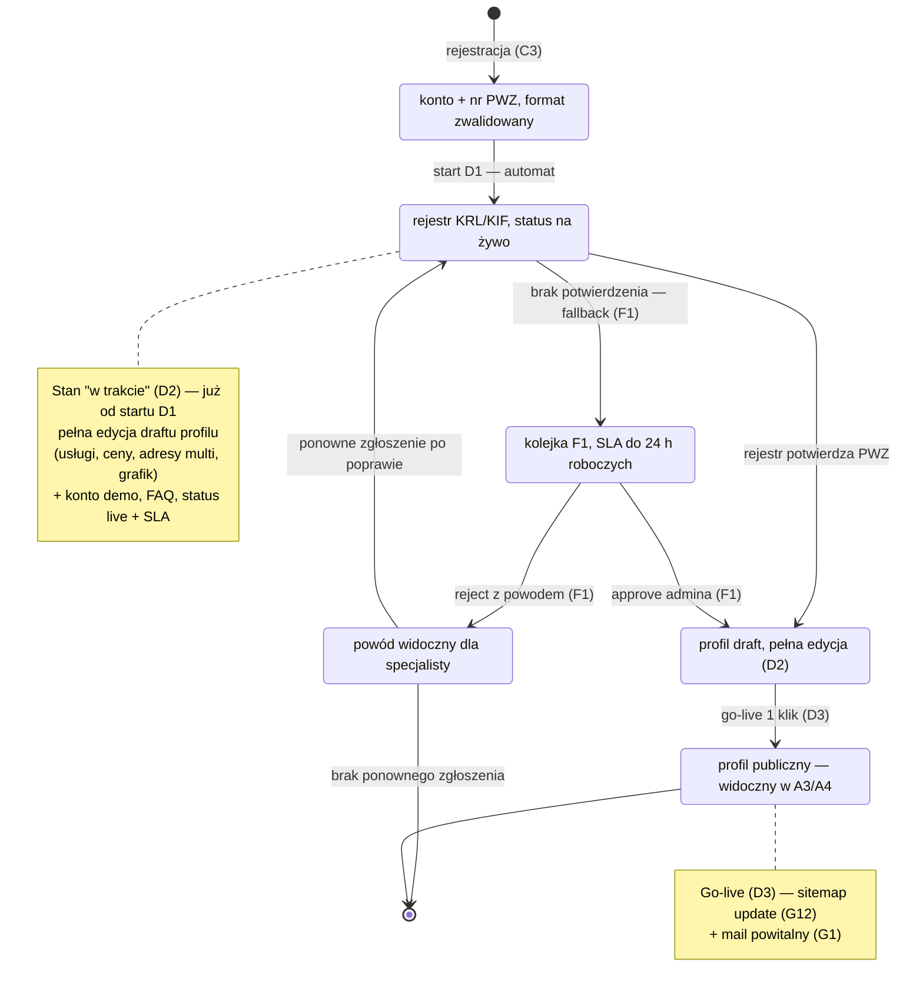

# CORE-WERYFIKACJA — Cykl weryfikacji specjalisty (C3 → D1 → D3)

## Notatki

**Kroki cyklu wg mapy:**
- [[C3]] rejestracja: email + telefon (OTP), nr PWZ; BE waliduje **format** PWZ i startuje D1. Błąd formatu zatrzymuje się na formularzu rejestracji (walidacja FE/BE), nie tworzy osobnego stanu.
- [[D1]] weryfikacja: najpierw automat (rejestr KRL/KIF), przy braku jednoznacznego dopasowania fallback do kolejki ręcznej [[F1]] (zgłoszenia, dane + dowody, approve/reject z powodem, timer SLA **do 24 h roboczych**); FE pokazuje status na żywo + SLA.
- [[D2]] stan "w trakcie": draft profilu (niepubliczny) z pełną edycją (usługi, ceny, adresy multi, zdjęcia, grafik), FAQ i **konto demo** (demo dataset) — dostępne już w trakcie weryfikacji, nie dopiero po niej.
- [[D3]] go-live: **1 klik** po weryfikacji → publikacja profilu, sitemap update ([[G12]]), mail powitalny ([[G1]]); specjalista staje się widoczny w A3/A4 i może przyjmować rezerwacje (E4).

**Założenia minimalne (mapa nie rozstrzyga):**
- Ścieżka ponownego zgłoszenia po odrzuceniu: specjalista poprawia dane (np. numer PWZ) i zgłasza się ponownie → proces wraca do automatu D1 (nie bezpośrednio do kolejki F1); mapa nie opisuje tej ścieżki wprost.
- Odrzucenie występuje tylko w kolejce ręcznej F1 (automat przy niepewności robi fallback, nie odrzuca sam) — założenie.
- Brak stanu "cofnięcie publikacji" (unpublish/blokada po go-live) — poza zakresem C3→D3; blokady konta obsługuje F5.
- Weryfikacja automatyczna: rejestr KRL/KIF wg mapy (D1: "rejestr KRL/KIF/wet." — dla wertykalu logopedycznego przyjęto KRL/KIF).

**Odwołania:** [[C3]], [[D1]], [[D2]], [[D3]], [[F1]], [[F5]], [[G1]], [[G12]], A3/A4, E2/E3 (dalszy ciąg ścieżki E2E "od landing do 1. rezerwacji").
