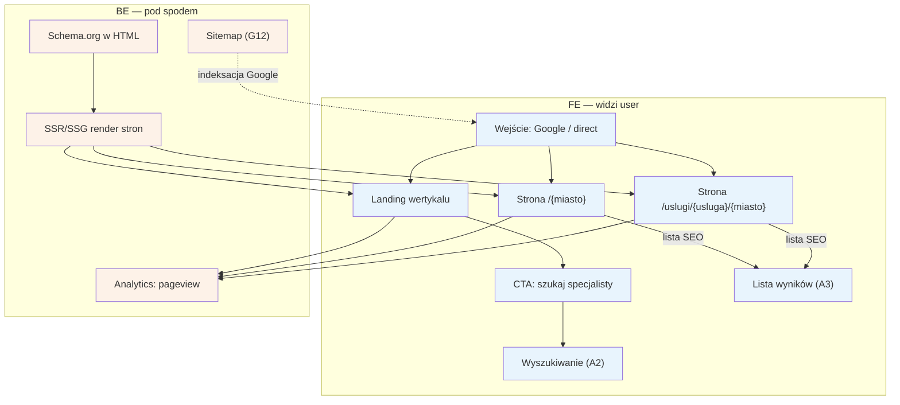

# A1 — Wejście SEO/direct

## Notatki
- Priorytet: P0.
- Trzy typy landingów z mapy: landing wertykalu, `/{miasto}`, `/uslugi/{usluga}/{miasto}`; wszystkie SSR/SSG (SEO long-tail = główny kanał, spec S5).
- Założenie (minimalne): strony `/{miasto}` i `/uslugi/{usluga}/{miasto}` renderują od razu listę wyników → przejście do [[a3-lista-wynikow]] (A3); landing wertykalu prowadzi do wyszukiwania [[a2-wyszukiwanie]] (A2).
- Sitemap i refresh schema.org generuje G12 (SEO joby).
- Analytics: pageview od dnia 1 (metryki lejka, S5).
