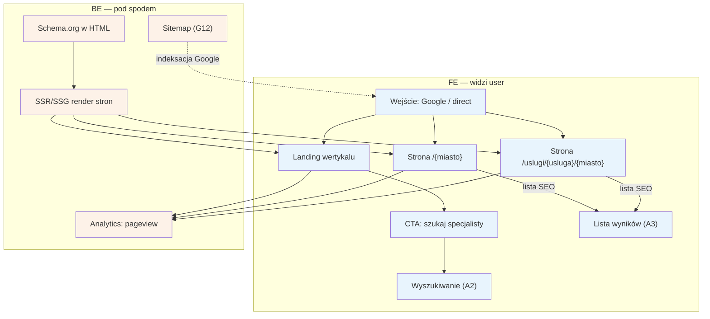

# A1 — Wejście SEO/direct

## Notatki
- Priorytet: P0.
- Trzy typy landingów z mapy: landing wertykalu, `/{miasto}`, `/uslugi/{usluga}/{miasto}`; wszystkie SSR/SSG (SEO long-tail = główny kanał, spec S5).
- Założenie (minimalne): strony `/{miasto}` i `/uslugi/{usluga}/{miasto}` renderują od razu listę wyników → przejście do [[a3-lista-wynikow]] (A3); landing wertykalu prowadzi do wyszukiwania [[a2-wyszukiwanie]] (A2).
- Sitemap i refresh schema.org generuje G12 (SEO joby).
- Analytics: pageview od dnia 1 (metryki lejka, S5).

## Co opisuje ten diagram
Pokazuje, jak pacjent trafia do serwisu z internetu — najczęściej z wyszukiwarki Google albo wpisując adres bezpośrednio. Uczestniczą pacjent oraz system, który z wyprzedzeniem przygotowuje strony wejściowe (landing, strony miast i usług) tak, aby Google mógł je znaleźć i zaindeksować. Flow zaczyna się w momencie wejścia na stronę, a kończy przejściem do wyszukiwania (A2) albo od razu do listy wyników (A3).

## Powiązane diagramy
| ID | Diagram | Jak się łączy |
|---|---|---|
| A2 | [a2-wyszukiwanie.md](a2-wyszukiwanie.md) | CTA z landingu wertykalu prowadzi do wyszukiwania |
| A3 | [a3-lista-wynikow.md](a3-lista-wynikow.md) | strony /{miasto} i /uslugi/{usluga}/{miasto} renderują od razu listę wyników |
| G12 | [../00-core/00-katalog-eventow.md](../00-core/00-katalog-eventow.md) | SEO joby generują sitemapę i odświeżają schema.org |

## Słownik
| Pojęcie | Wyjaśnienie |
|---|---|
| SEO | Działania, dzięki którym strony serwisu pojawiają się wysoko w wynikach Google. |
| Wejście direct | Wejście na stronę po ręcznym wpisaniu adresu, bez pośrednictwa wyszukiwarki. |
| SSR/SSG | Sposoby generowania stron po stronie serwera (na żądanie lub z góry), dzięki którym Google widzi pełną treść. |
| Schema.org | Ustandaryzowane znaczniki w kodzie strony, które pomagają Google zrozumieć jej zawartość. |
| Sitemap | Plik z listą wszystkich adresów serwisu, ułatwiający Google indeksację. |
| Indeksacja | Proces, w którym Google odwiedza strony i dodaje je do swojej wyszukiwarki. |
| Landing wertykalu | Strona wejściowa całej branży (tu: logopedzi), pierwszy ekran dla nowego użytkownika. |
| CTA | Przycisk wzywający do działania, np. „szukaj specjalisty". |
| Long-tail | Ruch z bardzo szczegółowych zapytań (np. „logopeda dziecięcy Kraków"), główny kanał pozyskiwania pacjentów. |
| Pageview | Zdarzenie analityczne rejestrujące każde wyświetlenie strony, podstawa metryk lejka. |
