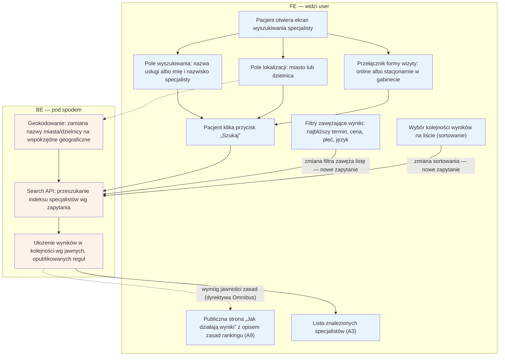

# A2 — Wyszukiwanie

## Notatki
- Priorytet: P0.
- Filtry z mapy: najbliższy termin, cena, płeć, język; do tego toggle online/stacjonarnie i sortowanie — zmiana filtra/sortowania odpytuje search API ponownie (bez nowego "Szukaj").
- Ranking wg jawnych reguł (Omnibus) — zasady opisane na `/jak-dzialaja-wyniki` → [[a9-strony-statyczne]] (A9); algorytm i wagi: spec S5.
- Geokodowanie: zamiana miasto/dzielnica na współrzędne do liczenia dystansu (wynik używany w A3 na karcie).
- Wyniki → [[a3-lista-wynikow]] (A3). Wybór technologii indeksu (Postgres FTS vs Meilisearch): otwarta decyzja z S5.

## Co opisuje ten diagram
Opisuje ekran wyszukiwania, na którym pacjent określa, czego szuka: usługę lub specjalistę, miasto albo dzielnicę, formę wizyty (online lub stacjonarnie) oraz dodatkowe filtry i sortowanie. Po kliknięciu „Szukaj" system zamienia lokalizację na współrzędne, przeszukuje indeks specjalistów i układa wyniki według jawnych reguł. Flow kończy się wyświetleniem listy wyników (A3); zasady układania wyników są publicznie opisane na osobnej stronie (A9).

## Aktorzy w tym flow

| Rola | Kto to jest | Co robi w tym flow |
|---|---|---|
| **Pacjent** | użytkownik strony; u logopedów zwykle rodzic rezerwujący wizytę dla dziecka | wpisuje czego szuka i gdzie, wybiera formę wizyty, ustawia filtry i sortowanie, klika „Szukaj" |
| **FE** (interfejs) | to, co użytkownik widzi w przeglądarce — ekran wyszukiwania z polami i przyciskami | zbiera od pacjenta kryteria wyszukiwania, wysyła je do serwera i wyświetla listę wyników |
| **Backend** | serwer platformy — część systemu niewidoczna dla użytkownika | zamienia lokalizację na współrzędne, przeszukuje indeks specjalistów i układa wyniki według jawnych reguł rankingu |

## Objaśnienie bloków

| Blok | Co to znaczy w praktyce | Kto tu działa |
|---|---|---|
| Pacjent otwiera ekran wyszukiwania | Punkt startu: pacjent trafia na stronę z wyszukiwarką specjalistów (np. ze strony głównej). | Pacjent, FE |
| Pole wyszukiwania: usługa albo specjalista | Pacjent wpisuje, czego potrzebuje — nazwę usługi (np. „diagnoza logopedyczna") albo od razu konkretne imię i nazwisko specjalisty. | Pacjent |
| Pole lokalizacji: miasto lub dzielnica | Pacjent określa, gdzie szuka wizyty — wpisuje miasto albo dokładniej dzielnicę. | Pacjent |
| Przełącznik formy wizyty | Wybór, czy wizyta ma być zdalna (online, np. przez wideorozmowę), czy na miejscu w gabinecie. | Pacjent |
| Filtry zawężające wyniki | Dodatkowe kryteria: najbliższy wolny termin, cena wizyty, płeć specjalisty, język, w jakim prowadzi wizyty. Zmiana filtra od razu odświeża wyniki — nie trzeba ponownie klikać „Szukaj". | Pacjent, FE |
| Wybór kolejności wyników (sortowanie) | Pacjent może zmienić, według czego lista jest ułożona (np. najbliższy termin zamiast domyślnej kolejności). Zmiana też od razu odświeża wyniki. | Pacjent, FE |
| Pacjent klika przycisk „Szukaj" | Moment wysłania zapytania: wpisane kryteria trafiają do serwera, który zaczyna szukać pasujących specjalistów. | Pacjent, FE |
| Geokodowanie | Serwer zamienia wpisaną nazwę miasta lub dzielnicy na współrzędne geograficzne (punkt na mapie) — dzięki temu potem da się policzyć odległość od gabinetu każdego specjalisty. | Backend |
| Search API: przeszukanie indeksu | Serwer przeszukuje specjalnie przygotowaną bazę (indeks) specjalistów, dopasowując ich do wpisanych kryteriów. | Backend |
| Ułożenie wyników wg jawnych reguł | Znalezieni specjaliści są układani w kolejności według reguł, które platforma publicznie opisuje (wymóg prawny — dyrektywa Omnibus). Nikt nie może „kupić" wyższej pozycji w ukryty sposób. | Backend |
| Publiczna strona „Jak działają wyniki" (A9) | Osobna strona serwisu, na której każdy może przeczytać, według jakich zasad układana jest lista wyników. Link do niej jest dostępny przy wynikach. | FE |
| Lista znalezionych specjalistów (A3) | Punkt końcowy tego flow: pacjent widzi listę pasujących specjalistów — jej wygląd i działanie opisuje osobny diagram A3. | Pacjent, FE |

## Powiązane diagramy
| ID | Diagram | Jak się łączy |
|---|---|---|
| A3 | [a3-lista-wynikow.md](a3-lista-wynikow.md) | wyniki wyszukiwania trafiają na listę wyników |
| A9 | [a9-strony-statyczne.md](a9-strony-statyczne.md) | strona /jak-dzialaja-wyniki jawnie opisuje zasady rankingu (Omnibus) |

## Słownik
| Pojęcie | Wyjaśnienie |
|---|---|
| Filtr | Zawężenie wyników, np. po najbliższym terminie, cenie, płci lub języku specjalisty. |
| Sortowanie | Zmiana kolejności wyników na liście według wybranego kryterium. |
| Toggle online/stacjonarnie | Przełącznik wyboru formy wizyty: zdalnej albo w gabinecie. |
| Geokodowanie | Zamiana nazwy miasta lub dzielnicy na współrzędne geograficzne, potrzebne do liczenia odległości. |
| Search API | Usługa systemowa, która przyjmuje zapytanie i przeszukuje bazę specjalistów. |
| Indeks | Specjalnie przygotowana baza danych umożliwiająca szybkie wyszukiwanie. |
| Ranking | Kolejność wyników ustalana według jawnych, publicznie opisanych reguł. |
| Omnibus | Unijna dyrektywa wymagająca m.in. ujawnienia zasad układania wyników wyszukiwania. |
| FE (frontend) | Interfejs — to, co użytkownik widzi i klika w przeglądarce. |
| BE (backend) | Serwer platformy — część systemu działająca „pod spodem", niewidoczna dla użytkownika. |
| API | Usługa serwerowa, z którą interfejs rozmawia automatycznie (wysyła zapytanie, dostaje dane). |
| A3, A9 | Identyfikatory innych flowów z mapy projektu — każdy ma własny diagram (A3: lista wyników, A9: strony statyczne). |
| Online / stacjonarnie | Dwie formy wizyty: zdalna (np. przez wideorozmowę) albo osobista w gabinecie specjalisty. |
