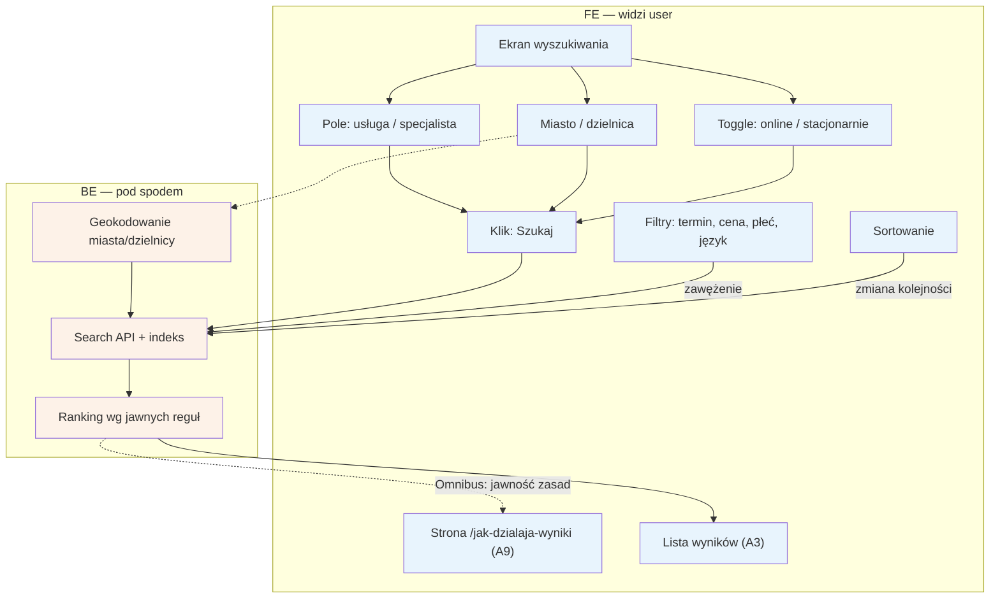

# A2 — Wyszukiwanie

## Notatki
- Priorytet: P0.
- Filtry z mapy: najbliższy termin, cena, płeć, język; do tego toggle online/stacjonarnie i sortowanie — zmiana filtra/sortowania odpytuje search API ponownie (bez nowego "Szukaj").
- Ranking wg jawnych reguł (Omnibus) — zasady opisane na `/jak-dzialaja-wyniki` → [[a9-strony-statyczne]] (A9); algorytm i wagi: spec S5.
- Geokodowanie: zamiana miasto/dzielnica na współrzędne do liczenia dystansu (wynik używany w A3 na karcie).
- Wyniki → [[a3-lista-wynikow]] (A3). Wybór technologii indeksu (Postgres FTS vs Meilisearch): otwarta decyzja z S5.
