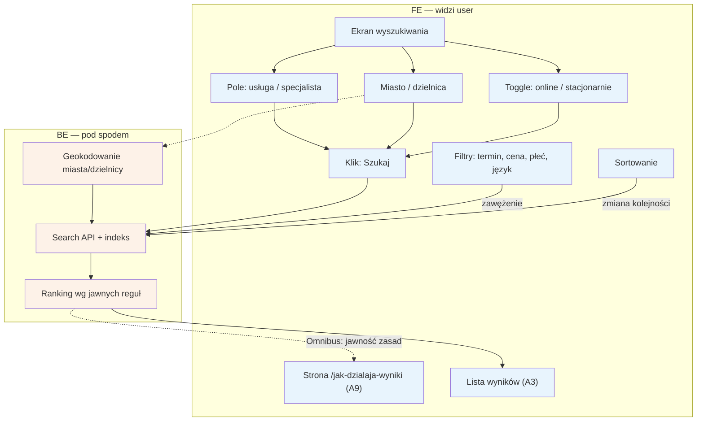

# A2 — Wyszukiwanie

## Notatki
- Priorytet: P0.
- Filtry z mapy: najbliższy termin, cena, płeć, język; do tego toggle online/stacjonarnie i sortowanie — zmiana filtra/sortowania odpytuje search API ponownie (bez nowego "Szukaj").
- Ranking wg jawnych reguł (Omnibus) — zasady opisane na `/jak-dzialaja-wyniki` → [[a9-strony-statyczne]] (A9); algorytm i wagi: spec S5.
- Geokodowanie: zamiana miasto/dzielnica na współrzędne do liczenia dystansu (wynik używany w A3 na karcie).
- Wyniki → [[a3-lista-wynikow]] (A3). Wybór technologii indeksu (Postgres FTS vs Meilisearch): otwarta decyzja z S5.

## Co opisuje ten diagram
Opisuje ekran wyszukiwania, na którym pacjent określa, czego szuka: usługę lub specjalistę, miasto albo dzielnicę, formę wizyty (online lub stacjonarnie) oraz dodatkowe filtry i sortowanie. Po kliknięciu „Szukaj" system zamienia lokalizację na współrzędne, przeszukuje indeks specjalistów i układa wyniki według jawnych reguł. Flow kończy się wyświetleniem listy wyników (A3); zasady układania wyników są publicznie opisane na osobnej stronie (A9).

## Powiązane diagramy
| ID | Diagram | Jak się łączy |
|---|---|---|
| A3 | [a3-lista-wynikow.md](a3-lista-wynikow.md) | wyniki wyszukiwania trafiają na listę wyników |
| A9 | [a9-strony-statyczne.md](a9-strony-statyczne.md) | strona /jak-dzialaja-wyniki jawnie opisuje zasady rankingu (Omnibus) |

## Słownik
| Pojęcie | Wyjaśnienie |
|---|---|
| Filtr | Zawężenie wyników, np. po najbliższym terminie, cenie, płci lub języku specjalisty. |
| Sortowanie | Zmiana kolejności wyników na liście według wybranego kryterium. |
| Toggle online/stacjonarnie | Przełącznik wyboru formy wizyty: zdalnej albo w gabinecie. |
| Geokodowanie | Zamiana nazwy miasta lub dzielnicy na współrzędne geograficzne, potrzebne do liczenia odległości. |
| Search API | Usługa systemowa, która przyjmuje zapytanie i przeszukuje bazę specjalistów. |
| Indeks | Specjalnie przygotowana baza danych umożliwiająca szybkie wyszukiwanie. |
| Ranking | Kolejność wyników ustalana według jawnych, publicznie opisanych reguł. |
| Omnibus | Unijna dyrektywa wymagająca m.in. ujawnienia zasad układania wyników wyszukiwania. |
