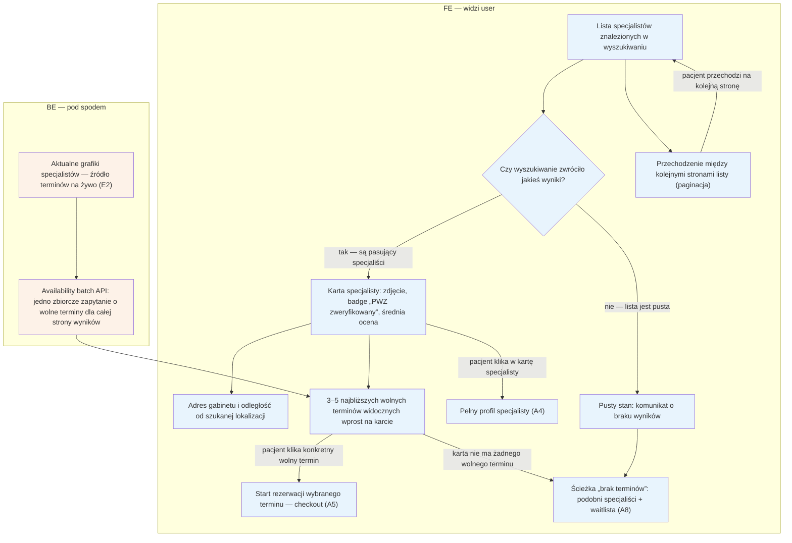

# A3 — Lista wyników

## Notatki
- Priorytet: P0.
- Karta wyniku z mapy: foto, badge PWZ, ocena, adres/dystans, inline sloty (3–5 najbliższych) — klik w slot skraca lejek prosto do [[a5-checkout]] (A5), klik w kartę → [[a4-profil-specjalisty]] (A4).
- Sloty inline liczone przez availability batch API (jedno zapytanie dla całej strony wyników), zawsze live z grafików specjalistów → E2.
- Edge case'y: pusty stan (brak wyników) oraz karta bez wolnych slotów — oba prowadzą do [[a8-brak-slotow]] (A8: podobni + waitlista).
- Cold start Kraków (mało wyników): jak nie wyglądać martwo — otwarty temat z S5.

## Co opisuje ten diagram
Pokazuje listę specjalistów po wyszukiwaniu: każda karta zawiera zdjęcie, potwierdzenie uprawnień (badge PWZ), ocenę, adres z odległością oraz kilka najbliższych wolnych terminów. W tle system na bieżąco pobiera dostępność z grafików specjalistów. Kliknięcie w kartę prowadzi do profilu (A4), kliknięcie w termin — prosto do rezerwacji (A5), a brak wyników lub wolnych terminów — do ścieżki „podobni + waitlista" (A8).

## Aktorzy w tym flow

| Rola | Kto to jest | Co robi w tym flow |
|---|---|---|
| **Pacjent** | użytkownik strony; u logopedów zwykle rodzic rezerwujący wizytę dla dziecka | przegląda listę wyników, klika w kartę specjalisty albo od razu w wolny termin, przechodzi między stronami listy |
| **Specjalista** (logopeda) | usługodawca przyjmujący wizyty | w tym flow nie wykonuje żadnej akcji — jego grafik dostępności (prowadzony w E2) jest źródłem terminów pokazywanych na kartach |
| **FE** (interfejs) | to, co użytkownik widzi w przeglądarce — lista kart specjalistów | wyświetla karty z danymi i terminami, obsługuje kliknięcia i paginację, pokazuje pusty stan gdy brak wyników |
| **Backend** | serwer platformy — część systemu niewidoczna dla użytkownika | jednym zbiorczym zapytaniem pobiera aktualne wolne terminy wszystkich specjalistów z danej strony wyników, zawsze prosto z ich grafików |

## Objaśnienie bloków

| Blok | Co to znaczy w praktyce | Kto tu działa |
|---|---|---|
| Lista specjalistów znalezionych w wyszukiwaniu | Punkt startu: pacjent właśnie wykonał wyszukiwanie (A2) i widzi stronę z jego wynikami. | Pacjent, FE |
| Czy wyszukiwanie zwróciło jakieś wyniki? | Rozwidlenie: system sprawdza, czy dla podanych kryteriów znalazł się choć jeden specjalista. Od tego zależy, czy pacjent zobaczy karty, czy komunikat o braku wyników. | FE |
| Karta specjalisty | Pojedynczy „kafelek" na liście — wizytówka jednego specjalisty: zdjęcie, znaczek potwierdzonych uprawnień (badge „PWZ zweryfikowany") i średnia ocena od pacjentów. Kliknięcie w kartę otwiera pełny profil. | Pacjent, FE |
| Adres gabinetu i odległość | Element karty: gdzie specjalista przyjmuje i jak daleko to jest od lokalizacji, którą pacjent wpisał w wyszukiwarce. | FE |
| 3–5 najbliższych wolnych terminów na karcie | Element karty: kilka najbliższych wolnych terminów pokazanych od razu, bez wchodzenia na profil. Kliknięcie w termin prowadzi prosto do rezerwacji — to celowy skrót, który oszczędza pacjentowi kroki. | Pacjent, FE |
| Przechodzenie między stronami listy (paginacja) | Gdy wyników jest dużo, lista jest podzielona na strony — pacjent może przejść do kolejnej, a widok listy ładuje się od nowa. | Pacjent, FE |
| Pusty stan: komunikat o braku wyników | Ekran pokazywany, gdy dla podanych kryteriów nie znalazł się żaden specjalista. Zamiast pustej strony pacjent dostaje przekierowanie do ścieżki ratunkowej (A8). | FE |
| Availability batch API | Serwer pobiera wolne terminy dla wszystkich specjalistów z bieżącej strony wyników jednym zbiorczym zapytaniem (zamiast osobnego zapytania per specjalista) — dzięki temu lista ładuje się szybko. | Backend |
| Aktualne grafiki specjalistów (E2) | Źródło prawdy o terminach: kalendarze dostępności, które specjaliści prowadzą w swoim panelu (E2). Terminy na liście są zawsze pobierane z nich na żywo, więc pacjent nie widzi nieaktualnych slotów. | Backend |
| Pełny profil specjalisty (A4) | Wyjście z flow: pacjent kliknął w kartę i przechodzi na profil specjalisty — opisany w diagramie A4. | Pacjent |
| Start rezerwacji — checkout (A5) | Wyjście z flow: pacjent kliknął konkretny wolny termin i od razu zaczyna proces rezerwacji — opisany w diagramie A5. | Pacjent |
| Ścieżka „brak terminów" (A8) | Wyjście awaryjne: gdy nie ma wyników albo karta nie ma wolnych terminów, pacjent dostaje propozycję podobnych specjalistów i możliwość zapisu na listę oczekujących (waitlistę) — diagram A8. | Pacjent, FE |

## Powiązane diagramy
| ID | Diagram | Jak się łączy |
|---|---|---|
| A4 | [a4-profil-specjalisty.md](a4-profil-specjalisty.md) | klik w kartę specjalisty otwiera jego profil |
| A5 | [a5-checkout.md](a5-checkout.md) | klik w inline slot prowadzi wprost do checkoutu |
| A8 | [a8-brak-slotow.md](a8-brak-slotow.md) | pusty stan lub karta bez wolnych slotów kieruje do „podobni + waitlista" |
| E2 | [../e-panel/e2-grafik-dostepnosc.md](../e-panel/e2-grafik-dostepnosc.md) | sloty inline liczone na żywo z grafików specjalistów |

## Słownik
| Pojęcie | Wyjaśnienie |
|---|---|
| Slot | Konkretny wolny termin wizyty w kalendarzu specjalisty. |
| Inline sloty | 3–5 najbliższych wolnych terminów pokazanych bezpośrednio na karcie wyniku. |
| Badge PWZ | Oznaczenie potwierdzające, że numer prawa wykonywania zawodu specjalisty został zweryfikowany. |
| Availability batch API | Jedno zbiorcze zapytanie do systemu, które pobiera dostępność wszystkich specjalistów z całej strony wyników naraz. |
| Live z grafików | Terminy pochodzą prosto z aktualnych kalendarzy specjalistów, bez opóźnienia. |
| Paginacja | Podział długiej listy wyników na kolejne strony. |
| Pusty stan | Ekran pokazywany, gdy wyszukiwanie nie zwróciło żadnych wyników. |
| Cold start | Sytuacja startowa, gdy w serwisie jest jeszcze mało specjalistów i lista mogłaby wyglądać na martwą. |
| PWZ | Prawo wykonywania zawodu — numer potwierdzający uprawnienia specjalisty. |
| Checkout | Proces rezerwacji od kliknięcia terminu do potwierdzenia — wieloetapowy formularz opisany w A5. |
| Waitlista | Lista oczekujących pacjentów, którym system proponuje zwolniony termin. |
| Karta (wyniku) | Pojedynczy „kafelek" na liście — skrócona wizytówka jednego specjalisty. |
| FE (frontend) | Interfejs — to, co użytkownik widzi i klika w przeglądarce. |
| BE (backend) | Serwer platformy — część systemu działająca „pod spodem", niewidoczna dla użytkownika. |
| API | Usługa serwerowa, z którą interfejs rozmawia automatycznie (wysyła zapytanie, dostaje dane). |
| A4, A5, A8, E2 | Identyfikatory innych flowów z mapy projektu — każdy ma własny diagram (A4: profil, A5: checkout, A8: brak slotów, E2: grafik specjalisty). |
