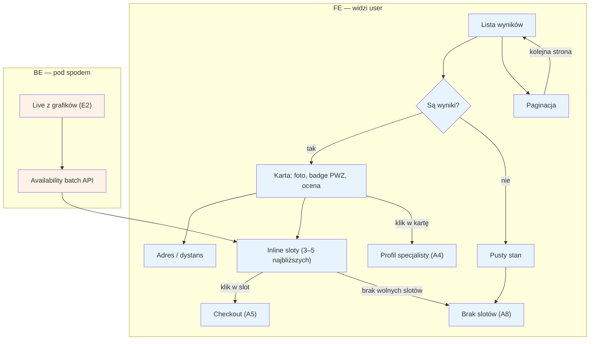

# A3 — Lista wyników

## Notatki
- Priorytet: P0.
- Karta wyniku z mapy: foto, badge PWZ, ocena, adres/dystans, inline sloty (3–5 najbliższych) — klik w slot skraca lejek prosto do [[a5-checkout]] (A5), klik w kartę → [[a4-profil-specjalisty]] (A4).
- Sloty inline liczone przez availability batch API (jedno zapytanie dla całej strony wyników), zawsze live z grafików specjalistów → E2.
- Edge case'y: pusty stan (brak wyników) oraz karta bez wolnych slotów — oba prowadzą do [[a8-brak-slotow]] (A8: podobni + waitlista).
- Cold start Kraków (mało wyników): jak nie wyglądać martwo — otwarty temat z S5.

## Co opisuje ten diagram
Pokazuje listę specjalistów po wyszukiwaniu: każda karta zawiera zdjęcie, potwierdzenie uprawnień (badge PWZ), ocenę, adres z odległością oraz kilka najbliższych wolnych terminów. W tle system na bieżąco pobiera dostępność z grafików specjalistów. Kliknięcie w kartę prowadzi do profilu (A4), kliknięcie w termin — prosto do rezerwacji (A5), a brak wyników lub wolnych terminów — do ścieżki „podobni + waitlista" (A8).

## Powiązane diagramy
| ID | Diagram | Jak się łączy |
|---|---|---|
| A4 | [a4-profil-specjalisty.md](a4-profil-specjalisty.md) | klik w kartę specjalisty otwiera jego profil |
| A5 | [a5-checkout.md](a5-checkout.md) | klik w inline slot prowadzi wprost do checkoutu |
| A8 | [a8-brak-slotow.md](a8-brak-slotow.md) | pusty stan lub karta bez wolnych slotów kieruje do „podobni + waitlista" |
| E2 | [../e-panel/e2-grafik-dostepnosc.md](../e-panel/e2-grafik-dostepnosc.md) | sloty inline liczone na żywo z grafików specjalistów |

## Słownik
| Pojęcie | Wyjaśnienie |
|---|---|
| Slot | Konkretny wolny termin wizyty w kalendarzu specjalisty. |
| Inline sloty | 3–5 najbliższych wolnych terminów pokazanych bezpośrednio na karcie wyniku. |
| Badge PWZ | Oznaczenie potwierdzające, że numer prawa wykonywania zawodu specjalisty został zweryfikowany. |
| Availability batch API | Jedno zbiorcze zapytanie do systemu, które pobiera dostępność wszystkich specjalistów z całej strony wyników naraz. |
| Live z grafików | Terminy pochodzą prosto z aktualnych kalendarzy specjalistów, bez opóźnienia. |
| Paginacja | Podział długiej listy wyników na kolejne strony. |
| Pusty stan | Ekran pokazywany, gdy wyszukiwanie nie zwróciło żadnych wyników. |
| Cold start | Sytuacja startowa, gdy w serwisie jest jeszcze mało specjalistów i lista mogłaby wyglądać na martwą. |
