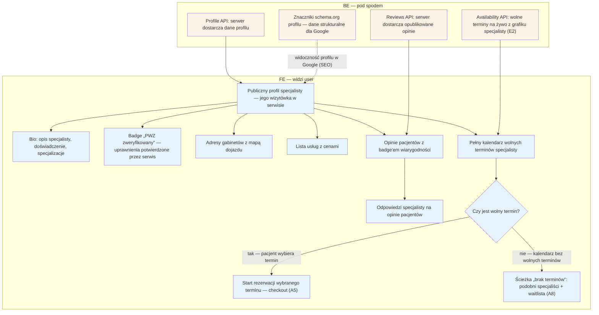

# A4 — Profil specjalisty

## Notatki
- Priorytet: P0.
- Wejścia na profil: z listy [[a3-lista-wynikow]] (A3) lub bezpośrednio z SEO (A1, URL `/{imie-nazwisko}/{miasto}` wg S5).
- Badge "PWZ zweryfikowany" = wynik weryfikacji D1/F1; adresy multi (D2/E11); usługi+ceny z E3; kalendarz live z modelu dostępności E2.
- Opinie z badge'ami wiarygodności + odpowiedzi specjalisty — pipeline opinii: B5 → F2 → E8; publikowane przez reviews API.
- Wybór slotu → [[a5-checkout]] (A5); brak wolnych terminów → [[a8-brak-slotow]] (A8).
- Schema.org profilu odświeżane przez G12.

## Co opisuje ten diagram
Przedstawia publiczny profil specjalisty — wizytówkę z bio, potwierdzeniem uprawnień (badge PWZ), adresami na mapie, usługami z cenami, pełnym kalendarzem oraz opiniami pacjentów wraz z odpowiedziami specjalisty. Pacjent trafia tu z listy wyników albo bezpośrednio z Google. Flow kończy się wyborem wolnego terminu i przejściem do rezerwacji (A5) albo — gdy terminów brak — przejściem do ścieżki „podobni + waitlista" (A8).

## Aktorzy w tym flow

| Rola | Kto to jest | Co robi w tym flow |
|---|---|---|
| **Pacjent** | użytkownik strony; u logopedów zwykle rodzic rezerwujący wizytę dla dziecka | przegląda profil (opis, ceny, opinie, adresy), sprawdza kalendarz i wybiera wolny termin |
| **Specjalista** (logopeda) | usługodawca przyjmujący wizyty, właściciel profilu | w tym flow nie klika niczego na żywo — profil pokazuje treści, które wcześniej przygotował: bio, usługi z cenami, grafik dostępności oraz jego odpowiedzi na opinie |
| **FE** (interfejs) | to, co użytkownik widzi w przeglądarce — strona profilu | składa profil z sekcji (bio, badge, adresy, usługi, kalendarz, opinie) i prowadzi pacjenta do wyboru terminu |
| **Backend** | serwer platformy — część systemu niewidoczna dla użytkownika | dostarcza dane profilu, opublikowane opinie i aktualne wolne terminy; utrzymuje znaczniki schema.org, dzięki którym profil jest dobrze widoczny w Google |

## Objaśnienie bloków

| Blok | Co to znaczy w praktyce | Kto tu działa |
|---|---|---|
| Publiczny profil specjalisty | Punkt startu: strona-wizytówka jednego specjalisty, dostępna bez logowania. Pacjent trafia tu z listy wyników (A3) albo prosto z Google (A1). | Pacjent, FE |
| Bio | Sekcja z opisem specjalisty: kim jest, jakie ma doświadczenie i czym się zajmuje. Treść przygotowuje sam specjalista. | FE (treść od Specjalisty) |
| Badge „PWZ zweryfikowany" | Znaczek przy nazwisku informujący, że serwis sprawdził numer prawa wykonywania zawodu specjalisty (proces D1, zatwierdzany przez admina w F1). Dla pacjenta to sygnał: „to prawdziwy, uprawniony specjalista". | FE |
| Adresy gabinetów z mapą | Sekcja z miejscami przyjęć — specjalista może mieć kilka adresów; każdy pokazany na mapie. | FE (dane od Specjalisty) |
| Lista usług z cenami | Cennik: jakie usługi specjalista oferuje (np. diagnoza, terapia) i ile kosztują. Ceny pochodzą z panelu specjalisty (E3) — bez ukrytych kosztów. | FE (dane od Specjalisty) |
| Pełny kalendarz wolnych terminów | Kalendarz ze wszystkimi wolnymi terminami specjalisty (nie tylko 3–5 najbliższych jak na liście wyników). Terminy pobierane na żywo z grafiku, więc są zawsze aktualne. | Pacjent, FE |
| Opinie pacjentów z badge'em wiarygodności | Sekcja opinii. Badge wiarygodności oznacza, że opinię napisał pacjent po faktycznie odbytej wizycie — opinie nie biorą się „z powietrza" (pipeline: B5 → moderacja F2). | FE |
| Odpowiedzi specjalisty na opinie | Pod opinią może być widoczna publiczna odpowiedź specjalisty — np. podziękowanie albo odniesienie się do krytyki. | FE (treść od Specjalisty) |
| Czy jest wolny termin? | Rozwidlenie: jeśli w kalendarzu jest wolny termin, pacjent może go wybrać i przejść do rezerwacji; jeśli nie ma żadnego — pacjent dostaje ścieżkę awaryjną. | Pacjent, FE |
| Start rezerwacji — checkout (A5) | Wyjście z flow: pacjent wybrał termin i zaczyna proces rezerwacji — opisany w diagramie A5. | Pacjent |
| Ścieżka „brak terminów" (A8) | Wyjście awaryjne: brak wolnych terminów kieruje pacjenta do propozycji podobnych specjalistów i zapisu na listę oczekujących (waitlistę) — diagram A8. | Pacjent, FE |
| Profile API | Usługa serwera, która dostarcza na stronę wszystkie dane profilu (bio, adresy, usługi, badge). | Backend |
| Reviews API | Usługa serwera, która dostarcza na profil opinie — wyłącznie te już opublikowane po moderacji. | Backend |
| Availability API (E2) | Usługa serwera, która na bieżąco podaje wolne terminy z grafiku prowadzonego przez specjalistę w jego panelu (E2). | Backend |
| Znaczniki schema.org | Specjalne oznaczenia w kodzie strony, niewidoczne dla pacjenta, które pomagają Google zrozumieć profil (np. pokazać ocenę w wynikach wyszukiwania). Odświeżane automatycznie (G12). | Backend |

## Powiązane diagramy
| ID | Diagram | Jak się łączy |
|---|---|---|
| A1 | [a1-wejscie-seo.md](a1-wejscie-seo.md) | wejście na profil bezpośrednio z SEO (URL /{imie-nazwisko}/{miasto}) |
| A3 | [a3-lista-wynikow.md](a3-lista-wynikow.md) | wejście na profil z karty na liście wyników |
| A5 | [a5-checkout.md](a5-checkout.md) | wybór wolnego slotu uruchamia checkout |
| A8 | [a8-brak-slotow.md](a8-brak-slotow.md) | brak wolnych terminów kieruje do „podobni + waitlista" |
| D1 | [../cd-specjalista-onboarding/d1-weryfikacja-pwz.md](../cd-specjalista-onboarding/d1-weryfikacja-pwz.md) | weryfikacja PWZ jest źródłem badge'a na profilu |
| F1 | [../f-backoffice/f1-kolejka-weryfikacji-pwz.md](../f-backoffice/f1-kolejka-weryfikacji-pwz.md) | admin zatwierdza weryfikację, od której zależy badge |
| D2 | [../cd-specjalista-onboarding/d2-stan-w-trakcie.md](../cd-specjalista-onboarding/d2-stan-w-trakcie.md) | adresy (multi) uzupełniane podczas onboardingu |
| E11 | [../e-panel/e11-ustawienia.md](../e-panel/e11-ustawienia.md) | adresy zarządzane później w ustawieniach specjalisty |
| E3 | [../e-panel/e3-uslugi-ceny.md](../e-panel/e3-uslugi-ceny.md) | usługi i ceny na profilu pochodzą z panelu specjalisty |
| E2 | [../e-panel/e2-grafik-dostepnosc.md](../e-panel/e2-grafik-dostepnosc.md) | kalendarz na profilu liczony live z modelu dostępności |
| B5 | [../b-pacjent-konto/b5-wystawienie-opinii.md](../b-pacjent-konto/b5-wystawienie-opinii.md) | początek pipeline'u opinii — pacjent wystawia opinię |
| F2 | [../f-backoffice/f2-moderacja-opinii.md](../f-backoffice/f2-moderacja-opinii.md) | moderacja opinii przed publikacją na profilu |
| E8 | [../e-panel/e8-approval-opinie.md](../e-panel/e8-approval-opinie.md) | odpowiedzi specjalisty na opinie widoczne na profilu |
| G12 | [../00-core/00-katalog-eventow.md](../00-core/00-katalog-eventow.md) | SEO joby odświeżają schema.org profilu |

## Słownik
| Pojęcie | Wyjaśnienie |
|---|---|
| PWZ | Prawo wykonywania zawodu — numer potwierdzający uprawnienia specjalisty. |
| Badge „PWZ zweryfikowany" | Znaczek na profilu informujący, że uprawnienia specjalisty sprawdził serwis. |
| Badge wiarygodności opinii | Oznaczenie, że opinia pochodzi od pacjenta po faktycznie odbytej wizycie. |
| Slot | Konkretny wolny termin wizyty w kalendarzu specjalisty. |
| Availability API | Usługa podająca aktualną dostępność terminów z grafiku specjalisty. |
| Reviews API | Usługa dostarczająca na profil opublikowane opinie pacjentów. |
| Pipeline opinii | Droga opinii od wystawienia przez pacjenta, przez moderację, do publikacji i odpowiedzi specjalisty. |
| Schema.org | Znaczniki w kodzie strony pomagające Google zrozumieć profil (np. pokazać ocenę w wynikach). |
| SEO | Działania, dzięki którym profil jest widoczny w Google pod własnym adresem. |
| Bio | Opis specjalisty na profilu: doświadczenie, specjalizacje, sposób pracy. |
| Checkout | Proces rezerwacji od kliknięcia terminu do potwierdzenia — wieloetapowy formularz opisany w A5. |
| Waitlista | Lista oczekujących pacjentów, którym system proponuje zwolniony termin. |
| Profile API | Usługa serwerowa dostarczająca na stronę dane profilu specjalisty. |
| FE (frontend) | Interfejs — to, co użytkownik widzi i klika w przeglądarce. |
| BE (backend) | Serwer platformy — część systemu działająca „pod spodem", niewidoczna dla użytkownika. |
| A1, A3, A5, A8, E2, G12 | Identyfikatory innych flowów z mapy projektu — każdy ma własny diagram (A1: wejście z SEO, A3: lista wyników, A5: checkout, A8: brak slotów, E2: grafik, G12: joby SEO). |
