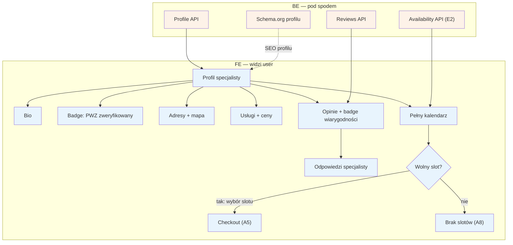

# A4 — Profil specjalisty

## Notatki
- Priorytet: P0.
- Wejścia na profil: z listy [[a3-lista-wynikow]] (A3) lub bezpośrednio z SEO (A1, URL `/{imie-nazwisko}/{miasto}` wg S5).
- Badge "PWZ zweryfikowany" = wynik weryfikacji D1/F1; adresy multi (D2/E11); usługi+ceny z E3; kalendarz live z modelu dostępności E2.
- Opinie z badge'ami wiarygodności + odpowiedzi specjalisty — pipeline opinii: B5 → F2 → E8; publikowane przez reviews API.
- Wybór slotu → [[a5-checkout]] (A5); brak wolnych terminów → [[a8-brak-slotow]] (A8).
- Schema.org profilu odświeżane przez G12.

## Co opisuje ten diagram
Przedstawia publiczny profil specjalisty — wizytówkę z bio, potwierdzeniem uprawnień (badge PWZ), adresami na mapie, usługami z cenami, pełnym kalendarzem oraz opiniami pacjentów wraz z odpowiedziami specjalisty. Pacjent trafia tu z listy wyników albo bezpośrednio z Google. Flow kończy się wyborem wolnego terminu i przejściem do rezerwacji (A5) albo — gdy terminów brak — przejściem do ścieżki „podobni + waitlista" (A8).

## Powiązane diagramy
| ID | Diagram | Jak się łączy |
|---|---|---|
| A1 | [a1-wejscie-seo.md](a1-wejscie-seo.md) | wejście na profil bezpośrednio z SEO (URL /{imie-nazwisko}/{miasto}) |
| A3 | [a3-lista-wynikow.md](a3-lista-wynikow.md) | wejście na profil z karty na liście wyników |
| A5 | [a5-checkout.md](a5-checkout.md) | wybór wolnego slotu uruchamia checkout |
| A8 | [a8-brak-slotow.md](a8-brak-slotow.md) | brak wolnych terminów kieruje do „podobni + waitlista" |
| D1 | [../cd-specjalista-onboarding/d1-weryfikacja-pwz.md](../cd-specjalista-onboarding/d1-weryfikacja-pwz.md) | weryfikacja PWZ jest źródłem badge'a na profilu |
| F1 | [../f-backoffice/f1-kolejka-weryfikacji-pwz.md](../f-backoffice/f1-kolejka-weryfikacji-pwz.md) | admin zatwierdza weryfikację, od której zależy badge |
| D2 | [../cd-specjalista-onboarding/d2-stan-w-trakcie.md](../cd-specjalista-onboarding/d2-stan-w-trakcie.md) | adresy (multi) uzupełniane podczas onboardingu |
| E11 | [../e-panel/e11-ustawienia.md](../e-panel/e11-ustawienia.md) | adresy zarządzane później w ustawieniach specjalisty |
| E3 | [../e-panel/e3-uslugi-ceny.md](../e-panel/e3-uslugi-ceny.md) | usługi i ceny na profilu pochodzą z panelu specjalisty |
| E2 | [../e-panel/e2-grafik-dostepnosc.md](../e-panel/e2-grafik-dostepnosc.md) | kalendarz na profilu liczony live z modelu dostępności |
| B5 | [../b-pacjent-konto/b5-wystawienie-opinii.md](../b-pacjent-konto/b5-wystawienie-opinii.md) | początek pipeline'u opinii — pacjent wystawia opinię |
| F2 | [../f-backoffice/f2-moderacja-opinii.md](../f-backoffice/f2-moderacja-opinii.md) | moderacja opinii przed publikacją na profilu |
| E8 | [../e-panel/e8-approval-opinie.md](../e-panel/e8-approval-opinie.md) | odpowiedzi specjalisty na opinie widoczne na profilu |
| G12 | [../00-core/00-katalog-eventow.md](../00-core/00-katalog-eventow.md) | SEO joby odświeżają schema.org profilu |

## Słownik
| Pojęcie | Wyjaśnienie |
|---|---|
| PWZ | Prawo wykonywania zawodu — numer potwierdzający uprawnienia specjalisty. |
| Badge „PWZ zweryfikowany" | Znaczek na profilu informujący, że uprawnienia specjalisty sprawdził serwis. |
| Badge wiarygodności opinii | Oznaczenie, że opinia pochodzi od pacjenta po faktycznie odbytej wizycie. |
| Slot | Konkretny wolny termin wizyty w kalendarzu specjalisty. |
| Availability API | Usługa podająca aktualną dostępność terminów z grafiku specjalisty. |
| Reviews API | Usługa dostarczająca na profil opublikowane opinie pacjentów. |
| Pipeline opinii | Droga opinii od wystawienia przez pacjenta, przez moderację, do publikacji i odpowiedzi specjalisty. |
| Schema.org | Znaczniki w kodzie strony pomagające Google zrozumieć profil (np. pokazać ocenę w wynikach). |
| SEO | Działania, dzięki którym profil jest widoczny w Google pod własnym adresem. |
