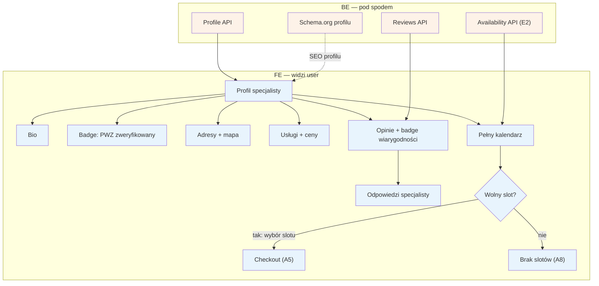

# A4 — Profil specjalisty

## Notatki
- Priorytet: P0.
- Wejścia na profil: z listy [[a3-lista-wynikow]] (A3) lub bezpośrednio z SEO (A1, URL `/{imie-nazwisko}/{miasto}` wg S5).
- Badge "PWZ zweryfikowany" = wynik weryfikacji D1/F1; adresy multi (D2/E11); usługi+ceny z E3; kalendarz live z modelu dostępności E2.
- Opinie z badge'ami wiarygodności + odpowiedzi specjalisty — pipeline opinii: B5 → F2 → E8; publikowane przez reviews API.
- Wybór slotu → [[a5-checkout]] (A5); brak wolnych terminów → [[a8-brak-slotow]] (A8).
- Schema.org profilu odświeżane przez G12.
