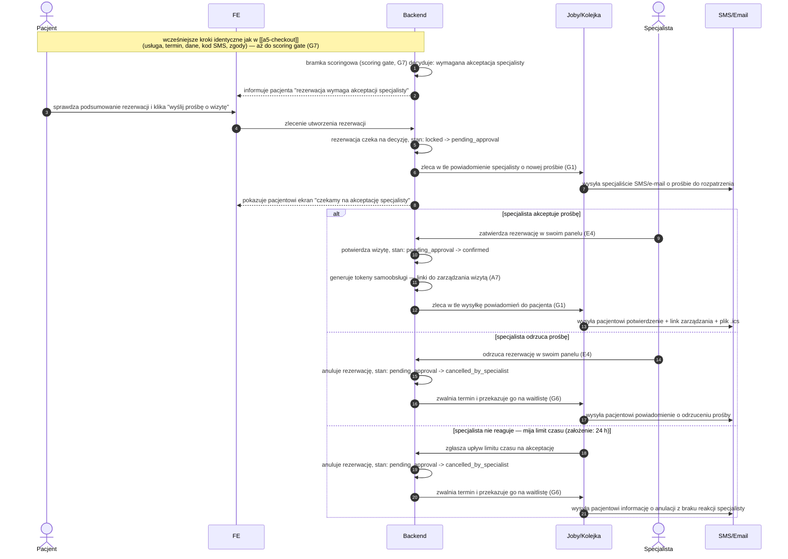

# A5 — Checkout: wariant akceptacji specjalisty (scoring gate)

## Notatki
- Wariant scoring gate (G7): rezerwacja tylko za ręczną akceptacją specjalisty w panelu E4 ("ręczna akceptacja, gdy scoring wymaga").
- Timeout braku reakcji specjalisty: MAPA NIE ROZSTRZYGA — założenie minimalne: 24 h od utworzenia, potem auto-anulacja; zgłoszone w rozbieżnościach.
- Odrzucenie i timeout mapowane na cancelled_by_specialist (kanon CORE-STANY nie ma stanu "rejected") — założenie minimalne.
- Zwolniony slot po odrzuceniu/timeout trafia do waitlisty (G6) — analogicznie do B3/E5.
- Propozycje alternatyw dla pacjenta po odrzuceniu (wzorzec E5/A8: podobni specjaliści, inne sloty) — mapa nie rozstrzyga dla tego wariantu, pominięto.
- Kroki wcześniejsze (usługa, slot, lock G5, B7 "dla kogo", OTP, zgody RODO) — identyczne jak w [[a5-checkout]].
- Po akceptacji: pełne A7 (tokeny samoobsługi, email + SMS z linkiem zarządzania, .ics, enqueue G1).
- ⚠️ Flaga 2 (płatności online w POC): OTWARTA — decyzją użytkownika z 2026-07-15 dokumentujemy oba warianty; ten wariant jest zarazem fallbackiem sankcji, gdyby POC ruszył bez płatności online (zamiast [[a5-checkout-wariant-przedplata]]).
- Powiązania: CORE-STANY, G5, G7, B7, A7, E4, G1, G6, [[a5-checkout]], [[a5-checkout-wariant-przedplata]].

## Co opisuje ten diagram
Wariant rezerwacji, w którym system — na podstawie scoringu pacjenta — wymaga, aby specjalista ręcznie zaakceptował prośbę o wizytę. Uczestniczą pacjent, specjalista (działający w swoim panelu) oraz system wysyłający powiadomienia. Flow zaczyna się od decyzji bramki scoringowej „wymagana akceptacja", a kończy potwierdzeniem wizyty po akceptacji albo anulacją i zwolnieniem terminu, gdy specjalista odrzuci prośbę lub nie zareaguje w ciągu 24 godzin.

## Aktorzy w tym flow

| Rola | Kto to jest | Co robi w tym flow |
|---|---|---|
| **Pacjent** | użytkownik strony; u logopedów najczęściej rodzic rezerwujący wizytę dla dziecka (B7) | sprawdza podsumowanie i wysyła prośbę o wizytę, potem czeka na decyzję specjalisty |
| **Specjalista** | logopeda/lekarz — usługodawca, właściciel kalendarza wizyt | dostaje powiadomienie o prośbie i w swoim panelu (E4) akceptuje ją albo odrzuca |
| **FE** (interfejs) | strona serwisu w przeglądarce pacjenta — to, co pacjent widzi na ekranie | pokazuje informację o wymaganej akceptacji, ekran „czekamy na akceptację" oraz wynik |
| **Backend** (system) | serwer platformy — część działająca po stronie serwisu, niewidoczna dla pacjenta | podejmuje decyzję bramki scoringowej, tworzy rezerwację, zmienia jej stany, generuje tokeny samoobsługi |
| **Joby/Kolejka** | zadania wykonywane w tle, poza główną „rozmową" pacjenta z systemem | wysyła powiadomienia, pilnuje limitu czasu na decyzję (24 h), przekazuje zwolniony termin na waitlistę |
| **SMS/Email** | bramka powiadomień — usługa wysyłająca SMS-y i e-maile | zawiadamia specjalistę o prośbie, a pacjenta o potwierdzeniu, odrzuceniu lub anulacji |

## Objaśnienie kroków

| Kroki (nr) | Co to znaczy w praktyce | Kto tu działa |
|---|---|---|
| 1–2 | Bramka scoringowa (G7) uznała, że pacjent — z powodu historii nieobecności — może zarezerwować wizytę tylko za zgodą specjalisty. Pacjent widzi informację, że rezerwacja wymaga akceptacji. | Backend, FE |
| 3–5 | Pacjent sprawdza podsumowanie i klika „wyślij prośbę o wizytę". System tworzy rezerwację w stanie oczekiwania na decyzję (pending_approval) — termin jest trzymany dla pacjenta, ale wizyta nie jest jeszcze potwierdzona. | Pacjent, FE, Backend |
| 6–7 | System zleca w tle powiadomienie: specjalista dostaje SMS/e-mail, że w jego panelu czeka prośba o wizytę do rozpatrzenia. | Backend, Joby/Kolejka, SMS/Email |
| 8 | Pacjent widzi ekran „czekamy na akceptację specjalisty" — na tym etapie może tylko czekać na decyzję. | Backend, FE |
| 9–13 | Akceptacja: specjalista zatwierdza prośbę w swoim panelu (E4). Wizyta zostaje potwierdzona (stan confirmed), system generuje tokeny samoobsługi (linki, którymi pacjent później zmieni lub odwoła wizytę bez logowania) i wysyła pacjentowi potwierdzenie z linkiem zarządzania oraz plikiem .ics (termin do wgrania do kalendarza). | Specjalista, Backend, Joby/Kolejka, SMS/Email |
| 14–17 | Odrzucenie: specjalista odrzuca prośbę w panelu (E4). Rezerwacja przechodzi w stan cancelled_by_specialist, zwolniony termin trafia na waitlistę (G6), a pacjent dostaje powiadomienie o odrzuceniu. | Specjalista, Backend, Joby/Kolejka, SMS/Email |
| 18–21 | Brak reakcji: jeśli specjalista nie podejmie decyzji w założonym czasie (24 h), kolejka zgłasza upływ limitu i system sam anuluje rezerwację (również stan cancelled_by_specialist). Termin wraca na waitlistę (G6), a pacjent dostaje informację o anulacji. | Joby/Kolejka, Backend, SMS/Email |

## Powiązane diagramy
| ID | Diagram | Jak się łączy |
|---|---|---|
| CORE-STANY | [../00-core/00-stany-rezerwacji.md](../00-core/00-stany-rezerwacji.md) | stany kanoniczne: pending_approval → confirmed / cancelled_by_specialist |
| A5 | [a5-checkout.md](a5-checkout.md) | wspólne kroki początkowe (lock, B7, OTP, zgody) aż do scoring gate |
| A5 (przedpłata) | [a5-checkout-wariant-przedplata.md](a5-checkout-wariant-przedplata.md) | alternatywna sankcja gate'u (przedpłata), którą ten wariant zastępuje bez płatności online |
| A7 | [a7-potwierdzenie.md](a7-potwierdzenie.md) | po akceptacji pełne potwierdzenie: tokeny, email + SMS, .ics |
| A8 | [a8-brak-slotow.md](a8-brak-slotow.md) | wzorzec „podobni specjaliści" po odrzuceniu (tu świadomie pominięty) |
| B3 | [../b-pacjent-konto/b3-odwolanie-tokenem.md](../b-pacjent-konto/b3-odwolanie-tokenem.md) | analogiczny mechanizm zwalniania slotu na waitlistę |
| B7 | [../b-pacjent-konto/b7-pacjent-podopieczny.md](../b-pacjent-konto/b7-pacjent-podopieczny.md) | krok „dla kogo wizyta" we wcześniejszej, wspólnej części flow |
| E4 | [../e-panel/e4-rezerwacje.md](../e-panel/e4-rezerwacje.md) | specjalista akceptuje lub odrzuca prośbę w panelu rezerwacji |
| E5 | [../e-panel/e5-odwolanie-pojedyncze.md](../e-panel/e5-odwolanie-pojedyncze.md) | analogia: zwalnianie slotu i propozycje alternatyw dla pacjenta |
| G1 | [../00-core/00-katalog-eventow.md](../00-core/00-katalog-eventow.md) | powiadomienia do specjalisty (prośba) i pacjenta (wynik) |
| G5 | [../g-silniki/g5-slot-lock.md](../g-silniki/g5-slot-lock.md) | lock slotu we wcześniejszych, wspólnych krokach checkoutu |
| G6 | [../g-silniki/g6-waitlist-engine.md](../g-silniki/g6-waitlist-engine.md) | slot zwolniony po odrzuceniu/timeoucie trafia na waitlistę |
| G7 | [../g-silniki/g7-scoring-engine.md](../g-silniki/g7-scoring-engine.md) | źródło decyzji o wymaganej ręcznej akceptacji |

## Słownik
| Pojęcie | Wyjaśnienie |
|---|---|
| Scoring gate | Automatyczna bramka oceniająca wiarygodność pacjenta; tu skutkuje wymogiem ręcznej akceptacji. |
| pending_approval | Stan rezerwacji czekającej na decyzję specjalisty. |
| Akceptacja / odrzucenie | Decyzja specjalisty w panelu, czy przyjmuje prośbę o wizytę. |
| Timeout | Limit czasu na reakcję specjalisty (założone 24 h); po jego upływie rezerwacja anuluje się sama. |
| cancelled_by_specialist | Stan rezerwacji anulowanej po stronie specjalisty (odrzucenie lub brak reakcji). |
| Waitlista | Lista oczekujących powiadamianych o zwolnionym terminie. |
| Token samoobsługi | Link dla pacjenta do zarządzania wizytą bez logowania, generowany po akceptacji. |
| .ics | Plik z terminem wizyty do dodania do kalendarza pacjenta. |
| Fallback | Rozwiązanie zapasowe — ten wariant zastępuje przedpłatę, gdyby serwis ruszył bez płatności online. |
| Scoring | Wewnętrzna punktacja wiarygodności pacjenta (historia nieobecności i późnych odwołań) — źródło decyzji bramki. |
| locked | Stan z wcześniejszej, wspólnej części checkoutu — termin zablokowany na 10 minut dla pacjenta (lock G5, TTL). |
| confirmed | Kanoniczny stan „wizyta umówiona" — osiągany tu po akceptacji specjalisty. |
| Panel specjalisty (E4) | Miejsce w serwisie, w którym specjalista zarządza rezerwacjami — tam akceptuje lub odrzuca prośby o wizytę. |
| Kolejka (joby) | Zadania wykonywane w tle: powiadomienia, pilnowanie limitu czasu na decyzję, przekazanie terminu na waitlistę. |
