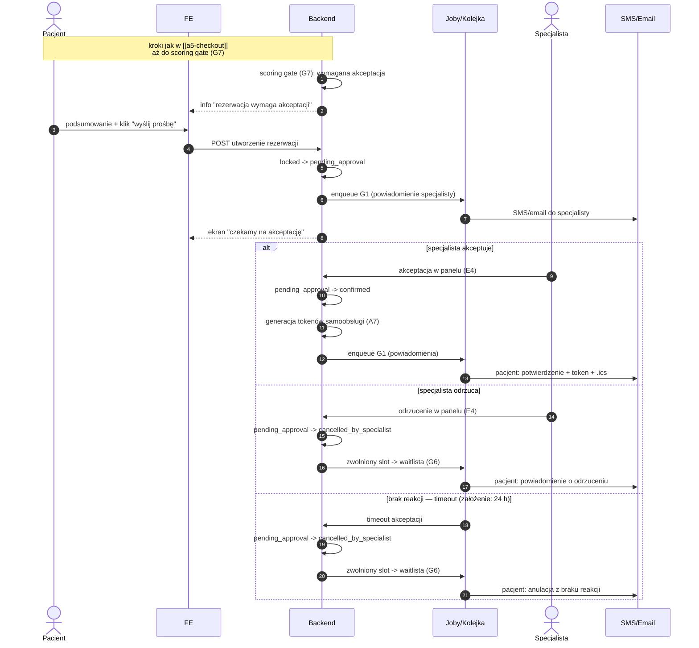

# A5 — Checkout: wariant akceptacji specjalisty (scoring gate)

## Notatki
- Wariant scoring gate (G7): rezerwacja tylko za ręczną akceptacją specjalisty w panelu E4 ("ręczna akceptacja, gdy scoring wymaga").
- Timeout braku reakcji specjalisty: MAPA NIE ROZSTRZYGA — założenie minimalne: 24 h od utworzenia, potem auto-anulacja; zgłoszone w rozbieżnościach.
- Odrzucenie i timeout mapowane na cancelled_by_specialist (kanon CORE-STANY nie ma stanu "rejected") — założenie minimalne.
- Zwolniony slot po odrzuceniu/timeout trafia do waitlisty (G6) — analogicznie do B3/E5.
- Propozycje alternatyw dla pacjenta po odrzuceniu (wzorzec E5/A8: podobni specjaliści, inne sloty) — mapa nie rozstrzyga dla tego wariantu, pominięto.
- Kroki wcześniejsze (usługa, slot, lock G5, B7 "dla kogo", OTP, zgody RODO) — identyczne jak w [[a5-checkout]].
- Po akceptacji: pełne A7 (tokeny samoobsługi, email + SMS z linkiem zarządzania, .ics, enqueue G1).
- ⚠️ Flaga 2 (płatności online w POC): OTWARTA — decyzją użytkownika z 2026-07-15 dokumentujemy oba warianty; ten wariant jest zarazem fallbackiem sankcji, gdyby POC ruszył bez płatności online (zamiast [[a5-checkout-wariant-przedplata]]).
- Powiązania: CORE-STANY, G5, G7, B7, A7, E4, G1, G6, [[a5-checkout]], [[a5-checkout-wariant-przedplata]].
