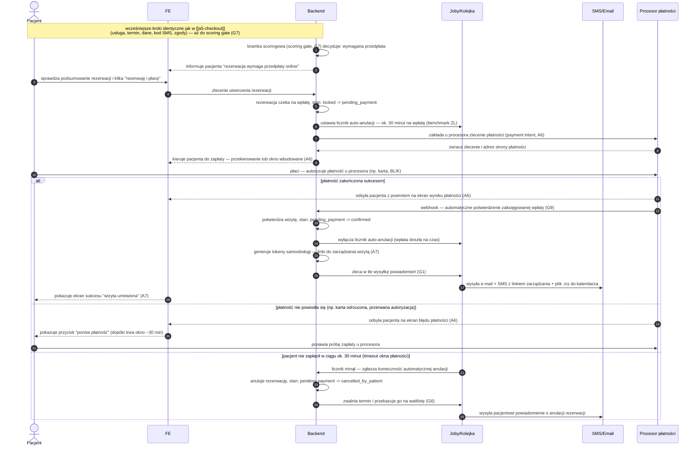

# A5 — Checkout: wariant przedpłaty (scoring gate) + pełne A6 płatność online

## Notatki
- Plik pokrywa W PEŁNI flow A6 (płatność online): payment intent, redirect/embed procesora (PAY), ekran wyniku, obsługa błędu płatności, webhook potwierdzenia (G9), okno na płatność ~30 min (benchmark ZL) + auto-anulacja po timeout.
- Ten sam flow płatności dotyczy dobrowolnego wyboru "płatność online" w wariancie normalnym ([[a5-checkout]]) — różnica: tam brak przymusu gate'u.
- Stany rezerwacji: kanoniczne z CORE-STANY; pending_payment trzyma slot po wygaśnięciu locka G5 (TTL 10 min) — założenie minimalne, mapa nie rozstrzyga relacji lock vs okno płatności.
- Stan po auto-anulacji timeoutu: przyjęto cancelled_by_patient (kanon nie ma stanu "cancelled_by_system") — założenie minimalne, zgłoszone w rozbieżnościach.
- Przy gate przedpłaty opcja "płatność na miejscu" niedostępna — założenie minimalne (sens sankcji scoringowej G7).
- Błąd płatności: retry możliwy tylko w oknie ~30 min; po timeout działa auto-anulacja jak w gałęzi timeout.
- G9 obejmuje też zwroty i reconciliation — poza zakresem tego diagramu.
- B7 (dla kogo wizyta) i OTP — kroki wcześniejsze, identyczne jak w [[a5-checkout]].
- ⚠️ Flaga 2 (płatności online w POC): OTWARTA — decyzją użytkownika z 2026-07-15 dokumentujemy oba warianty; jeśli POC ruszy bez płatności online, ten wariant nie działa i sankcją pozostaje [[a5-checkout-wariant-akceptacja]].
- Powiązania: CORE-STANY, G5, G7, B7, A7, A6, G1, G6, G9, [[a5-checkout]], [[a5-checkout-wariant-akceptacja]].

## Co opisuje ten diagram
Wariant rezerwacji, w którym system — na podstawie scoringu pacjenta — wymaga zapłaty z góry; diagram zawiera zarazem pełny przebieg płatności online (A6). Uczestniczą pacjent, system oraz zewnętrzny procesor płatności, a w tle kolejka zadań i powiadomienia. Flow zaczyna się od decyzji bramki scoringowej „wymagana przedpłata", a kończy potwierdzeniem rezerwacji po udanej płatności albo automatyczną anulacją i zwolnieniem terminu, gdy pacjent nie zapłaci w ciągu ok. 30 minut.

## Aktorzy w tym flow

| Rola | Kto to jest | Co robi w tym flow |
|---|---|---|
| **Pacjent** | użytkownik strony; u logopedów najczęściej rodzic rezerwujący wizytę dla dziecka (B7) | sprawdza podsumowanie, klika „rezerwuję i płacę", autoryzuje płatność u procesora, w razie błędu ponawia próbę |
| **FE** (interfejs) | strona serwisu w przeglądarce pacjenta — to, co pacjent widzi na ekranie | pokazuje informację o wymaganej przedpłacie, kieruje do płatności, wyświetla ekran wyniku, błędu lub sukcesu |
| **Backend** (system) | serwer platformy — część działająca po stronie serwisu, niewidoczna dla pacjenta | podejmuje decyzję bramki scoringowej, tworzy rezerwację, zakłada zlecenie płatności, odbiera webhook i zmienia stany rezerwacji |
| **Joby/Kolejka** | zadania wykonywane w tle, poza główną „rozmową" pacjenta z systemem | odlicza okno ok. 30 minut na wpłatę, wykonuje automatyczną anulację, wysyła powiadomienia, przekazuje zwolniony termin na waitlistę |
| **Procesor płatności** | zewnętrzna firma obsługująca płatności online (karty, BLIK itp.) | przyjmuje i autoryzuje wpłatę pacjenta, odsyła go na ekran wyniku, potwierdza wpłatę webhookiem (G9) |
| **SMS/Email** | bramka powiadomień — usługa wysyłająca SMS-y i e-maile | dostarcza potwierdzenie z linkiem zarządzania i plikiem .ics albo powiadomienie o anulacji |

## Objaśnienie kroków

| Kroki (nr) | Co to znaczy w praktyce | Kto tu działa |
|---|---|---|
| 1–2 | Bramka scoringowa (G7) uznała, że pacjent — z powodu historii nieobecności — musi zapłacić z góry. Pacjent widzi informację, że rezerwacja wymaga przedpłaty online; płatność na miejscu jest w tym wariancie niedostępna. | Backend, FE |
| 3–5 | Pacjent sprawdza podsumowanie i klika „rezerwuję i płacę". System tworzy rezerwację w stanie oczekiwania na wpłatę (pending_payment) — termin jest trzymany dla pacjenta, ale wizyta nie jest jeszcze potwierdzona. | Pacjent, FE, Backend |
| 6 | System ustawia w tle licznik: pacjent ma ok. 30 minut na zapłatę (długość okna wzorowana na praktyce rynkowej — benchmark ZL). Jeśli w tym czasie wpłata nie dojdzie, rezerwacja anuluje się sama. | Backend, Joby/Kolejka |
| 7–9 | System zakłada u zewnętrznego procesora płatności zlecenie (payment intent) i dostaje adres strony płatności. Pacjent zostaje przekierowany na stronę procesora albo widzi okno płatności wbudowane w serwis. | Backend, Procesor płatności, FE |
| 10 | Pacjent płaci — autoryzuje płatność (np. podaje dane karty albo zatwierdza kod BLIK) bezpośrednio u procesora, poza naszym serwisem. | Pacjent, Procesor płatności |
| 11–13 | Płatność udana: procesor odsyła pacjenta na ekran wyniku, a niezależnie od tego wysyła do systemu webhook — automatyczne potwierdzenie zaksięgowanej wpłaty (G9). Dopiero webhook (a nie sam powrót pacjenta na stronę) potwierdza wizytę: stan zmienia się na confirmed. | Procesor płatności, Backend, FE |
| 14 | System wyłącza licznik auto-anulacji — wpłata doszła na czas, więc odliczanie nie jest już potrzebne. | Backend, Joby/Kolejka |
| 15–18 | System generuje tokeny samoobsługi (linki, którymi pacjent później zmieni lub odwoła wizytę bez logowania) i zleca w tle powiadomienia: pacjent dostaje e-mail + SMS z linkiem zarządzania i plikiem .ics (termin do wgrania do kalendarza), a na ekranie widzi potwierdzenie „wizyta umówiona" (A7). | Backend, Joby/Kolejka, SMS/Email, FE |
| 19–21 | Płatność nieudana (np. karta odrzucona, przerwana autoryzacja): pacjent widzi ekran błędu i przycisk „ponów płatność". Może próbować ponownie, dopóki trwa okno ok. 30 minut. | Procesor płatności, FE, Pacjent |
| 22–25 | Timeout: pacjent nie zapłacił w ciągu ok. 30 minut. Licznik w tle uruchamia automatyczną anulację — rezerwacja przechodzi w cancelled_by_patient (kanon stanów nie ma osobnego stanu „anulowana przez system"), zwolniony termin trafia na waitlistę (G6), a pacjent dostaje powiadomienie o anulacji. | Joby/Kolejka, Backend, SMS/Email |

## Powiązane diagramy
| ID | Diagram | Jak się łączy |
|---|---|---|
| CORE-STANY | [../00-core/00-stany-rezerwacji.md](../00-core/00-stany-rezerwacji.md) | stany kanoniczne: pending_payment → confirmed / cancelled_by_patient |
| A5 | [a5-checkout.md](a5-checkout.md) | wspólne kroki początkowe (lock, B7, OTP, zgody) aż do scoring gate |
| A5 (akceptacja) | [a5-checkout-wariant-akceptacja.md](a5-checkout-wariant-akceptacja.md) | alternatywna sankcja gate'u; fallback, gdyby POC ruszył bez płatności online |
| A7 | [a7-potwierdzenie.md](a7-potwierdzenie.md) | ekran sukcesu i tokeny samoobsługi po potwierdzeniu płatności |
| B7 | [../b-pacjent-konto/b7-pacjent-podopieczny.md](../b-pacjent-konto/b7-pacjent-podopieczny.md) | krok „dla kogo wizyta" we wcześniejszej, wspólnej części flow |
| G1 | [../00-core/00-katalog-eventow.md](../00-core/00-katalog-eventow.md) | powiadomienia po potwierdzeniu lub anulacji |
| G5 | [../g-silniki/g5-slot-lock.md](../g-silniki/g5-slot-lock.md) | pending_payment przejmuje slot po wygaśnięciu locka (TTL 10 min) |
| G6 | [../g-silniki/g6-waitlist-engine.md](../g-silniki/g6-waitlist-engine.md) | slot zwolniony po timeoucie płatności trafia na waitlistę |
| G7 | [../g-silniki/g7-scoring-engine.md](../g-silniki/g7-scoring-engine.md) | źródło decyzji o przymusowej przedpłacie |
| G9 | [../00-core/00-katalog-eventow.md](../00-core/00-katalog-eventow.md) | webhook procesora płatności potwierdza wpłatę |

## Słownik
| Pojęcie | Wyjaśnienie |
|---|---|
| Gate przedpłaty | Wymóg zapłaty z góry nałożony przez system na pacjentów o obniżonym scoringu. |
| Scoring | Automatyczna ocena wiarygodności pacjenta na podstawie jego historii (np. odwołań, nieobecności). |
| Procesor płatności | Zewnętrzna firma obsługująca płatności online (karty, BLIK itp.). |
| Payment intent | Zlecenie płatności utworzone u procesora, zanim pacjent przejdzie do zapłaty. |
| Redirect / embed | Sposób pokazania płatności: przekierowanie na stronę procesora albo okno wbudowane w serwis. |
| Webhook | Automatyczne powiadomienie wysyłane przez procesora do systemu, że płatność się powiodła. |
| Timer auto-anulacji | Odliczanie ok. 30 minut; jeśli płatność nie dojdzie, system sam anuluje rezerwację. |
| pending_payment | Stan rezerwacji oczekującej na płatność, który trzyma slot dla pacjenta. |
| Waitlista | Lista oczekujących, którzy dostają powiadomienie o zwolnionym terminie. |
| Reconciliation | Okresowe uzgadnianie płatności między systemem a procesorem (poza zakresem tego diagramu). |
| Benchmark ZL | Wzorowanie się na praktyce rynkowej (ZnanyLekarz) — stąd okno płatności ok. 30 minut. |
| Autoryzacja płatności | Moment, w którym pacjent zatwierdza zapłatę u procesora (dane karty, kod BLIK, potwierdzenie w aplikacji banku). |
| Token samoobsługi | Specjalny link, którym pacjent później zmieni lub odwoła wizytę bez logowania. |
| .ics | Plik z terminem wizyty do dodania do kalendarza (Google, Outlook itp.). |
| locked | Stan z wcześniejszej, wspólnej części checkoutu — termin zablokowany na 10 minut dla pacjenta (lock G5, TTL). |
| confirmed / cancelled_by_patient | Kanoniczne stany końcowe tego wariantu: wizyta umówiona albo anulowana po stronie pacjenta (tu: brak wpłaty w terminie). |
| Kolejka (joby) | Zadania wykonywane w tle: licznik auto-anulacji, wysyłka powiadomień, przekazanie terminu na waitlistę. |
| Timeout | Upłynięcie limitu czasu — tu: koniec okna ok. 30 minut na wpłatę, po którym rezerwacja anuluje się automatycznie. |
