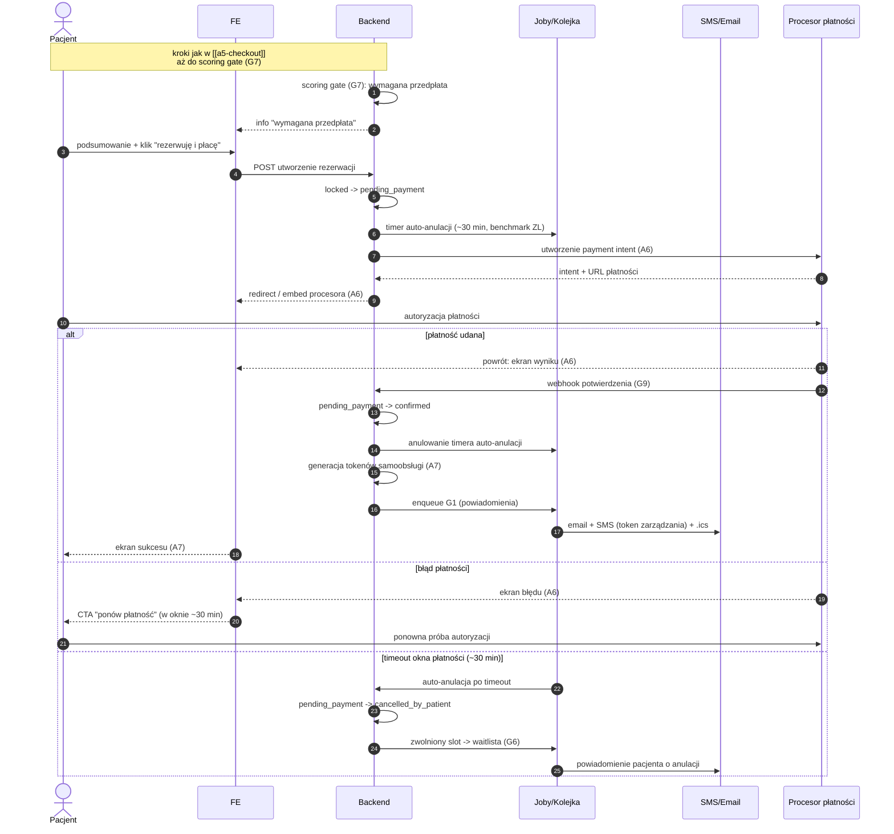

# A5 — Checkout: wariant przedpłaty (scoring gate) + pełne A6 płatność online

## Notatki
- Plik pokrywa W PEŁNI flow A6 (płatność online): payment intent, redirect/embed procesora (PAY), ekran wyniku, obsługa błędu płatności, webhook potwierdzenia (G9), okno na płatność ~30 min (benchmark ZL) + auto-anulacja po timeout.
- Ten sam flow płatności dotyczy dobrowolnego wyboru "płatność online" w wariancie normalnym ([[a5-checkout]]) — różnica: tam brak przymusu gate'u.
- Stany rezerwacji: kanoniczne z CORE-STANY; pending_payment trzyma slot po wygaśnięciu locka G5 (TTL 10 min) — założenie minimalne, mapa nie rozstrzyga relacji lock vs okno płatności.
- Stan po auto-anulacji timeoutu: przyjęto cancelled_by_patient (kanon nie ma stanu "cancelled_by_system") — założenie minimalne, zgłoszone w rozbieżnościach.
- Przy gate przedpłaty opcja "płatność na miejscu" niedostępna — założenie minimalne (sens sankcji scoringowej G7).
- Błąd płatności: retry możliwy tylko w oknie ~30 min; po timeout działa auto-anulacja jak w gałęzi timeout.
- G9 obejmuje też zwroty i reconciliation — poza zakresem tego diagramu.
- B7 (dla kogo wizyta) i OTP — kroki wcześniejsze, identyczne jak w [[a5-checkout]].
- ⚠️ Flaga 2 (płatności online w POC): OTWARTA — decyzją użytkownika z 2026-07-15 dokumentujemy oba warianty; jeśli POC ruszy bez płatności online, ten wariant nie działa i sankcją pozostaje [[a5-checkout-wariant-akceptacja]].
- Powiązania: CORE-STANY, G5, G7, B7, A7, A6, G1, G6, G9, [[a5-checkout]], [[a5-checkout-wariant-akceptacja]].

## Co opisuje ten diagram
Wariant rezerwacji, w którym system — na podstawie scoringu pacjenta — wymaga zapłaty z góry; diagram zawiera zarazem pełny przebieg płatności online (A6). Uczestniczą pacjent, system oraz zewnętrzny procesor płatności, a w tle kolejka zadań i powiadomienia. Flow zaczyna się od decyzji bramki scoringowej „wymagana przedpłata", a kończy potwierdzeniem rezerwacji po udanej płatności albo automatyczną anulacją i zwolnieniem terminu, gdy pacjent nie zapłaci w ciągu ok. 30 minut.

## Powiązane diagramy
| ID | Diagram | Jak się łączy |
|---|---|---|
| CORE-STANY | [../00-core/00-stany-rezerwacji.md](../00-core/00-stany-rezerwacji.md) | stany kanoniczne: pending_payment → confirmed / cancelled_by_patient |
| A5 | [a5-checkout.md](a5-checkout.md) | wspólne kroki początkowe (lock, B7, OTP, zgody) aż do scoring gate |
| A5 (akceptacja) | [a5-checkout-wariant-akceptacja.md](a5-checkout-wariant-akceptacja.md) | alternatywna sankcja gate'u; fallback, gdyby POC ruszył bez płatności online |
| A7 | [a7-potwierdzenie.md](a7-potwierdzenie.md) | ekran sukcesu i tokeny samoobsługi po potwierdzeniu płatności |
| B7 | [../b-pacjent-konto/b7-pacjent-podopieczny.md](../b-pacjent-konto/b7-pacjent-podopieczny.md) | krok „dla kogo wizyta" we wcześniejszej, wspólnej części flow |
| G1 | [../00-core/00-katalog-eventow.md](../00-core/00-katalog-eventow.md) | powiadomienia po potwierdzeniu lub anulacji |
| G5 | [../g-silniki/g5-slot-lock.md](../g-silniki/g5-slot-lock.md) | pending_payment przejmuje slot po wygaśnięciu locka (TTL 10 min) |
| G6 | [../g-silniki/g6-waitlist-engine.md](../g-silniki/g6-waitlist-engine.md) | slot zwolniony po timeoucie płatności trafia na waitlistę |
| G7 | [../g-silniki/g7-scoring-engine.md](../g-silniki/g7-scoring-engine.md) | źródło decyzji o przymusowej przedpłacie |
| G9 | [../00-core/00-katalog-eventow.md](../00-core/00-katalog-eventow.md) | webhook procesora płatności potwierdza wpłatę |

## Słownik
| Pojęcie | Wyjaśnienie |
|---|---|
| Gate przedpłaty | Wymóg zapłaty z góry nałożony przez system na pacjentów o obniżonym scoringu. |
| Scoring | Automatyczna ocena wiarygodności pacjenta na podstawie jego historii (np. odwołań, nieobecności). |
| Procesor płatności | Zewnętrzna firma obsługująca płatności online (karty, BLIK itp.). |
| Payment intent | Zlecenie płatności utworzone u procesora, zanim pacjent przejdzie do zapłaty. |
| Redirect / embed | Sposób pokazania płatności: przekierowanie na stronę procesora albo okno wbudowane w serwis. |
| Webhook | Automatyczne powiadomienie wysyłane przez procesora do systemu, że płatność się powiodła. |
| Timer auto-anulacji | Odliczanie ok. 30 minut; jeśli płatność nie dojdzie, system sam anuluje rezerwację. |
| pending_payment | Stan rezerwacji oczekującej na płatność, który trzyma slot dla pacjenta. |
| Waitlista | Lista oczekujących, którzy dostają powiadomienie o zwolnionym terminie. |
| Reconciliation | Okresowe uzgadnianie płatności między systemem a procesorem (poza zakresem tego diagramu). |
| Benchmark ZL | Wzorowanie się na praktyce rynkowej (ZnanyLekarz) — stąd okno płatności ok. 30 minut. |
