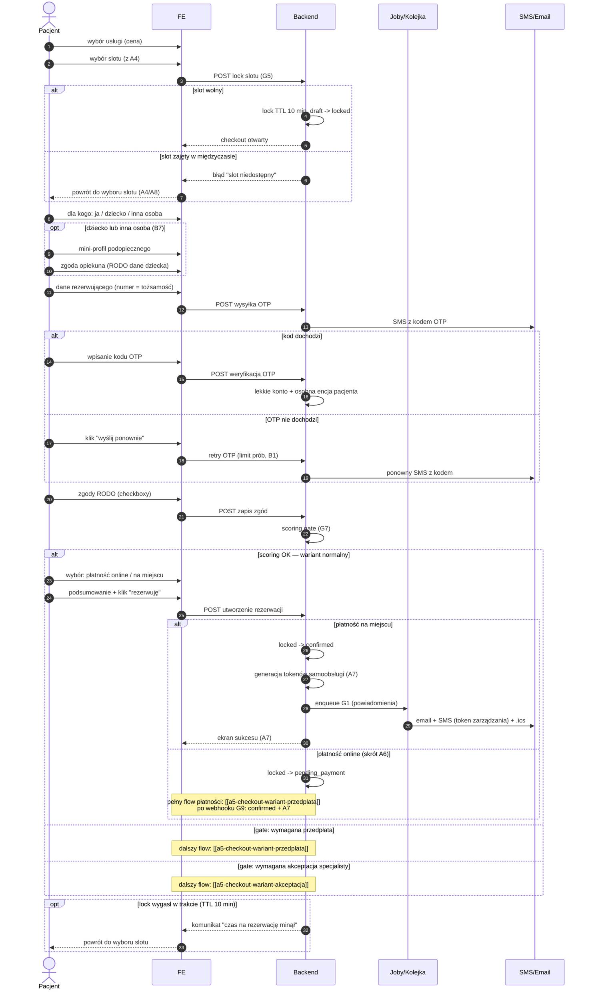

# A5 — Checkout rezerwacji (wariant normalny)

## Notatki
- Stany rezerwacji: tylko kanoniczne z CORE-STANY (draft -> locked TTL 10 min -> pending_payment | pending_approval -> confirmed).
- G5: lock slotu 10 min od wejścia w checkout; wygaśnięcie locka może wystąpić na dowolnym kroku — diagram pokazuje to jako opt na końcu; założenie minimalne: powrót do wyboru slotu bez utraty wpisanych danych (mapa nie rozstrzyga).
- B7 (pacjent ≠ rezerwujący): "dla kogo: ja / dziecko / inna osoba", mini-profil podopiecznego jako osobna encja pacjenta powiązana z kontem rezerwującego; zgoda opiekuna + RODO dane dziecka (Flaga 1).
- OTP SMS: numer telefonu = tożsamość; przy 1. rezerwacji tworzone lekkie konto + osobna encja pacjenta; rate limiting i limit prób — jak w B1.
- Scoring gate (G7): punkt decyzyjny; progi -> skutki. Warianty: [[a5-checkout-wariant-przedplata]] (przedpłata), [[a5-checkout-wariant-akceptacja]] (akceptacja specjalisty).
- A7 (potwierdzenie): ekran sukcesu, generacja tokenów samoobsługi (TTL/single-use — otwarta decyzja, S1), email + SMS z linkiem zarządzania, .ics, enqueue G1.
- Ścieżka płatności online potraktowana skrótowo — pełne A6 w [[a5-checkout-wariant-przedplata]].
- Edge case'y z mapy: slot zajęty w międzyczasie (przy locku), OTP nie dochodzi (retry), lock wygasł w trakcie.
- ⚠️ Flaga 2 (płatności online w POC): OTWARTA — decyzją użytkownika z 2026-07-15 dokumentujemy oba warianty (pełny checkout z płatnością online oraz rezerwację za akceptacją specjalisty).
- Powiązania: CORE-STANY, G5, G7, B7, A7, A6, A4, A8, B1, G1, [[a5-checkout-wariant-przedplata]], [[a5-checkout-wariant-akceptacja]].
