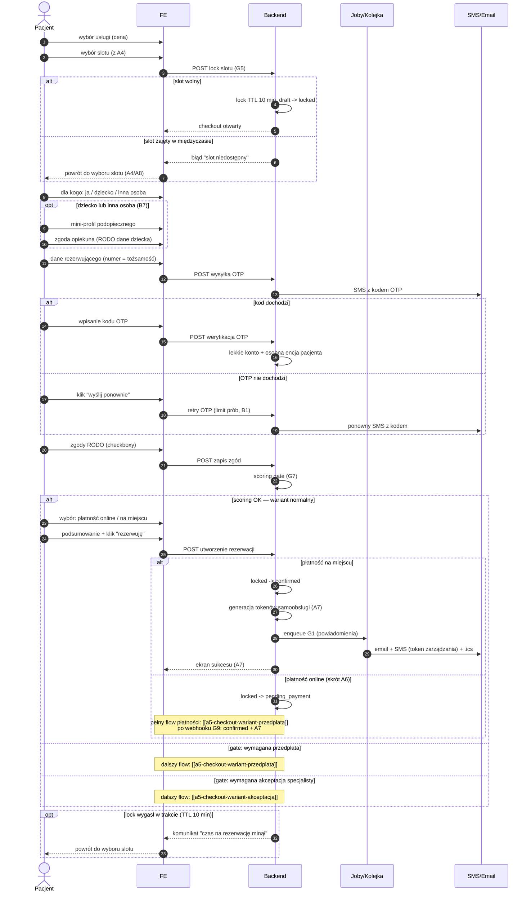

# A5 — Checkout rezerwacji (wariant normalny)

## Notatki
- Stany rezerwacji: tylko kanoniczne z CORE-STANY (draft -> locked TTL 10 min -> pending_payment | pending_approval -> confirmed).
- G5: lock slotu 10 min od wejścia w checkout; wygaśnięcie locka może wystąpić na dowolnym kroku — diagram pokazuje to jako opt na końcu; założenie minimalne: powrót do wyboru slotu bez utraty wpisanych danych (mapa nie rozstrzyga).
- B7 (pacjent ≠ rezerwujący): "dla kogo: ja / dziecko / inna osoba", mini-profil podopiecznego jako osobna encja pacjenta powiązana z kontem rezerwującego; zgoda opiekuna + RODO dane dziecka (Flaga 1).
- OTP SMS: numer telefonu = tożsamość; przy 1. rezerwacji tworzone lekkie konto + osobna encja pacjenta; rate limiting i limit prób — jak w B1.
- Scoring gate (G7): punkt decyzyjny; progi -> skutki. Warianty: [[a5-checkout-wariant-przedplata]] (przedpłata), [[a5-checkout-wariant-akceptacja]] (akceptacja specjalisty).
- A7 (potwierdzenie): ekran sukcesu, generacja tokenów samoobsługi (TTL/single-use — otwarta decyzja, S1), email + SMS z linkiem zarządzania, .ics, enqueue G1.
- Ścieżka płatności online potraktowana skrótowo — pełne A6 w [[a5-checkout-wariant-przedplata]].
- Edge case'y z mapy: slot zajęty w międzyczasie (przy locku), OTP nie dochodzi (retry), lock wygasł w trakcie.
- ⚠️ Flaga 2 (płatności online w POC): OTWARTA — decyzją użytkownika z 2026-07-15 dokumentujemy oba warianty (pełny checkout z płatnością online oraz rezerwację za akceptacją specjalisty).
- Powiązania: CORE-STANY, G5, G7, B7, A7, A6, A4, A8, B1, G1, [[a5-checkout-wariant-przedplata]], [[a5-checkout-wariant-akceptacja]].

## Co opisuje ten diagram
Główna ścieżka rezerwacji wizyty (checkout). Pacjent wybiera usługę i termin, system blokuje termin na 10 minut, pacjent podaje, dla kogo jest wizyta, potwierdza swój numer telefonu kodem SMS i akceptuje zgody. Następnie system automatycznie ocenia wiarygodność pacjenta (scoring) i — w wariancie normalnym — pozwala dokończyć rezerwację z płatnością na miejscu albo online. Flow kończy się ekranem potwierdzenia (A7) albo przejściem do jednego z wariantów sankcyjnych: przedpłaty lub akceptacji specjalisty.

## Powiązane diagramy
| ID | Diagram | Jak się łączy |
|---|---|---|
| CORE-STANY | [../00-core/00-stany-rezerwacji.md](../00-core/00-stany-rezerwacji.md) | używa kanonicznych stanów rezerwacji (draft → locked → … → confirmed) |
| A4 | [a4-profil-specjalisty.md](a4-profil-specjalisty.md) | źródło wybranego slotu; powrót przy zajętym slocie lub wygasłym locku |
| A5 (przedpłata) | [a5-checkout-wariant-przedplata.md](a5-checkout-wariant-przedplata.md) | dalszy flow, gdy scoring gate wymaga przedpłaty; zawiera pełne A6 |
| A5 (akceptacja) | [a5-checkout-wariant-akceptacja.md](a5-checkout-wariant-akceptacja.md) | dalszy flow, gdy scoring gate wymaga akceptacji specjalisty |
| A6 | [a5-checkout-wariant-przedplata.md](a5-checkout-wariant-przedplata.md) | pełny przebieg płatności online (tu potraktowany skrótowo) |
| A7 | [a7-potwierdzenie.md](a7-potwierdzenie.md) | ekran sukcesu i tokeny samoobsługi po przejściu do confirmed |
| A8 | [a8-brak-slotow.md](a8-brak-slotow.md) | powrót, gdy slot został zajęty w międzyczasie |
| B1 | [../b-pacjent-konto/b1-logowanie.md](../b-pacjent-konto/b1-logowanie.md) | te same zasady OTP: limit prób i rate limiting |
| B7 | [../b-pacjent-konto/b7-pacjent-podopieczny.md](../b-pacjent-konto/b7-pacjent-podopieczny.md) | rezerwacja dla dziecka/innej osoby — mini-profil podopiecznego |
| G1 | [../00-core/00-katalog-eventow.md](../00-core/00-katalog-eventow.md) | wysyłka powiadomień (email + SMS) po potwierdzeniu |
| G5 | [../g-silniki/g5-slot-lock.md](../g-silniki/g5-slot-lock.md) | mechanizm locka slotu z TTL 10 min |
| G7 | [../g-silniki/g7-scoring-engine.md](../g-silniki/g7-scoring-engine.md) | scoring gate decyduje o wariancie checkoutu |

## Słownik
| Pojęcie | Wyjaśnienie |
|---|---|
| Checkout | Proces finalizowania rezerwacji — od wyboru terminu do potwierdzenia wizyty. |
| Slot | Konkretny wolny termin wizyty w kalendarzu specjalisty. |
| Lock | Czasowa blokada wybranego terminu, żeby nikt inny nie zajął go w trakcie rezerwacji. |
| TTL | Czas życia blokady — tu 10 minut, po których lock wygasa. |
| OTP | Jednorazowy kod SMS potwierdzający, że numer telefonu należy do rezerwującego. |
| Scoring gate | Automatyczna bramka oceniająca wiarygodność pacjenta i decydująca, czy wymagać przedpłaty albo akceptacji. |
| Lekkie konto | Konto tworzone automatycznie przy pierwszej rezerwacji, bez hasła — tożsamością jest numer telefonu. |
| Token samoobsługi | Specjalny link, którym pacjent później zmieni lub odwoła wizytę bez logowania. |
| RODO | Przepisy o ochronie danych osobowych; wymagają zgód, szczególnie na dane dziecka. |
| .ics | Plik z terminem wizyty do dodania do kalendarza (Google, Outlook itp.). |
| Enqueue | Wstawienie zadania (np. wysyłki powiadomień) do kolejki wykonywanej w tle. |
| pending_payment / pending_approval | Stany rezerwacji oczekującej odpowiednio na płatność online albo na akceptację specjalisty. |
