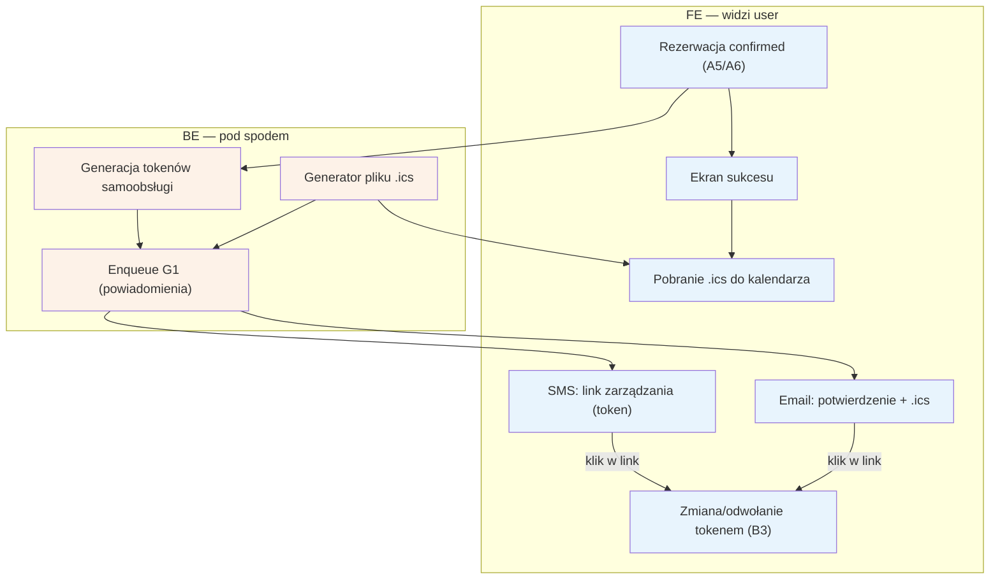

# A7 — Potwierdzenie rezerwacji

## Notatki
- Priorytet: P0.
- Wejście: rezerwacja w stanie kanonicznym `confirmed` — z A5 (płatność na miejscu / po akceptacji specjalisty) lub z A6 (płatność online). Flaga 2 (płatności online w POC) pozostaje OTWARTA — oba warianty dojścia do `confirmed` są dokumentowane (decyzja użytkownika 2026-07-15); szczegóły w [[a5-checkout]] / [[a6-platnosc-online]].
- Token samoobsługi w SMS/email → [[b3-odwolanie-tokenem]] (B3); parametry tokenu (TTL, single-use) — otwarta decyzja z S1.
- Założenie (minimalne): `.ics` jest załącznikiem emaila i do pobrania z ekranu sukcesu — mapa nie precyzuje kanału dystrybucji.
- Enqueue G1 (notification engine) wysyła email+SMS; dalej harmonogram przypomnień G2 (T−24 h).

## Co opisuje ten diagram
Pokazuje moment tuż po skutecznej rezerwacji: pacjent widzi ekran sukcesu i może pobrać plik z terminem do swojego kalendarza, a system w tle generuje tokeny samoobsługi i wysyła e-mail z potwierdzeniem oraz SMS ze specjalnym linkiem do zarządzania wizytą. Uczestniczą pacjent i system powiadomień. Flow zaczyna się, gdy rezerwacja osiąga stan „confirmed" (z A5 lub po płatności online A6), a kończy dostarczeniem potwierdzeń i przekazaniem pacjentowi linku do zmiany lub odwołania wizyty (B3).

## Powiązane diagramy
| ID | Diagram | Jak się łączy |
|---|---|---|
| A5 | [a5-checkout.md](a5-checkout.md) | źródło stanu confirmed: płatność na miejscu lub akceptacja specjalisty |
| A6 | [a5-checkout-wariant-przedplata.md](a5-checkout-wariant-przedplata.md) | dojście do confirmed przez płatność online (webhook) |
| B3 | [../b-pacjent-konto/b3-odwolanie-tokenem.md](../b-pacjent-konto/b3-odwolanie-tokenem.md) | link z tokenem z SMS/e-maila prowadzi do zmiany/odwołania wizyty |
| G1 | [../00-core/00-katalog-eventow.md](../00-core/00-katalog-eventow.md) | notification engine faktycznie wysyła e-mail i SMS |
| G2 | [../00-core/00-katalog-eventow.md](../00-core/00-katalog-eventow.md) | dalej działa harmonogram przypomnień T−24 h przed wizytą |

## Słownik
| Pojęcie | Wyjaśnienie |
|---|---|
| confirmed | Stan rezerwacji ostatecznie potwierdzonej — wizyta jest umówiona. |
| Token samoobsługi | Specjalny link, którym pacjent zarządza wizytą (zmiana, odwołanie) bez logowania. |
| TTL / single-use | Możliwe parametry tokenu: ograniczona ważność w czasie lub jednorazowe użycie (decyzja jeszcze otwarta). |
| Link zarządzania | Adres w SMS/e-mailu prowadzący do samoobsługowej zmiany lub odwołania wizyty. |
| .ics | Plik z terminem wizyty, który dodaje wydarzenie do kalendarza pacjenta (Google, Outlook itp.). |
| Enqueue | Wstawienie wysyłki powiadomień do kolejki zadań wykonywanych w tle. |
| Notification engine | Silnik systemowy (G1), który obsługuje wysyłkę e-maili i SMS-ów. |
| Przypomnienie T−24 h | Automatyczne przypomnienie o wizycie wysyłane dobę przed terminem (G2). |
