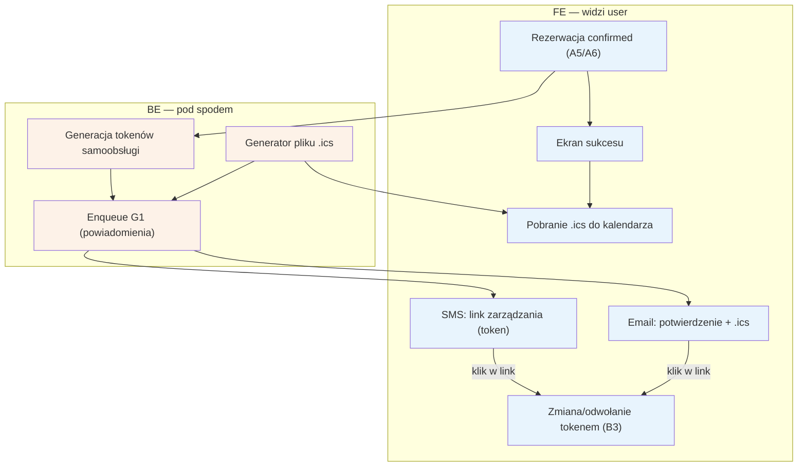

# A7 — Potwierdzenie rezerwacji

## Notatki
- Priorytet: P0.
- Wejście: rezerwacja w stanie kanonicznym `confirmed` — z A5 (płatność na miejscu / po akceptacji specjalisty) lub z A6 (płatność online). Flaga 2 (płatności online w POC) pozostaje OTWARTA — oba warianty dojścia do `confirmed` są dokumentowane (decyzja użytkownika 2026-07-15); szczegóły w [[a5-checkout]] / [[a6-platnosc-online]].
- Token samoobsługi w SMS/email → [[b3-odwolanie-tokenem]] (B3); parametry tokenu (TTL, single-use) — otwarta decyzja z S1.
- Założenie (minimalne): `.ics` jest załącznikiem emaila i do pobrania z ekranu sukcesu — mapa nie precyzuje kanału dystrybucji.
- Enqueue G1 (notification engine) wysyła email+SMS; dalej harmonogram przypomnień G2 (T−24 h).
