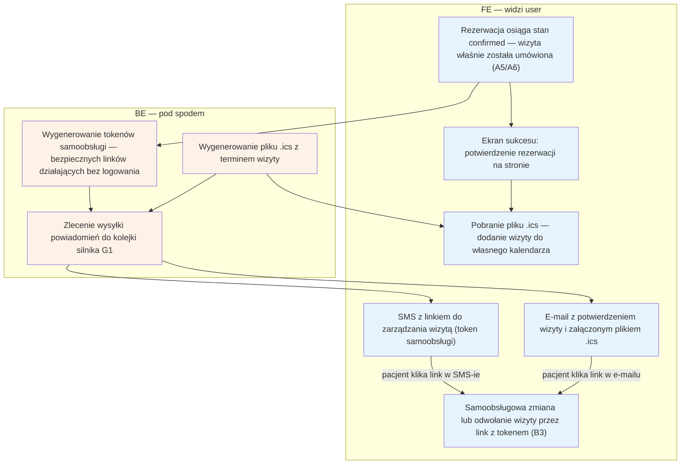

# A7 — Potwierdzenie rezerwacji

## Notatki
- Priorytet: P0.
- Wejście: rezerwacja w stanie kanonicznym `confirmed` — z A5 (płatność na miejscu / po akceptacji specjalisty) lub z A6 (płatność online). Flaga 2 (płatności online w POC) pozostaje OTWARTA — oba warianty dojścia do `confirmed` są dokumentowane (decyzja użytkownika 2026-07-15); szczegóły w [[a5-checkout]] / [[a6-platnosc-online]].
- Token samoobsługi w SMS/email → [[b3-odwolanie-tokenem]] (B3); parametry tokenu (TTL, single-use) — otwarta decyzja z S1.
- Założenie (minimalne): `.ics` jest załącznikiem emaila i do pobrania z ekranu sukcesu — mapa nie precyzuje kanału dystrybucji.
- Enqueue G1 (notification engine) wysyła email+SMS; dalej harmonogram przypomnień G2 (T−24 h).

## Co opisuje ten diagram
Pokazuje moment tuż po skutecznej rezerwacji: pacjent widzi ekran sukcesu i może pobrać plik z terminem do swojego kalendarza, a system w tle generuje tokeny samoobsługi i wysyła e-mail z potwierdzeniem oraz SMS ze specjalnym linkiem do zarządzania wizytą. Uczestniczą pacjent i system powiadomień. Flow zaczyna się, gdy rezerwacja osiąga stan „confirmed" (z A5 lub po płatności online A6), a kończy dostarczeniem potwierdzeń i przekazaniem pacjentowi linku do zmiany lub odwołania wizyty (B3).

## Aktorzy w tym flow

| Rola | Kto to jest | Co robi w tym flow |
|---|---|---|
| **Pacjent** | użytkownik strony; u logopedów zwykle rodzic rezerwujący wizytę dla dziecka | widzi ekran sukcesu, pobiera plik .ics do swojego kalendarza, odbiera e-mail i SMS, może kliknąć link zarządzania wizytą |
| **FE** (interfejs) | to, co użytkownik widzi w przeglądarce — ekran po udanej rezerwacji | pokazuje potwierdzenie rezerwacji i przycisk pobrania pliku .ics |
| **Backend** | serwer platformy — część systemu niewidoczna dla użytkownika | generuje tokeny samoobsługi i plik .ics, zleca wysyłkę powiadomień |
| **System** (automaty) | silnik powiadomień G1 — kolejka zadań wykonywanych w tle, bez udziału człowieka | odbiera zlecenie wysyłki i faktycznie realizuje wysłanie e-maila i SMS-a |
| **SMS/Email** (bramka powiadomień) | zewnętrzna usługa doręczająca wiadomości na telefon i skrzynkę pacjenta | dostarcza pacjentowi e-mail z potwierdzeniem i załącznikiem .ics oraz SMS z linkiem zarządzania |

## Objaśnienie bloków

| Blok | Co to znaczy w praktyce | Kto tu działa |
|---|---|---|
| Rezerwacja osiąga stan confirmed (A5/A6) | Punkt startu: rezerwacja właśnie została ostatecznie potwierdzona — wizyta jest umówiona. Stało się to w checkoucie (A5: płatność na miejscu lub akceptacja specjalisty) albo po opłaceniu online (A6). | — (stan z poprzedniego flow) |
| Ekran sukcesu | Strona „udało się — wizyta zarezerwowana", którą pacjent widzi zaraz po potwierdzeniu. Podsumowuje termin i miejsce wizyty. | Pacjent, FE |
| Pobranie pliku .ics | Pacjent może jednym kliknięciem pobrać plik z terminem wizyty i dodać go do swojego prywatnego kalendarza (Google, Outlook, kalendarz w telefonie). | Pacjent, FE |
| E-mail z potwierdzeniem i plikiem .ics | Wiadomość e-mail z podsumowaniem wizyty; plik .ics jest dołączony jako załącznik. Zawiera też link do zarządzania rezerwacją. | SMS/Email → Pacjent |
| SMS z linkiem do zarządzania wizytą | Krótka wiadomość SMS ze specjalnym linkiem (tokenem samoobsługi), którym pacjent może później zmienić lub odwołać wizytę — bez zakładania konta i logowania. | SMS/Email → Pacjent |
| Samoobsługowa zmiana/odwołanie wizyty (B3) | Wyjście z flow: kliknięcie linku z SMS-a lub e-maila prowadzi do ekranu, gdzie pacjent sam zmienia termin albo odwołuje wizytę — opisane w diagramie B3. | Pacjent |
| Wygenerowanie tokenów samoobsługi | Serwer tworzy unikalne, bezpieczne linki przypisane do tej konkretnej rezerwacji. Kto ma link — może zarządzać wizytą, dlatego działa on bez logowania. Parametry (czas ważności, jednorazowość) to jeszcze otwarta decyzja. | Backend |
| Wygenerowanie pliku .ics | Serwer przygotowuje plik kalendarza z datą, godziną i miejscem wizyty — ten sam plik trafia do e-maila i do pobrania z ekranu sukcesu. | Backend |
| Zlecenie wysyłki do kolejki silnika G1 | Serwer nie wysyła wiadomości sam — wstawia zadanie „wyślij potwierdzenia" do kolejki, a silnik powiadomień G1 wykonuje je w tle. Dzięki temu pacjent nie czeka na ekranie, aż wiadomości wyjdą. | Backend, System (G1) |

## Powiązane diagramy
| ID | Diagram | Jak się łączy |
|---|---|---|
| A5 | [a5-checkout.md](a5-checkout.md) | źródło stanu confirmed: płatność na miejscu lub akceptacja specjalisty |
| A6 | [a5-checkout-wariant-przedplata.md](a5-checkout-wariant-przedplata.md) | dojście do confirmed przez płatność online (webhook) |
| B3 | [../b-pacjent-konto/b3-odwolanie-tokenem.md](../b-pacjent-konto/b3-odwolanie-tokenem.md) | link z tokenem z SMS/e-maila prowadzi do zmiany/odwołania wizyty |
| G1 | [../00-core/00-katalog-eventow.md](../00-core/00-katalog-eventow.md) | notification engine faktycznie wysyła e-mail i SMS |
| G2 | [../00-core/00-katalog-eventow.md](../00-core/00-katalog-eventow.md) | dalej działa harmonogram przypomnień T−24 h przed wizytą |

## Słownik
| Pojęcie | Wyjaśnienie |
|---|---|
| confirmed | Stan rezerwacji ostatecznie potwierdzonej — wizyta jest umówiona. |
| Token samoobsługi | Specjalny link, którym pacjent zarządza wizytą (zmiana, odwołanie) bez logowania. |
| TTL / single-use | Możliwe parametry tokenu: ograniczona ważność w czasie lub jednorazowe użycie (decyzja jeszcze otwarta). |
| Link zarządzania | Adres w SMS/e-mailu prowadzący do samoobsługowej zmiany lub odwołania wizyty. |
| .ics | Plik z terminem wizyty, który dodaje wydarzenie do kalendarza pacjenta (Google, Outlook itp.). |
| Enqueue | Wstawienie wysyłki powiadomień do kolejki zadań wykonywanych w tle. |
| Notification engine | Silnik systemowy (G1), który obsługuje wysyłkę e-maili i SMS-ów. |
| Przypomnienie T−24 h | Automatyczne przypomnienie o wizycie wysyłane dobę przed terminem (G2). |
| Kolejka (zadań) | Lista zadań do wykonania w tle — serwer dokłada zadanie, a automat wykonuje je po kolei, nie blokując pacjenta. |
| Ekran sukcesu | Strona pokazywana zaraz po udanej rezerwacji, z podsumowaniem wizyty i pobraniem pliku .ics. |
| FE (frontend) | Interfejs — to, co użytkownik widzi i klika w przeglądarce. |
| BE (backend) | Serwer platformy — część systemu działająca „pod spodem", niewidoczna dla użytkownika. |
| A5, A6, B3, G1, G2 | Identyfikatory innych flowów z mapy projektu — każdy ma własny diagram (A5/A6: warianty checkoutu, B3: odwołanie tokenem, G1: powiadomienia, G2: przypomnienia). |
