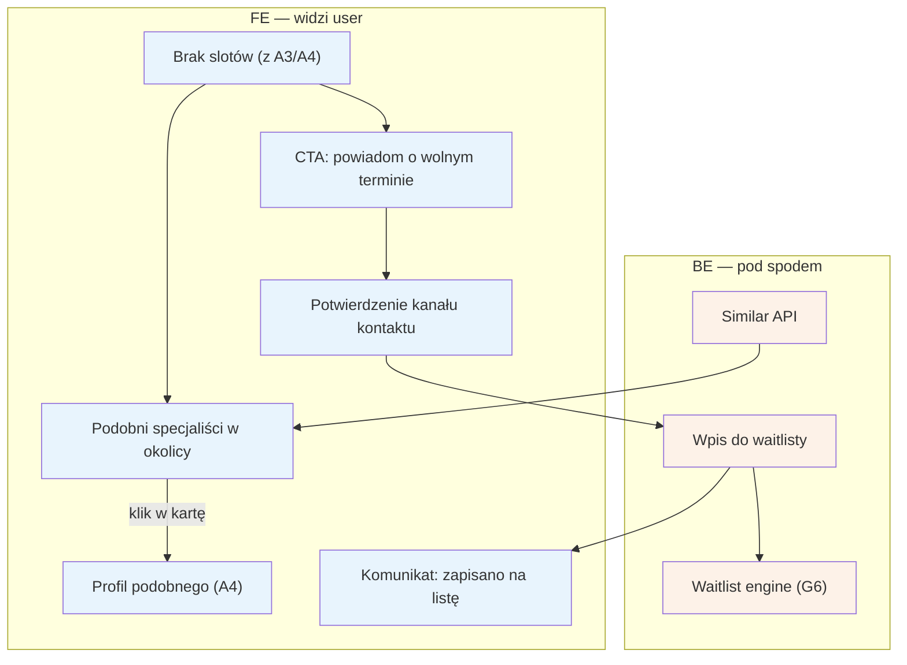

# A8 — Brak slotów

## Notatki
- Priorytet: P1 (cała ścieżka waitlisty; "podobni" mogą wejść wcześniej jako łatwiejsza połowa flow).
- Wejścia: pusty stan lub karta/kalendarz bez wolnych terminów → [[a3-lista-wynikow]] (A3), [[a4-profil-specjalisty]] (A4).
- Wpis do waitlisty konsumuje G6 (FIFO, okno 2 h, kaskada) — dalszy ciąg po stronie pacjenta: [[b4-waitlista]] (B4).
- Założenie (minimalne): "powiadom mnie" wymaga zweryfikowanego kanału kontaktu (numer telefonu = tożsamość, jak w A5/B1); mapa nie precyzuje, czy zapis na waitlistę możliwy bez wcześniejszej rezerwacji/konta — do rozstrzygnięcia przy #6 (polityka odwołań/waitlista).
- Kryteria "podobieństwa" specjalistów (usługa? dystans? cena?) — mapa nie rozstrzyga; założenie: ta sama usługa + najbliższa okolica.

## Co opisuje ten diagram
Ścieżka ratunkowa uruchamiana, gdy pacjent nie znajdzie wolnego terminu — z listy wyników (A3) albo z profilu specjalisty (A4). Serwis pokazuje wtedy podobnych specjalistów w okolicy oraz proponuje zapis na listę oczekujących („powiadom o wolnym terminie"). Flow kończy się przejściem na profil innego specjalisty albo wpisem na waitlistę, którą dalej obsługuje silnik G6 i ścieżka pacjenta B4.

## Powiązane diagramy
| ID | Diagram | Jak się łączy |
|---|---|---|
| A3 | [a3-lista-wynikow.md](a3-lista-wynikow.md) | wejście: pusty stan lub karta bez wolnych slotów |
| A4 | [a4-profil-specjalisty.md](a4-profil-specjalisty.md) | wejście: kalendarz bez terminów; wyjście: profil podobnego specjalisty |
| A5 | [a5-checkout.md](a5-checkout.md) | ta sama zasada „numer telefonu = tożsamość" przy weryfikacji kontaktu |
| B1 | [../b-pacjent-konto/b1-logowanie.md](../b-pacjent-konto/b1-logowanie.md) | weryfikacja kanału kontaktu jak przy logowaniu |
| B4 | [../b-pacjent-konto/b4-waitlista.md](../b-pacjent-konto/b4-waitlista.md) | dalszy ciąg waitlisty po stronie pacjenta (oferta zwolnionego terminu) |
| G6 | [../g-silniki/g6-waitlist-engine.md](../g-silniki/g6-waitlist-engine.md) | silnik waitlisty konsumuje wpis (FIFO, okno 2 h, kaskada) |

## Słownik
| Pojęcie | Wyjaśnienie |
|---|---|
| Slot | Konkretny wolny termin wizyty w kalendarzu specjalisty. |
| Pusty stan | Ekran pokazywany, gdy wyszukiwanie nie zwróciło żadnych specjalistów. |
| Podobni specjaliści | Propozycje innych specjalistów (ta sama usługa, najbliższa okolica) zamiast pustego ekranu. |
| Similar API | Usługa systemowa dobierająca podobnych specjalistów do pokazania. |
| CTA | Przycisk zachęcający do działania — tu „powiadom o wolnym terminie". |
| Kanał kontaktu | Zweryfikowany numer telefonu (lub e-mail), na który przyjdzie powiadomienie z waitlisty. |
| Waitlista | Lista oczekujących na zwolniony termin u danego specjalisty. |
| FIFO, okno 2 h | Zasady waitlisty: kto pierwszy się zapisał, ten pierwszy dostaje propozycję i ma 2 godziny na reakcję. |
