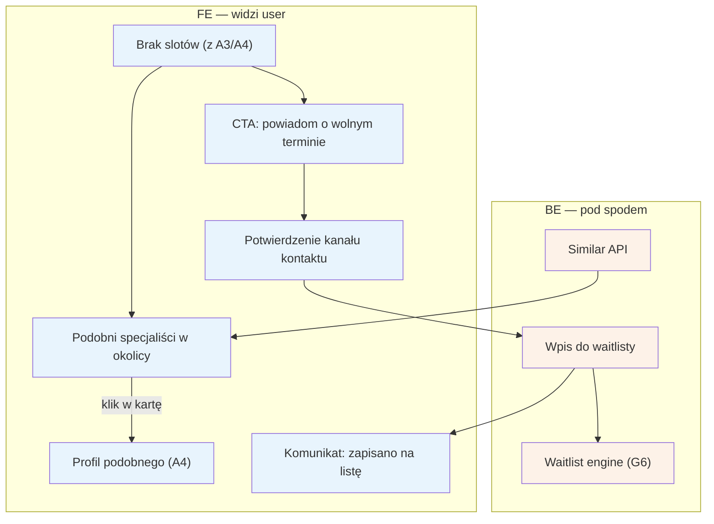

# A8 — Brak slotów

## Notatki
- Priorytet: P1 (cała ścieżka waitlisty; "podobni" mogą wejść wcześniej jako łatwiejsza połowa flow).
- Wejścia: pusty stan lub karta/kalendarz bez wolnych terminów → [[a3-lista-wynikow]] (A3), [[a4-profil-specjalisty]] (A4).
- Wpis do waitlisty konsumuje G6 (FIFO, okno 2 h, kaskada) — dalszy ciąg po stronie pacjenta: [[b4-waitlista]] (B4).
- Założenie (minimalne): "powiadom mnie" wymaga zweryfikowanego kanału kontaktu (numer telefonu = tożsamość, jak w A5/B1); mapa nie precyzuje, czy zapis na waitlistę możliwy bez wcześniejszej rezerwacji/konta — do rozstrzygnięcia przy #6 (polityka odwołań/waitlista).
- Kryteria "podobieństwa" specjalistów (usługa? dystans? cena?) — mapa nie rozstrzyga; założenie: ta sama usługa + najbliższa okolica.
