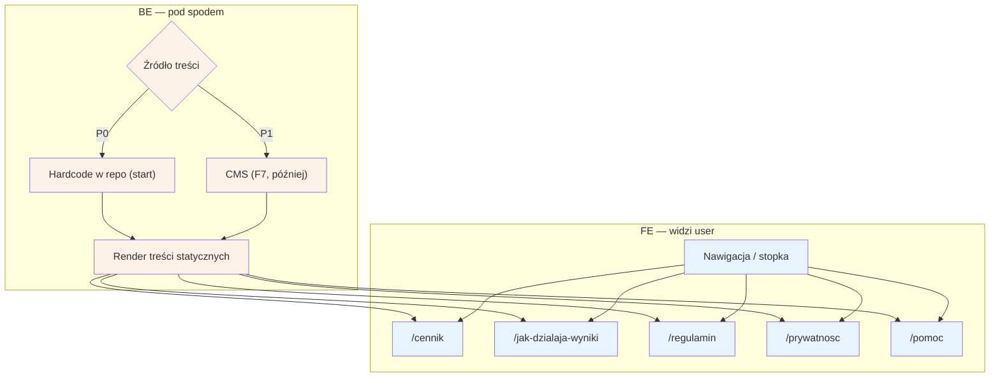

# A9 — Strony statyczne

## Notatki
- Priorytet: P0 (treści hardcode na start; UI CMS to F7 w P1).
- `/jak-dzialaja-wyniki` — wymóg Omnibus, linkowana z wyszukiwania → [[a2-wyszukiwanie]] (A2); treść zasad rankingu: spec S5.
- `/regulamin` i `/prywatnosc` — podstawa prawna zgód z checkoutu (A5) i RODO self-service (B9).
- `/pomoc` — m.in. jak odwołać/zmienić wizytę (B3) i zasady waitlisty (B4).
- `/cennik` — założenie: cennik dla pacjentów (serwis bezpłatny?); cennik B2B dla specjalistów to osobno C2 — mapa nie precyzuje zawartości `/cennik`, do potwierdzenia.
