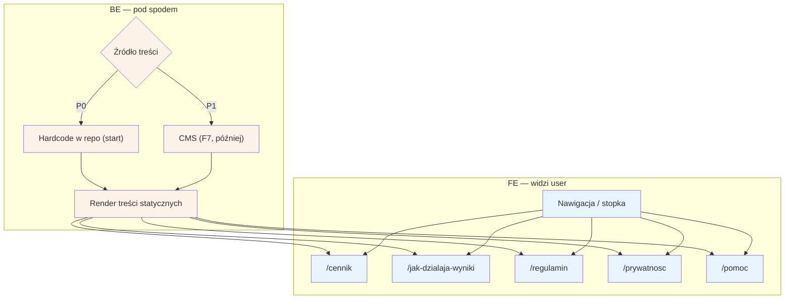

# A9 — Strony statyczne

## Notatki
- Priorytet: P0 (treści hardcode na start; UI CMS to F7 w P1).
- `/jak-dzialaja-wyniki` — wymóg Omnibus, linkowana z wyszukiwania → [[a2-wyszukiwanie]] (A2); treść zasad rankingu: spec S5.
- `/regulamin` i `/prywatnosc` — podstawa prawna zgód z checkoutu (A5) i RODO self-service (B9).
- `/pomoc` — m.in. jak odwołać/zmienić wizytę (B3) i zasady waitlisty (B4).
- `/cennik` — założenie: cennik dla pacjentów (serwis bezpłatny?); cennik B2B dla specjalistów to osobno C2 — mapa nie precyzuje zawartości `/cennik`, do potwierdzenia.

## Co opisuje ten diagram
Zbiór stałych stron informacyjnych serwisu: cennik, zasady działania wyników wyszukiwania, regulamin, polityka prywatności i pomoc. Pacjent trafia na nie z nawigacji lub stopki i po prostu czyta treść — flow nie kończy się żadną transakcją. Na start treści są wpisane na sztywno w kod, a docelowo będzie nimi zarządzał admin przez CMS (F7).

## Powiązane diagramy
| ID | Diagram | Jak się łączy |
|---|---|---|
| A2 | [a2-wyszukiwanie.md](a2-wyszukiwanie.md) | strona /jak-dzialaja-wyniki jest linkowana z wyszukiwania (wymóg Omnibus) |
| A5 | [a5-checkout.md](a5-checkout.md) | /regulamin i /prywatnosc to podstawa prawna zgód z checkoutu |
| B3 | [../b-pacjent-konto/b3-odwolanie-tokenem.md](../b-pacjent-konto/b3-odwolanie-tokenem.md) | /pomoc opisuje, jak odwołać lub zmienić wizytę |
| B4 | [../b-pacjent-konto/b4-waitlista.md](../b-pacjent-konto/b4-waitlista.md) | /pomoc opisuje zasady działania waitlisty |
| B9 | [../b-pacjent-konto/b9-rodo-self-service.md](../b-pacjent-konto/b9-rodo-self-service.md) | /prywatnosc wiąże się z samoobsługą praw RODO |
| C2 | [../cd-specjalista-onboarding/c2-cennik-b2b.md](../cd-specjalista-onboarding/c2-cennik-b2b.md) | cennik B2B dla specjalistów to osobny flow, odrębny od /cennik |
| F7 | [../f-backoffice/f7-cms-seo.md](../f-backoffice/f7-cms-seo.md) | docelowe źródło treści — CMS zarządzany przez admina |

## Słownik
| Pojęcie | Wyjaśnienie |
|---|---|
| Strona statyczna | Strona o stałej, informacyjnej treści, bez interakcji (np. regulamin). |
| Hardcode | Treść wpisana na sztywno w kod aplikacji — najszybsze rozwiązanie na start. |
| CMS | System zarządzania treścią, dzięki któremu admin edytuje strony bez udziału programisty. |
| Render | Wygenerowanie i wyświetlenie treści strony użytkownikowi. |
| Omnibus | Dyrektywa UE wymagająca m.in. jawnego opisania zasad układania wyników — stąd strona /jak-dzialaja-wyniki. |
| RODO | Przepisy o ochronie danych osobowych — podstawa strony /prywatnosc. |
| B2B | Oferta dla specjalistów/firm (płatny abonament), odrębna od bezpłatnego serwisu dla pacjentów. |
| P0 / P1 | Priorytety wdrożenia: P0 = niezbędne na start, P1 = zaraz po starcie. |
