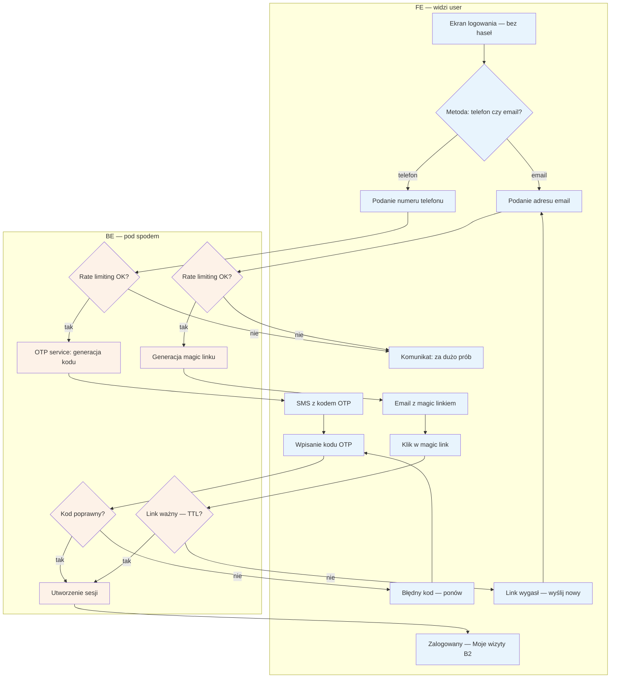

# B1 — Logowanie

## Notatki
- Bez haseł: numer telefonu = tożsamość (jak przy 1. rezerwacji w A5); email = kanał zapasowy (magic link).
- Rate limiting: dotyczy wysyłki OTP/magic linków; limit błędnych kodów przyjęty jako część tego samego mechanizmu (mapa nie rozdziela) — po przekroczeniu ten sam komunikat "za dużo prób".
- TTL magic linku i czas życia sesji — mapa nie rozstrzyga; założenie minimalne: link jednorazowy z TTL, sesja standardowa.
- Powiązania: A5 (OTP przy 1. rezerwacji tworzy lekkie konto), B2 (cel po zalogowaniu), B3 (fallback przy nieważnym tokenie), G8 (limity per numer/IP/device).
