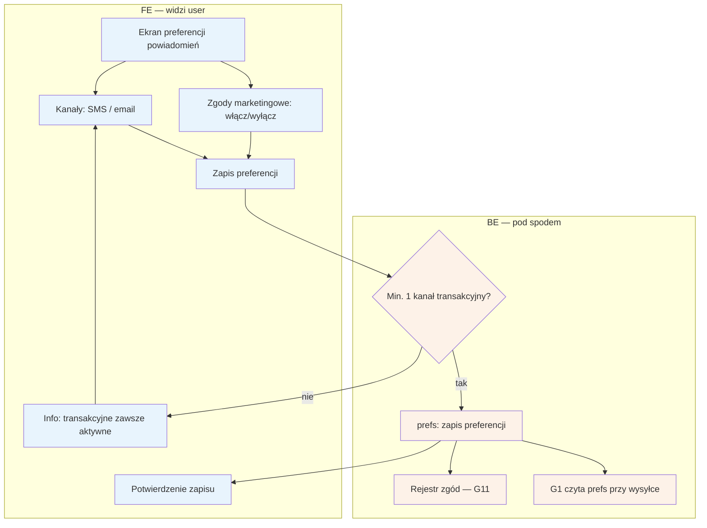

# B10 — Preferencje powiadomień

## Notatki
- P1; pacjent zarządza kanałami (SMS/email) i zgodami marketingowymi; opt-out z G1 dotyczy marketingu.
- Założenie minimalne: powiadomień transakcyjnych (potwierdzenia, przypomnienia T−24 h, tokeny samoobsługi) nie można wyłączyć całkowicie — wymagany min. 1 aktywny kanał; mapa nie rozstrzyga.
- Zmiana zgód marketingowych zapisywana w rejestrze zgód (G11) — spójnie z B9 (tam pełne zarządzanie zgodami RODO, tu podzbiór marketingowy).
- Granularność per typ powiadomienia (przypomnienia vs opinie vs waitlista) — mapa nie definiuje; założenie: tylko kanały + marketing.
- Powiązania: G1, G2, G11, B9.

## Co opisuje ten diagram
Diagram opisuje ekran preferencji powiadomień pacjenta: wybór kanałów (SMS/email) oraz włączanie i wyłączanie zgód marketingowych. System pilnuje, aby dla powiadomień transakcyjnych (potwierdzenia, przypomnienia) pozostał aktywny co najmniej jeden kanał — całkowite wyłączenie nie jest możliwe. Zapisane preferencje odczytuje silnik powiadomień przy każdej wysyłce, a zmiany zgód marketingowych trafiają do rejestru zgód.

## Powiązane diagramy
| ID | Diagram | Jak się łączy |
|---|---|---|
| G1 | [00-katalog-eventow.md](../00-core/00-katalog-eventow.md) | notification engine czyta preferencje przy każdej wysyłce |
| G2 | [00-katalog-eventow.md](../00-core/00-katalog-eventow.md) | przypomnienie T−24 h to powiadomienie transakcyjne |
| G11 | [00-katalog-eventow.md](../00-core/00-katalog-eventow.md) | zmiany zgód marketingowych zapisywane w rejestrze zgód |
| B9 | [b9-rodo-self-service.md](b9-rodo-self-service.md) | pełne zarządzanie zgodami RODO; tu podzbiór marketingowy |

## Słownik
| Pojęcie | Wyjaśnienie |
|---|---|
| Powiadomienia transakcyjne | Wiadomości niezbędne do obsługi wizyty (potwierdzenia, przypomnienia, tokeny) — nie da się ich całkiem wyłączyć. |
| Zgody marketingowe | Osobna zgoda na wiadomości reklamowe/informacyjne, którą pacjent może dowolnie włączać i wyłączać. |
| Opt-out | Rezygnacja z otrzymywania danego typu wiadomości — tu dotyczy tylko marketingu. |
| Kanał powiadomień | Droga doręczenia wiadomości: SMS lub email. |
| Rejestr zgód | Ewidencja zgód pacjenta wraz z historią zmian, prowadzona automatycznie. |
| Preferencje (prefs) | Zapisane w systemie ustawienia pacjenta, sprawdzane przed każdą wysyłką. |
| Przypomnienie T−24 h | Automatyczna wiadomość wysyłana 24 godziny przed wizytą. |
| Token samoobsługi | Link z SMS-a/emaila do zarządzania wizytą — doręczany kanałem transakcyjnym. |
