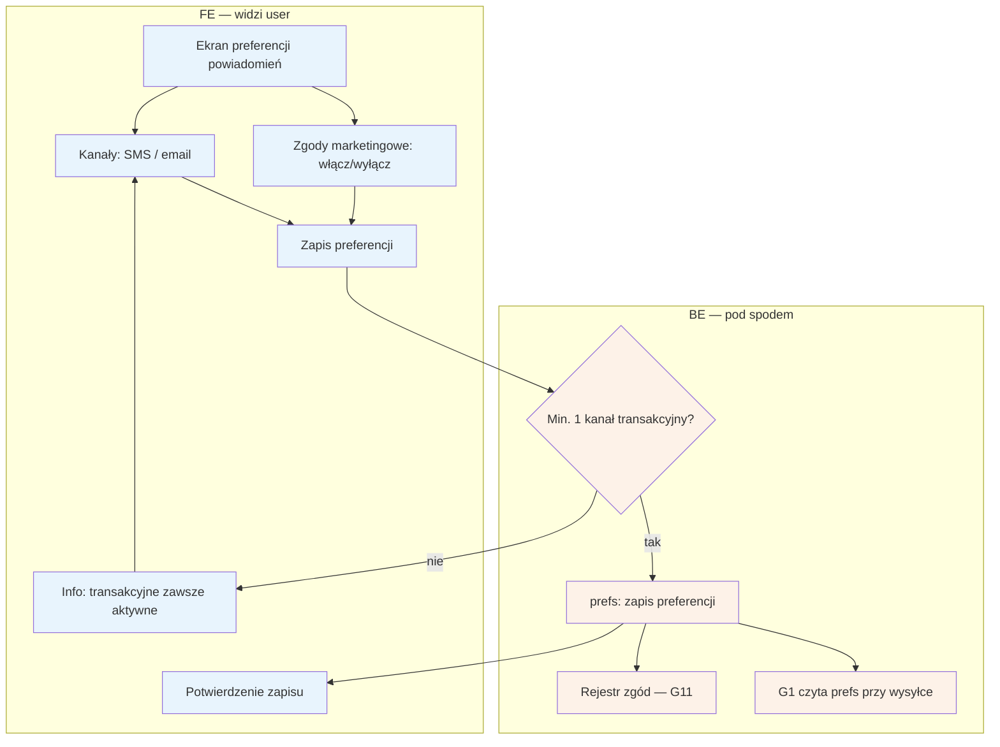

# B10 — Preferencje powiadomień

## Notatki
- P1; pacjent zarządza kanałami (SMS/email) i zgodami marketingowymi; opt-out z G1 dotyczy marketingu.
- Założenie minimalne: powiadomień transakcyjnych (potwierdzenia, przypomnienia T−24 h, tokeny samoobsługi) nie można wyłączyć całkowicie — wymagany min. 1 aktywny kanał; mapa nie rozstrzyga.
- Zmiana zgód marketingowych zapisywana w rejestrze zgód (G11) — spójnie z B9 (tam pełne zarządzanie zgodami RODO, tu podzbiór marketingowy).
- Granularność per typ powiadomienia (przypomnienia vs opinie vs waitlista) — mapa nie definiuje; założenie: tylko kanały + marketing.
- Powiązania: G1, G2, G11, B9.
