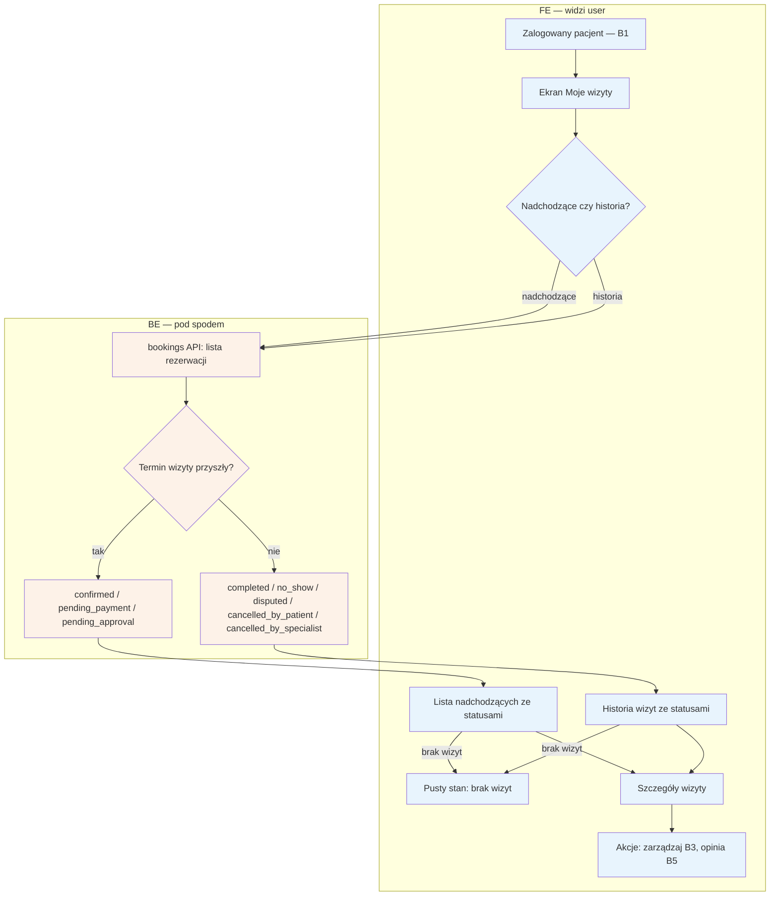

# B2 — Moje wizyty

## Notatki
- Statusy wyłącznie kanoniczne z CORE-STANY; stany przejściowe draft/locked nie są pokazywane pacjentowi (założenie minimalne — mapa nie rozstrzyga).
- Nadchodzące: confirmed, pending_payment, pending_approval; historia: completed, no_show, disputed, cancelled_by_patient, cancelled_by_specialist.
- Akcje przy wizycie: zarządzanie (zmiana/odwołanie) prowadzi do B3; z historii wystawienie opinii tylko przez token wizyty (B5) — z poziomu konta jako skrót do tego samego formularza (założenie).
- Pusty stan: mapa go nie wymienia dla B2 (wymienia dla A3) — przyjęty jako minimalny standard listy.
- Powiązania: B1, B3, B5, B4 (wpisy waitlisty — otwarte, czy widoczne w Moich wizytach).

## Co opisuje ten diagram
Diagram opisuje ekran "Moje wizyty" zalogowanego pacjenta. System pobiera listę rezerwacji i dzieli je na nadchodzące oraz historię, pokazując przy każdej wizycie jej status. Flow zaczyna się po zalogowaniu, a kończy przejściem do szczegółów wizyty i dostępnych akcji: zarządzania wizytą (zmiana/odwołanie) lub wystawienia opinii. Uczestniczą pacjent i system.

## Powiązane diagramy
| ID | Diagram | Jak się łączy |
|---|---|---|
| B1 | [b1-logowanie.md](b1-logowanie.md) | wejście — ekran dostępny po zalogowaniu |
| B3 | [b3-odwolanie-tokenem.md](b3-odwolanie-tokenem.md) | akcja "zarządzaj" przy wizycie prowadzi do zmiany/odwołania |
| B5 | [b5-wystawienie-opinii.md](b5-wystawienie-opinii.md) | skrót z historii wizyt do formularza opinii |
| B4 | [b4-waitlista.md](b4-waitlista.md) | otwarta kwestia, czy wpisy waitlisty są tu widoczne |
| CORE-STANY | [00-stany-rezerwacji.md](../00-core/00-stany-rezerwacji.md) | statusy na listach = kanoniczne stany rezerwacji |
| A3 | [a3-lista-wynikow.md](../a-pacjent-public/a3-lista-wynikow.md) | wzorzec pustego stanu przyjęty z listy wyników |

## Słownik
| Pojęcie | Wyjaśnienie |
|---|---|
| Status kanoniczny | Jedna z ustalonych dla całego systemu nazw stanu rezerwacji, używana wszędzie tak samo. |
| confirmed | Wizyta potwierdzona — termin jest umówiony i aktualny. |
| pending_payment | Rezerwacja czeka na opłacenie przez pacjenta. |
| pending_approval | Rezerwacja czeka na akceptację przez specjalistę. |
| no_show | Pacjent nie stawił się na wizycie. |
| disputed | Wizyta jest przedmiotem sporu (pacjent zakwestionował oznaczenie no-show). |
| Pusty stan | Ekran pokazywany, gdy lista nie ma żadnych pozycji (brak wizyt). |
