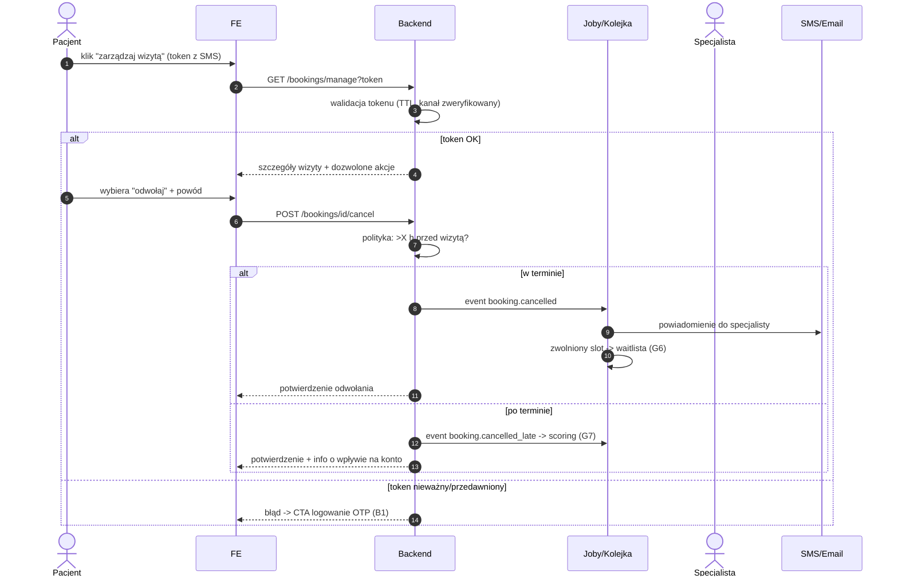

# B3 — Zmiana/odwołanie wizyty tokenem (bez logowania)

## Notatki
- Token: single-use? TTL? → otwarta decyzja z mapy (S1)
- Kanał niezweryfikowany = brak samoobsługi tym kanałem (arch. v2, F3)
- Powiązania: B4 (waitlista), G6, G7, #6 polityka odwołań

## Co opisuje ten diagram
Diagram pokazuje samoobsługową zmianę lub odwołanie wizyty bez logowania: pacjent klika link z tokenem otrzymany SMS-em. System sprawdza ważność tokenu i moment odwołania — odwołanie w terminie zwalnia slot (termin trafia do waitlisty) i powiadamia specjalistę, a odwołanie po terminie dodatkowo obciąża konto pacjenta w scoringu. Jeśli token jest nieważny, pacjent zostaje skierowany do logowania kodem OTP.

## Powiązane diagramy
| ID | Diagram | Jak się łączy |
|---|---|---|
| B1 | [b1-logowanie.md](b1-logowanie.md) | fallback: nieważny token kieruje do logowania OTP |
| B4 | [b4-waitlista.md](b4-waitlista.md) | zwolniony slot uruchamia powiadomienia waitlisty |
| G6 | [g6-waitlist-engine.md](../g-silniki/g6-waitlist-engine.md) | silnik przejmuje zwolniony slot po odwołaniu |
| G7 | [g7-scoring-engine.md](../g-silniki/g7-scoring-engine.md) | event booking.cancelled_late zasila scoring pacjenta |

## Słownik
| Pojęcie | Wyjaśnienie |
|---|---|
| Token samoobsługi | Unikalny link z SMS-a, który pozwala zarządzać konkretną wizytą bez logowania. |
| TTL | Czas ważności tokenu — po jego upływie link przestaje działać. |
| Single-use | Jednorazowość — token po użyciu (lub decyzji) nie nadaje się do ponownego użycia; tu kwestia otwarta. |
| Kanał zweryfikowany | Potwierdzony numer telefonu lub email; tylko takim kanałem można korzystać z samoobsługi. |
| Polityka odwołań | Reguła "do ilu godzin przed wizytą" można odwołać bez konsekwencji. |
| OTP | Jednorazowy kod SMS służący do zalogowania, gdy token nie działa. |
| Waitlista | Lista pacjentów czekających na zwolniony termin u specjalisty. |
| Scoring | Wewnętrzna ocena wiarygodności pacjenta, na którą wpływają m.in. późne odwołania. |
| Event | Komunikat wysyłany wewnątrz systemu (np. "rezerwacja odwołana"), który uruchamia dalsze automatyczne kroki. |
