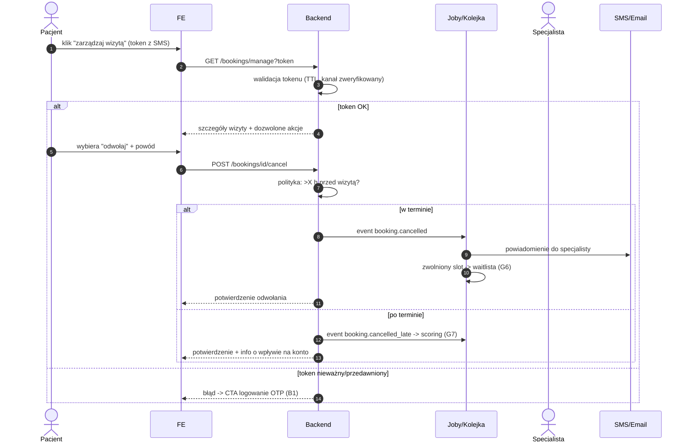

# B3 — Zmiana/odwołanie wizyty tokenem (bez logowania)

## Notatki
- Token: single-use? TTL? → otwarta decyzja z mapy (S1)
- Kanał niezweryfikowany = brak samoobsługi tym kanałem (arch. v2, F3)
- Powiązania: B4 (waitlista), G6, G7, #6 polityka odwołań
