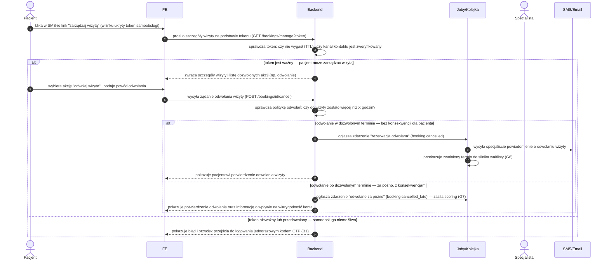

# B3 — Zmiana/odwołanie wizyty tokenem (bez logowania)

## Notatki
- Token: single-use? TTL? → otwarta decyzja z mapy (S1)
- Kanał niezweryfikowany = brak samoobsługi tym kanałem (arch. v2, F3)
- Powiązania: B4 (waitlista), G6, G7, #6 polityka odwołań

## Co opisuje ten diagram
Diagram pokazuje samoobsługową zmianę lub odwołanie wizyty bez logowania: pacjent klika link z tokenem otrzymany SMS-em. System sprawdza ważność tokenu i moment odwołania — odwołanie w terminie zwalnia slot (termin trafia do waitlisty) i powiadamia specjalistę, a odwołanie po terminie dodatkowo obciąża konto pacjenta w scoringu. Jeśli token jest nieważny, pacjent zostaje skierowany do logowania kodem OTP.

## Aktorzy w tym flow

| Rola | Kto to jest | Co robi w tym flow |
|---|---|---|
| **Pacjent** | użytkownik strony; u logopedów zwykle rodzic, który zarezerwował wizytę dla dziecka | klika link "zarządzaj wizytą" z SMS-a, wybiera odwołanie wizyty i podaje powód |
| **FE** | interfejs w przeglądarce — to, co pacjent widzi na ekranie | pokazuje szczegóły wizyty, dozwolone akcje, potwierdzenia oraz komunikaty o błędnym tokenie |
| **System/Backend** | serwerowa część platformy, działająca "pod spodem" | sprawdza ważność tokenu, pilnuje polityki odwołań, ogłasza zdarzenia o odwołaniu |
| **Joby/Kolejka** | automatyczne zadania systemu wykonywane w tle, bez udziału człowieka | zleca powiadomienie specjalisty i przekazuje zwolniony termin do silnika waitlisty (G6) |
| **Specjalista** | logopeda/lekarz — usługodawca, u którego była umówiona wizyta | dostaje powiadomienie o odwołaniu wizyty (sam niczego tu nie klika) |
| **SMS/Email** | bramka powiadomień — usługa wysyłająca SMS-y i e-maile | dostarcza specjaliście powiadomienie o odwołanej wizycie |

## Objaśnienie kroków

| Blok/Krok | Co to znaczy w praktyce | Kto tu działa |
|---|---|---|
| Kroki 1–2 | Pacjent dostał wcześniej SMS z linkiem "zarządzaj wizytą". W linku ukryty jest **token samoobsługi** — unikalny klucz przypisany do konkretnej wizyty, dzięki któremu można nią zarządzać bez logowania. Kliknięcie otwiera stronę, a przeglądarka prosi backend o szczegóły wizyty powiązanej z tokenem. | Pacjent, FE |
| Krok 3 | Backend sprawdza token: czy nie minął jego czas ważności (**TTL** — po upływie tego czasu link przestaje działać) oraz czy numer telefonu / e-mail, na który wysłano link, został wcześniej potwierdzony (**kanał zweryfikowany**). To zabezpieczenie przed użyciem cudzego albo starego linku. Czy token jest też **single-use** (jednorazowy — po użyciu przestaje działać) to kwestia otwarta z mapy. | System/Backend |
| Kroki 4–5 | Token prawidłowy: pacjent widzi szczegóły swojej wizyty oraz listę tego, co wolno mu zrobić (np. odwołać). Wybiera "odwołaj wizytę" i wpisuje powód. | System/Backend, FE, Pacjent |
| Kroki 6–7 | Przeglądarka przekazuje żądanie odwołania do backendu. Backend sprawdza **politykę odwołań**: czy do wizyty zostało jeszcze więcej niż ustalone X godzin. Od tego zależy, czy odwołanie liczy się jako "w terminie" (bez konsekwencji), czy "za późno". | FE, System/Backend |
| Kroki 8–11 | **Odwołanie w terminie — bez konsekwencji.** System ogłasza zdarzenie `booking.cancelled`, kolejka wysyła specjaliście powiadomienie, a zwolniony termin trafia do silnika waitlisty (G6), który zaproponuje go osobom oczekującym. Pacjent widzi potwierdzenie odwołania. | System/Backend, Joby/Kolejka, SMS/Email |
| Kroki 12–13 | **Odwołanie po terminie — za późno.** System ogłasza zdarzenie `booking.cancelled_late`, które obniża scoring pacjenta (G7) — czyli jego wewnętrzną ocenę wiarygodności. Pacjent dostaje potwierdzenie odwołania wraz z uczciwą informacją, że późne odwołanie wpływa na jego konto (przy kolejnej rezerwacji może być wymagana przedpłata lub zgoda specjalisty). | System/Backend, Joby/Kolejka |
| Krok 14 | **Token nieważny** (wygasł, został już użyty lub kanał kontaktu nie jest zweryfikowany): pacjent widzi komunikat błędu i przycisk przejścia do logowania jednorazowym kodem **OTP** (B1) — po zalogowaniu może zarządzać wizytą z poziomu konta. | System/Backend, FE |

## Powiązane diagramy
| ID | Diagram | Jak się łączy |
|---|---|---|
| B1 | [b1-logowanie.md](b1-logowanie.md) | fallback: nieważny token kieruje do logowania OTP |
| B4 | [b4-waitlista.md](b4-waitlista.md) | zwolniony slot uruchamia powiadomienia waitlisty |
| G6 | [g6-waitlist-engine.md](../g-silniki/g6-waitlist-engine.md) | silnik przejmuje zwolniony slot po odwołaniu |
| G7 | [g7-scoring-engine.md](../g-silniki/g7-scoring-engine.md) | event booking.cancelled_late zasila scoring pacjenta |

## Słownik
| Pojęcie | Wyjaśnienie |
|---|---|
| Token samoobsługi | Unikalny link z SMS-a, który pozwala zarządzać konkretną wizytą bez logowania. |
| TTL | Czas ważności tokenu — po jego upływie link przestaje działać. |
| Single-use | Jednorazowość — token po użyciu (lub decyzji) nie nadaje się do ponownego użycia; tu kwestia otwarta. |
| Kanał zweryfikowany | Potwierdzony numer telefonu lub email; tylko takim kanałem można korzystać z samoobsługi. |
| Polityka odwołań | Reguła "do ilu godzin przed wizytą" można odwołać bez konsekwencji. |
| OTP | Jednorazowy kod SMS służący do zalogowania, gdy token nie działa. |
| Waitlista | Lista pacjentów czekających na zwolniony termin u specjalisty. |
| Scoring | Wewnętrzna ocena wiarygodności pacjenta, na którą wpływają m.in. późne odwołania. |
| Event | Komunikat wysyłany wewnątrz systemu (np. "rezerwacja odwołana"), który uruchamia dalsze automatyczne kroki. |
| booking.cancelled / booking.cancelled_late | Systemowe nazwy zdarzeń: "rezerwacja odwołana w terminie" / "odwołana za późno" — druga z nich zasila scoring pacjenta. |
| Slot (termin) | Konkretny termin wizyty w kalendarzu specjalisty; po odwołaniu wraca do sprzedaży lub trafia na waitlistę. |
| GET / POST | Techniczne typy żądań przeglądarki do backendu: GET pobiera dane (np. szczegóły wizyty), POST wykonuje akcję (np. odwołanie). |
| Silnik waitlisty (G6) | Automat, który po zwolnieniu terminu proponuje go kolejno osobom z listy oczekujących. |
