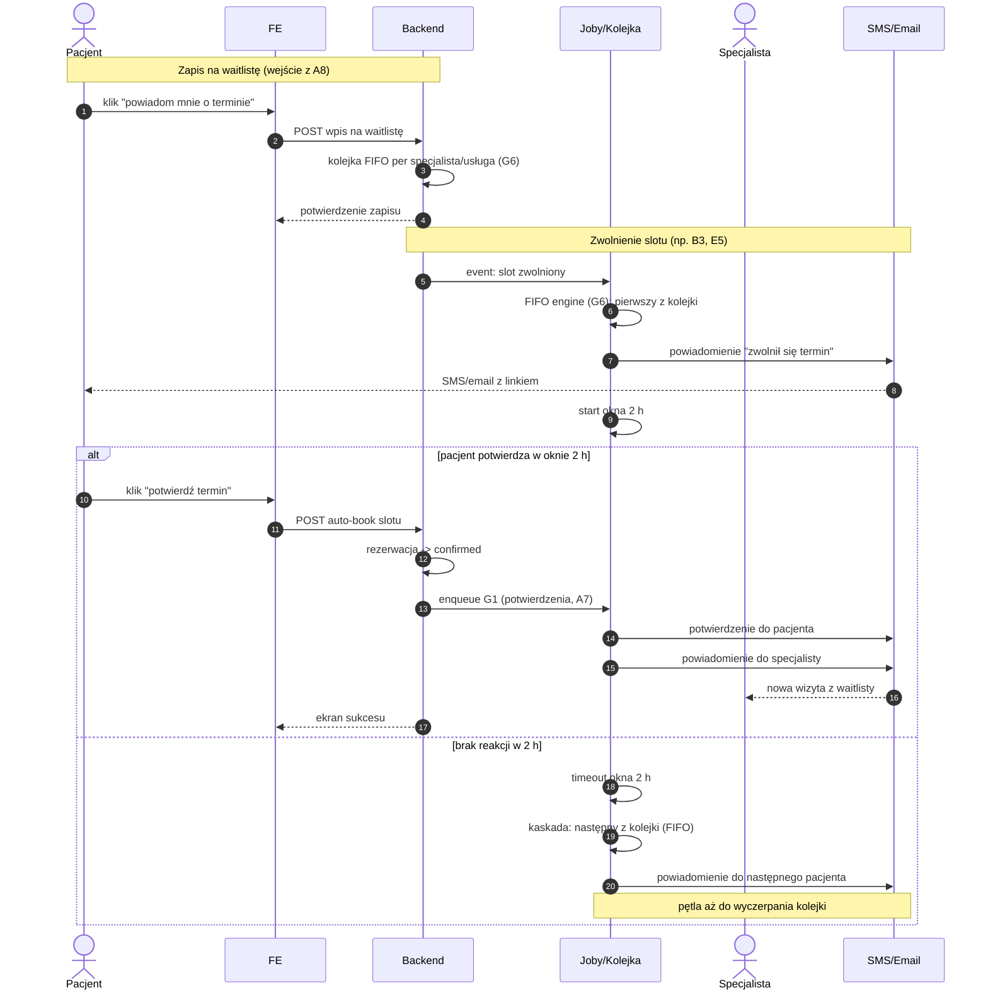

# B4 — Waitlista

## Notatki
- "Okno 2 h potwierdź/auto-book" zinterpretowane: pacjent ma 2 h na potwierdzenie, potwierdzenie tworzy rezerwację automatycznie (bez pełnego checkoutu A5) — mapa nie rozstrzyga, założenie minimalne.
- Auto-book → od razu confirmed (stany kanoniczne CORE-STANY); pominięcie płatności i scoring gate przy auto-booku to otwarta kwestia (⚠️ Flaga 2 pośrednio: co z wariantem przedpłaty przy slocie z waitlisty).
- Kolejka wyczerpana bez potwierdzenia → slot wraca do publicznej dostępności (A3/A4) — założenie minimalne.
- Rezygnacja pacjenta z wpisu ("nie chcę już terminu") nieopisana w mapie — założenie: natychmiastowa kaskada do następnego.
- Zapis na waitlistę: wejście z A8 ("powiadom mnie, gdy zwolni się termin"); zwolnienie slotu: B3 (odwołanie pacjenta), E5/E6 (odwołanie specjalisty).
- Powiązania: G6 (FIFO engine), A8, B3, E5, G1, A7, ścieżka e2e "Pacjent zmienia termin".

## Co opisuje ten diagram
Diagram opisuje działanie waitlisty, czyli listy oczekujących na termin. Pacjent, dla którego zabrakło wolnych slotów, zapisuje się na powiadomienie; gdy jakiś termin się zwolni (np. ktoś odwoła wizytę), system powiadamia pierwszą osobę z kolejki i daje jej 2 godziny na potwierdzenie. Potwierdzenie od razu tworzy rezerwację i powiadamia specjalistę o nowej wizycie; brak reakcji przekazuje termin kolejnej osobie z listy.

## Powiązane diagramy
| ID | Diagram | Jak się łączy |
|---|---|---|
| G6 | [g6-waitlist-engine.md](../g-silniki/g6-waitlist-engine.md) | silnik FIFO obsługujący kolejkę i okno 2 h |
| A8 | [a8-brak-slotow.md](../a-pacjent-public/a8-brak-slotow.md) | wejście: zapis na waitlistę przy braku terminów |
| B3 | [b3-odwolanie-tokenem.md](b3-odwolanie-tokenem.md) | odwołanie pacjenta zwalnia slot dla waitlisty |
| E5 | [e5-odwolanie-pojedyncze.md](../e-panel/e5-odwolanie-pojedyncze.md) | odwołanie przez specjalistę też zwalnia slot |
| E6 | [e6-tryb-urlop.md](../e-panel/e6-tryb-urlop.md) | zbiorcze odwołania (urlop) jako źródło zwolnionych slotów |
| G1 | [00-katalog-eventow.md](../00-core/00-katalog-eventow.md) | notification engine wysyła potwierdzenia po auto-booku |
| A7 | [a7-potwierdzenie.md](../a-pacjent-public/a7-potwierdzenie.md) | potwierdzenia rezerwacji po auto-booku jak po checkoucie |
| A5 | [a5-checkout.md](../a-pacjent-public/a5-checkout.md) | auto-book pomija pełny checkout (założenie) |
| A3 | [a3-lista-wynikow.md](../a-pacjent-public/a3-lista-wynikow.md) | po wyczerpaniu kolejki slot wraca do publicznej dostępności |
| A4 | [a4-profil-specjalisty.md](../a-pacjent-public/a4-profil-specjalisty.md) | zwolniony slot znów widoczny na profilu specjalisty |
| CORE-STANY | [00-stany-rezerwacji.md](../00-core/00-stany-rezerwacji.md) | auto-book prowadzi wprost do stanu confirmed |
| E2E-2 | [e2e-2-zmiana-terminu.md](../e2e/e2e-2-zmiana-terminu.md) | waitlista jest ogniwem ścieżki "Pacjent zmienia termin" |

## Słownik
| Pojęcie | Wyjaśnienie |
|---|---|
| Waitlista | Lista pacjentów czekających na zwolnienie się terminu u danego specjalisty. |
| FIFO | Kolejność "kto pierwszy się zapisał, ten pierwszy dostaje propozycję" (first in, first out). |
| Slot | Pojedynczy wolny termin wizyty w grafiku specjalisty. |
| Okno 2 h | Czas, jaki powiadomiony pacjent ma na potwierdzenie zwolnionego terminu. |
| Auto-book | Automatyczne utworzenie rezerwacji po kliknięciu "potwierdź termin", bez przechodzenia pełnego checkoutu. |
| Kaskada | Przekazywanie propozycji terminu kolejnym osobom z kolejki, aż ktoś potwierdzi lub lista się wyczerpie. |
| Timeout | Upłynięcie czasu na reakcję — po 2 h bez potwierdzenia propozycja przepada. |
| Event | Wewnętrzny komunikat systemu (np. "slot zwolniony"), który uruchamia automatyczne kroki. |
| confirmed | Stan rezerwacji "potwierdzona" — wizyta umówiona. |
