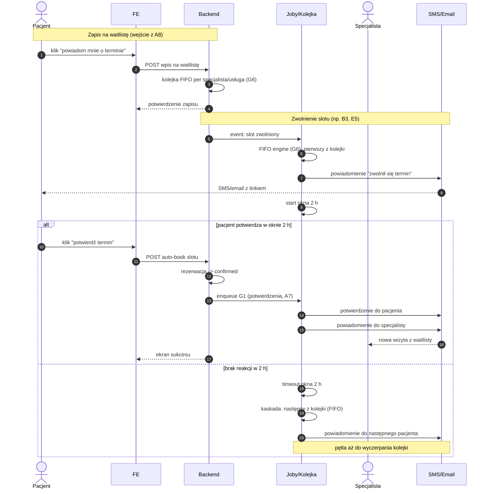

# B4 — Waitlista

## Notatki
- "Okno 2 h potwierdź/auto-book" zinterpretowane: pacjent ma 2 h na potwierdzenie, potwierdzenie tworzy rezerwację automatycznie (bez pełnego checkoutu A5) — mapa nie rozstrzyga, założenie minimalne.
- Auto-book → od razu confirmed (stany kanoniczne CORE-STANY); pominięcie płatności i scoring gate przy auto-booku to otwarta kwestia (⚠️ Flaga 2 pośrednio: co z wariantem przedpłaty przy slocie z waitlisty).
- Kolejka wyczerpana bez potwierdzenia → slot wraca do publicznej dostępności (A3/A4) — założenie minimalne.
- Rezygnacja pacjenta z wpisu ("nie chcę już terminu") nieopisana w mapie — założenie: natychmiastowa kaskada do następnego.
- Zapis na waitlistę: wejście z A8 ("powiadom mnie, gdy zwolni się termin"); zwolnienie slotu: B3 (odwołanie pacjenta), E5/E6 (odwołanie specjalisty).
- Powiązania: G6 (FIFO engine), A8, B3, E5, G1, A7, ścieżka e2e "Pacjent zmienia termin".
