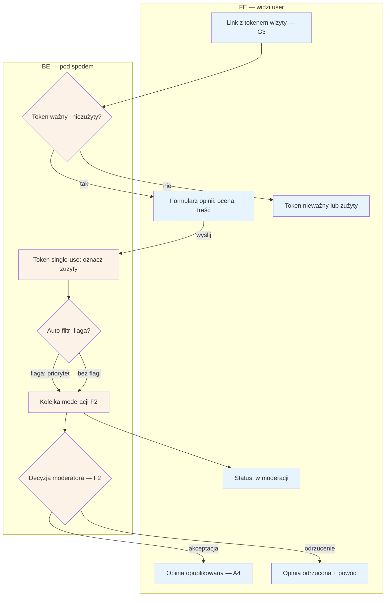

# B5 — Wystawienie opinii

## Notatki
- Formularz dostępny wyłącznie z tokenu wizyty; token wysyłany przez G3 (review ask T+2 h po approvalu wizyty w E8 lub auto-approvalu G4).
- Token single-use: zużywany przy wysłaniu opinii; ponowne wejście = komunikat "token zużyty".
- Auto-filtr: mapa nie definiuje reguł — założenie minimalne: wulgaryzmy / dane osobowe / dane zdrowotne → flaga z priorytetem. Do F2 trafia całość (auto-flagi + reszta), zgodnie z wierszem F2.
- Status moderacji widoczny dla pacjenta po wysłaniu (i w B2 przy wizycie — założenie); po decyzji: publikacja na profilu (A4, badge wiarygodności) lub odrzucenie z powodem.
- Wizyty dopisane ręcznie przez specjalistę (E4): prawo do opinii nierozstrzygnięte — ⚠️ Flaga 4.
- Powiązania: G3, G4, E8, F2, A4, B2, pipeline opinii (#1).

## Co opisuje ten diagram
Diagram pokazuje, jak pacjent wystawia opinię po odbytej wizycie. Wejście możliwe jest wyłącznie przez jednorazowy link z tokenem, wysyłany automatycznie ok. 2 godziny po zatwierdzeniu wizyty. Wysłana opinia przechodzi automatyczny filtr i trafia do kolejki moderacji, gdzie admin ją akceptuje (publikacja na profilu specjalisty) albo odrzuca z podaniem powodu — pacjent widzi status na każdym etapie.

## Powiązane diagramy
| ID | Diagram | Jak się łączy |
|---|---|---|
| G3 | [00-katalog-eventow.md](../00-core/00-katalog-eventow.md) | review ask T+2 h wysyła link z tokenem opinii |
| G4 | [g4-auto-approval.md](../g-silniki/g4-auto-approval.md) | auto-approval wizyty także uruchamia prośbę o opinię |
| E8 | [e8-approval-opinie.md](../e-panel/e8-approval-opinie.md) | approval wizyty przez specjalistę poprzedza wysyłkę tokenu |
| F2 | [f2-moderacja-opinii.md](../f-backoffice/f2-moderacja-opinii.md) | każda opinia trafia do kolejki moderacji admina |
| A4 | [a4-profil-specjalisty.md](../a-pacjent-public/a4-profil-specjalisty.md) | zaakceptowana opinia publikowana na profilu |
| B2 | [b2-moje-wizyty.md](b2-moje-wizyty.md) | status moderacji widoczny przy wizycie w koncie (założenie) |
| E4 | [e4-rezerwacje.md](../e-panel/e4-rezerwacje.md) | wizyty dopisane ręcznie — otwarte prawo do opinii (Flaga 4) |

## Słownik
| Pojęcie | Wyjaśnienie |
|---|---|
| Token wizyty | Unikalny link powiązany z konkretną wizytą, dający jednorazowy dostęp do formularza opinii. |
| Single-use | Jednorazowość tokenu — po wysłaniu opinii link przestaje działać. |
| Review ask | Automatyczna prośba o opinię wysyłana ok. 2 h po zatwierdzeniu wizyty. |
| Auto-approval | Automatyczne zatwierdzenie wizyty przez system po 48 h, gdy specjalista sam tego nie zrobi. |
| Auto-filtr | Automatyczne sprawdzenie treści opinii (np. wulgaryzmy, dane osobowe) przed moderacją. |
| Moderacja | Ręczna weryfikacja opinii przez admina przed publikacją. |
| Flaga | Oznaczenie opinii jako podejrzanej, nadające jej priorytet w kolejce moderacji. |
| Badge wiarygodności | Oznaczenie przy opinii na profilu potwierdzające, że pochodzi z odbytej wizyty. |
