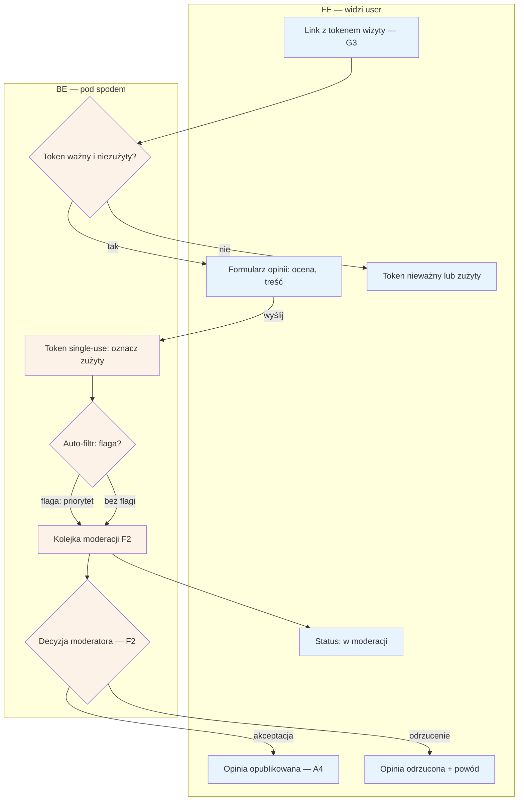

# B5 — Wystawienie opinii

## Notatki
- Formularz dostępny wyłącznie z tokenu wizyty; token wysyłany przez G3 (review ask T+2 h po approvalu wizyty w E8 lub auto-approvalu G4).
- Token single-use: zużywany przy wysłaniu opinii; ponowne wejście = komunikat "token zużyty".
- Auto-filtr: mapa nie definiuje reguł — założenie minimalne: wulgaryzmy / dane osobowe / dane zdrowotne → flaga z priorytetem. Do F2 trafia całość (auto-flagi + reszta), zgodnie z wierszem F2.
- Status moderacji widoczny dla pacjenta po wysłaniu (i w B2 przy wizycie — założenie); po decyzji: publikacja na profilu (A4, badge wiarygodności) lub odrzucenie z powodem.
- Wizyty dopisane ręcznie przez specjalistę (E4): prawo do opinii nierozstrzygnięte — ⚠️ Flaga 4.
- Powiązania: G3, G4, E8, F2, A4, B2, pipeline opinii (#1).
