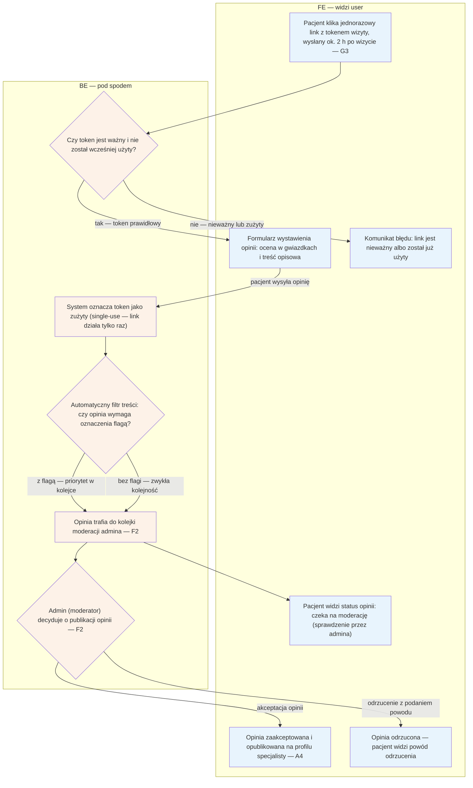

# B5 — Wystawienie opinii

## Notatki
- Formularz dostępny wyłącznie z tokenu wizyty; token wysyłany przez G3 (review ask T+2 h po approvalu wizyty w E8 lub auto-approvalu G4).
- Token single-use: zużywany przy wysłaniu opinii; ponowne wejście = komunikat "token zużyty".
- Auto-filtr: mapa nie definiuje reguł — założenie minimalne: wulgaryzmy / dane osobowe / dane zdrowotne → flaga z priorytetem. Do F2 trafia całość (auto-flagi + reszta), zgodnie z wierszem F2.
- Status moderacji widoczny dla pacjenta po wysłaniu (i w B2 przy wizycie — założenie); po decyzji: publikacja na profilu (A4, badge wiarygodności) lub odrzucenie z powodem.
- Wizyty dopisane ręcznie przez specjalistę (E4): prawo do opinii nierozstrzygnięte — ⚠️ Flaga 4.
- Powiązania: G3, G4, E8, F2, A4, B2, pipeline opinii (#1).

## Co opisuje ten diagram
Diagram pokazuje, jak pacjent wystawia opinię po odbytej wizycie. Wejście możliwe jest wyłącznie przez jednorazowy link z tokenem, wysyłany automatycznie ok. 2 godziny po zatwierdzeniu wizyty. Wysłana opinia przechodzi automatyczny filtr i trafia do kolejki moderacji, gdzie admin ją akceptuje (publikacja na profilu specjalisty) albo odrzuca z podaniem powodu — pacjent widzi status na każdym etapie.

## Aktorzy w tym flow

| Rola | Kto to jest | Co robi w tym flow |
|---|---|---|
| **Pacjent** | użytkownik strony; u logopedów zwykle rodzic, który był z dzieckiem na wizycie | klika jednorazowy link z e-maila/SMS-a, wypełnia i wysyła formularz opinii, śledzi status moderacji |
| **FE** | interfejs w przeglądarce — to, co pacjent widzi na ekranie | pokazuje formularz opinii, komunikat o nieważnym tokenie oraz status: w moderacji / opublikowana / odrzucona |
| **System/Backend** | serwerowa część platformy, działająca "pod spodem" | sprawdza ważność tokenu, oznacza go jako zużyty, przepuszcza opinię przez automatyczny filtr treści i wstawia ją do kolejki moderacji |
| **Admin** | operator platformy — back office; tutaj w roli moderatora | przegląda opinię w kolejce moderacji (F2) i decyduje: publikacja na profilu albo odrzucenie z podaniem powodu |

## Objaśnienie bloków

| Blok/Krok | Co to znaczy w praktyce | Kto tu działa |
|---|---|---|
| Link z tokenem wizyty (LINK) | Ok. 2 godziny po zatwierdzeniu wizyty system automatycznie wysyła pacjentowi prośbę o opinię (G3) z jednorazowym linkiem. W linku ukryty jest **token wizyty** — unikalny klucz potwierdzający, że opinię wystawia osoba, która naprawdę była na tej wizycie. Nie trzeba się logować. | Pacjent, System/Backend |
| Czy token ważny i nieużyty? (TOKEN) | System sprawdza dwie rzeczy: czy link nie stracił ważności (**TTL** — czas życia linku) i czy nie został już wcześniej wykorzystany (**single-use** — jednorazowość). Dzięki temu jedna wizyta = maksymalnie jedna opinia. | System/Backend |
| Formularz opinii (FORM) | Pacjent widzi prosty formularz: ocena (np. gwiazdki) i pole na treść opisową. | Pacjent, FE |
| Komunikat błędu (BLAD) | Gdy link wygasł albo opinia została już wysłana z tego linku, pacjent widzi wyjaśnienie zamiast formularza — nic więcej nie może zrobić tym linkiem. | FE |
| Oznaczenie tokenu jako zużytego (ZUZYCIE) | W chwili wysłania opinii system "kasuje" token: od tego momentu link przestaje działać. To ochrona przed wysłaniem wielu opinii z jednej wizyty. | System/Backend |
| Automatyczny filtr treści (FILTR) | Program automatycznie skanuje treść opinii pod kątem problemów (założenie: wulgaryzmy, dane osobowe, dane zdrowotne). Podejrzana opinia dostaje **flagę** — oznaczenie "sprawdź w pierwszej kolejności". Każda opinia — z flagą czy bez — i tak idzie do moderacji; flaga zmienia tylko priorytet. | System/Backend |
| Kolejka moderacji (KOLEJKA) | Poczekalnia opinii czekających na ręczne sprawdzenie przez admina (F2). **Moderacja** oznacza, że żadna opinia nie pojawia się publicznie bez akceptacji człowieka. | System/Backend, Admin |
| Status: w moderacji (STATUS) | W czasie oczekiwania na decyzję pacjent widzi, że jego opinia "czeka na sprawdzenie" — wie, że dotarła i nie zginęła. | Pacjent, FE |
| Decyzja moderatora (DECYZJA) | Admin czyta opinię i podejmuje decyzję: zaakceptować (publikacja) albo odrzucić (z podaniem powodu). | Admin |
| Opinia opublikowana (OPUBLIKOWANA) | Zaakceptowana opinia pojawia się publicznie na profilu specjalisty (A4) z oznaczeniem wiarygodności — czytelnicy wiedzą, że pochodzi z odbytej wizyty. | FE, System/Backend |
| Opinia odrzucona (ODRZUCONA) | Odrzucona opinia nie jest publikowana; pacjent widzi powód odrzucenia (np. naruszenie zasad). | Pacjent, FE |

## Powiązane diagramy
| ID | Diagram | Jak się łączy |
|---|---|---|
| G3 | [00-katalog-eventow.md](../00-core/00-katalog-eventow.md) | review ask T+2 h wysyła link z tokenem opinii |
| G4 | [g4-auto-approval.md](../g-silniki/g4-auto-approval.md) | auto-approval wizyty także uruchamia prośbę o opinię |
| E8 | [e8-approval-opinie.md](../e-panel/e8-approval-opinie.md) | approval wizyty przez specjalistę poprzedza wysyłkę tokenu |
| F2 | [f2-moderacja-opinii.md](../f-backoffice/f2-moderacja-opinii.md) | każda opinia trafia do kolejki moderacji admina |
| A4 | [a4-profil-specjalisty.md](../a-pacjent-public/a4-profil-specjalisty.md) | zaakceptowana opinia publikowana na profilu |
| B2 | [b2-moje-wizyty.md](b2-moje-wizyty.md) | status moderacji widoczny przy wizycie w koncie (założenie) |
| E4 | [e4-rezerwacje.md](../e-panel/e4-rezerwacje.md) | wizyty dopisane ręcznie — otwarte prawo do opinii (Flaga 4) |

## Słownik
| Pojęcie | Wyjaśnienie |
|---|---|
| Token wizyty | Unikalny link powiązany z konkretną wizytą, dający jednorazowy dostęp do formularza opinii. |
| Single-use | Jednorazowość tokenu — po wysłaniu opinii link przestaje działać. |
| Review ask | Automatyczna prośba o opinię wysyłana ok. 2 h po zatwierdzeniu wizyty. |
| Auto-approval | Automatyczne zatwierdzenie wizyty przez system po 48 h, gdy specjalista sam tego nie zrobi. |
| Auto-filtr | Automatyczne sprawdzenie treści opinii (np. wulgaryzmy, dane osobowe) przed moderacją. |
| Moderacja | Ręczna weryfikacja opinii przez admina przed publikacją. |
| Flaga | Oznaczenie opinii jako podejrzanej, nadające jej priorytet w kolejce moderacji. |
| Badge wiarygodności | Oznaczenie przy opinii na profilu potwierdzające, że pochodzi z odbytej wizyty. |
| TTL | Czas ważności tokenu — po jego upływie link do formularza opinii przestaje działać. |
| Kolejka moderacji | Lista opinii czekających na ręczne sprawdzenie przez admina; opinie z flagą mają w niej priorytet. |
| FE / BE | Podział diagramu: FE (górna część) to ekrany, które widzi pacjent; BE (dolna) to działania systemu "pod spodem". |
| Token samoobsługi | Ogólna nazwa mechanizmu jednorazowych linków z kluczem dostępu — token wizyty jest jego odmianą użytą w tym flow. |
