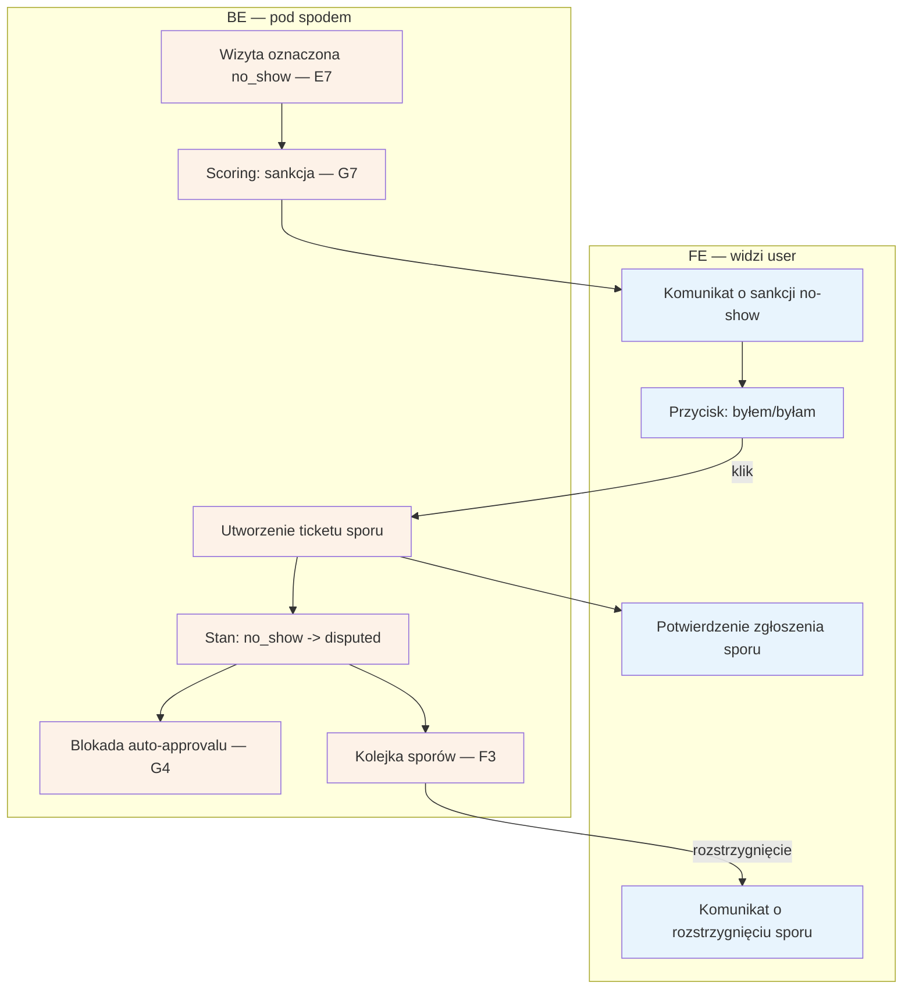

# B6 — Spór no-show

## Notatki
- Trigger: specjalista oznacza "nie stawił się" (E7) → event visit.no_show → G7 (sankcje progresywne); komunikat o sankcji do pacjenta zawiera przycisk "byłem/byłam".
- Kanał komunikatu (SMS/email/konto) — mapa nie rozstrzyga; założenie minimalne: przez G1 + widoczny w B2.
- Klik przycisku tworzy ticket sporu trafiający do kolejki F3 (rozstrzygnięcie poza zakresem B6).
- Stan rezerwacji: no_show -> disputed (kanoniczne, CORE-STANY); stan po rozstrzygnięciu sporu (powrót do completed? utrzymanie no_show?) — mapa nie definiuje, otwarta kwestia.
- Otwarty spór blokuje auto-approval T+48 h (⚠️ Flaga 3, G4) — inaczej system potwierdziłby wizytę, która się nie odbyła.
- Powiązania: E7, G7, F3, G4, G1, B2, ścieżka e2e "No-show + sankcja + spór".

## Co opisuje ten diagram
Diagram opisuje spór pacjenta z oznaczeniem "nie stawił się". Gdy specjalista oznaczy wizytę jako no-show, system nalicza pacjentowi sankcję i wysyła komunikat z przyciskiem "byłem/byłam". Kliknięcie tworzy zgłoszenie sporu: wizyta przechodzi w stan "disputed", automatyczne zatwierdzenie wizyty zostaje zablokowane, a sprawa trafia do kolejki adminów. Flow kończy się komunikatem o rozstrzygnięciu — samo rozstrzyganie odbywa się już w Back Office.

## Powiązane diagramy
| ID | Diagram | Jak się łączy |
|---|---|---|
| E7 | [e7-no-show.md](../e-panel/e7-no-show.md) | trigger: specjalista oznacza wizytę jako no_show |
| G7 | [g7-scoring-engine.md](../g-silniki/g7-scoring-engine.md) | event visit.no_show nalicza sankcję w scoringu |
| F3 | [f3-spory.md](../f-backoffice/f3-spory.md) | ticket sporu trafia do kolejki i rozstrzygnięcia admina |
| G4 | [g4-auto-approval.md](../g-silniki/g4-auto-approval.md) | otwarty spór blokuje auto-approval T+48 h |
| G1 | [00-katalog-eventow.md](../00-core/00-katalog-eventow.md) | notification engine dostarcza komunikat o sankcji |
| B2 | [b2-moje-wizyty.md](b2-moje-wizyty.md) | komunikat i status sporu widoczne też w koncie pacjenta |
| CORE-STANY | [00-stany-rezerwacji.md](../00-core/00-stany-rezerwacji.md) | przejście no_show → disputed to stany kanoniczne |
| E2E-4 | [e2e-4-no-show-sankcja-spor.md](../e2e/e2e-4-no-show-sankcja-spor.md) | pełna ścieżka e2e no-show, sankcji i sporu |

## Słownik
| Pojęcie | Wyjaśnienie |
|---|---|
| No-show | Sytuacja, gdy pacjent nie stawił się na umówionej wizycie. |
| Sankcja | Konsekwencja dla pacjenta za no-show (np. gorsze warunki kolejnych rezerwacji), naliczana automatycznie. |
| Scoring | Wewnętrzna ocena wiarygodności pacjenta, którą obniżają no-show i późne odwołania. |
| Sankcje progresywne | Kary rosnące przy kolejnych przewinieniach — im więcej no-show, tym dotkliwsza konsekwencja. |
| Spór | Zakwestionowanie przez pacjenta oznaczenia "nie stawił się" przyciskiem "byłem/byłam". |
| Ticket sporu | Zgłoszenie sprawy do rozpatrzenia przez admina w kolejce sporów. |
| disputed | Stan rezerwacji "sporna" — do czasu rozstrzygnięcia przez admina. |
| Auto-approval | Automatyczne zatwierdzenie wizyty po 48 h; przy otwartym sporze celowo wstrzymywane. |
| Event | Wewnętrzny komunikat systemu (np. visit.no_show), który uruchamia automatyczne kroki. |
