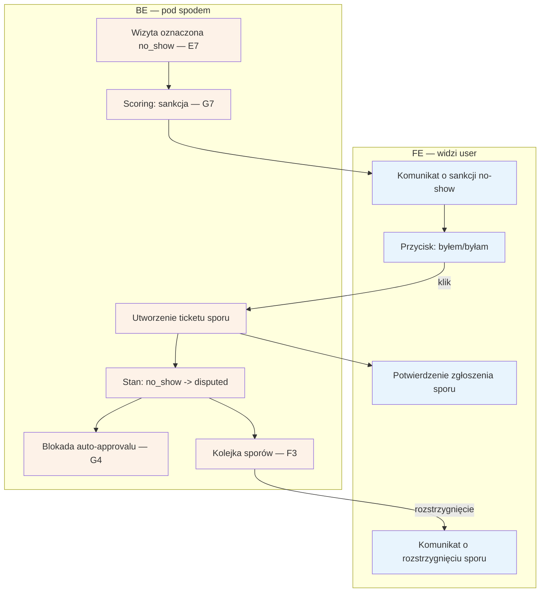

# B6 — Spór no-show

## Notatki
- Trigger: specjalista oznacza "nie stawił się" (E7) → event visit.no_show → G7 (sankcje progresywne); komunikat o sankcji do pacjenta zawiera przycisk "byłem/byłam".
- Kanał komunikatu (SMS/email/konto) — mapa nie rozstrzyga; założenie minimalne: przez G1 + widoczny w B2.
- Klik przycisku tworzy ticket sporu trafiający do kolejki F3 (rozstrzygnięcie poza zakresem B6).
- Stan rezerwacji: no_show -> disputed (kanoniczne, CORE-STANY); stan po rozstrzygnięciu sporu (powrót do completed? utrzymanie no_show?) — mapa nie definiuje, otwarta kwestia.
- Otwarty spór blokuje auto-approval T+48 h (⚠️ Flaga 3, G4) — inaczej system potwierdziłby wizytę, która się nie odbyła.
- Powiązania: E7, G7, F3, G4, G1, B2, ścieżka e2e "No-show + sankcja + spór".
