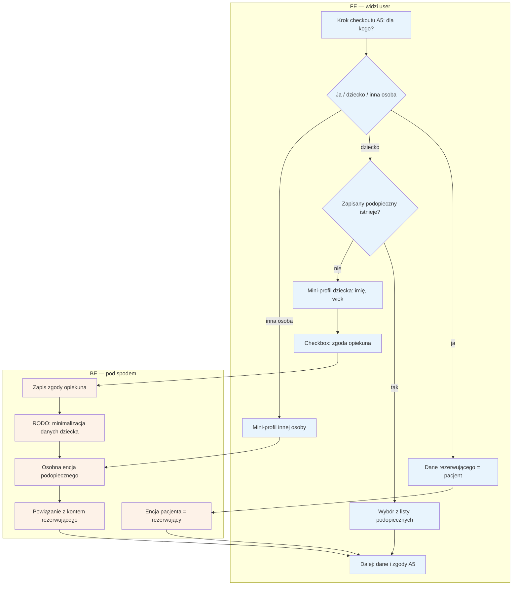

# B7 — Pacjent ≠ rezerwujący (podopieczny)

## Notatki
- ⚠️ Flaga 1: abstrakcja "podopieczny" (booker ≠ patient) od razu w core — fork weterynaryjny dostaje encję zwierzęcia tym samym mechanizmem, zero forka logiki.
- U logopedów przypadek domyślny: rezerwuje rodzic, pacjentem jest dziecko.
- Zakres pól mini-profilu — mapa nie definiuje; założenie minimalne: imię + wiek/rok urodzenia (minimalizacja danych, RODO dane dziecka).
- Zapisany podopieczny wielokrotnego użytku przy kolejnych rezerwacjach (S1: "zapis do przyszłych rezerwacji").
- "Inna osoba" (dorosła): podstawa przetwarzania danych osoby trzeciej / forma zgody — mapa nie rozstrzyga (zgoda opiekuna dotyczy dziecka), otwarta kwestia.
- Osobna encja pacjenta powiązana z kontem rezerwującego; tworzona w checkoucie razem z lekkim kontem (A5).
- Powiązania: A5 ([[a5-checkout]]), B8 (ankieta o dziecku), B9 (RODO self-service), CORE-STANY.

## Co opisuje ten diagram
Diagram pokazuje krok rezerwacji "dla kogo jest wizyta". Osoba rezerwująca może umówić wizytę dla siebie, dla dziecka lub dla innej osoby — u logopedów najczęściej rezerwuje rodzic, a pacjentem jest dziecko. Dla dziecka tworzony jest mini-profil (imię, wiek) z zaznaczeniem zgody opiekuna; system zapisuje podopiecznego jako osobny wpis powiązany z kontem rezerwującego, gotowy do użycia przy kolejnych rezerwacjach. Flow uruchamia się w trakcie checkoutu i kończy przejściem do danych i zgód.

## Powiązane diagramy
| ID | Diagram | Jak się łączy |
|---|---|---|
| A5 | [a5-checkout.md](../a-pacjent-public/a5-checkout.md) | ten flow jest krokiem checkoutu "dla kogo?" |
| B8 | [b8-formularz-przedwizytowy.md](b8-formularz-przedwizytowy.md) | ankieta przedwizytowa dotyczy danych podopiecznego |
| B9 | [b9-rodo-self-service.md](b9-rodo-self-service.md) | usunięcie konta obejmuje też encje podopiecznych |
| CORE-STANY | [00-stany-rezerwacji.md](../00-core/00-stany-rezerwacji.md) | rezerwacja dla podopiecznego przechodzi te same stany |

## Słownik
| Pojęcie | Wyjaśnienie |
|---|---|
| Podopieczny | Osoba, dla której umawiana jest wizyta, ale która sama nie rezerwuje (np. dziecko). |
| Rezerwujący (booker) | Osoba, która dokonuje rezerwacji i ma konto — niekoniecznie ta sama, która przyjdzie na wizytę. |
| Encja | Osobny wpis w bazie danych — podopieczny nie jest "dopiskiem" do konta, tylko własnym rekordem. |
| Mini-profil | Minimalny zestaw danych podopiecznego: imię i wiek/rok urodzenia. |
| Zgoda opiekuna | Potwierdzenie (checkbox), że dane dziecka podaje jego opiekun prawny. |
| Minimalizacja danych | Zasada RODO: zbieramy tylko te dane, które są naprawdę potrzebne. |
| RODO | Przepisy o ochronie danych osobowych, szczególnie restrykcyjne wobec danych dzieci. |
| Fork wertykalny | Kopia platformy dla innej branży (np. weterynarii) — ta sama mechanika podopiecznego obsłuży wtedy zwierzę. |
| Lekkie konto | Konto pacjenta tworzone automatycznie przy pierwszej rezerwacji, bez klasycznej rejestracji. |
