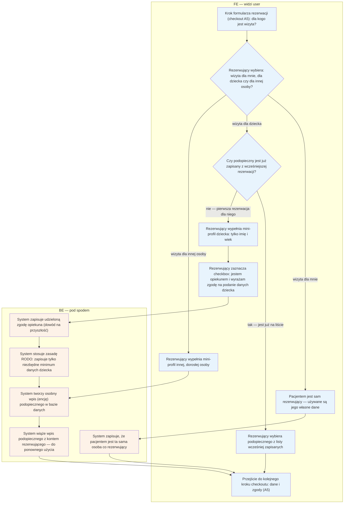

# B7 — Pacjent ≠ rezerwujący (podopieczny)

## Notatki
- ⚠️ Flaga 1: abstrakcja "podopieczny" (booker ≠ patient) od razu w core — fork weterynaryjny dostaje encję zwierzęcia tym samym mechanizmem, zero forka logiki.
- U logopedów przypadek domyślny: rezerwuje rodzic, pacjentem jest dziecko.
- Zakres pól mini-profilu — mapa nie definiuje; założenie minimalne: imię + wiek/rok urodzenia (minimalizacja danych, RODO dane dziecka).
- Zapisany podopieczny wielokrotnego użytku przy kolejnych rezerwacjach (S1: "zapis do przyszłych rezerwacji").
- "Inna osoba" (dorosła): podstawa przetwarzania danych osoby trzeciej / forma zgody — mapa nie rozstrzyga (zgoda opiekuna dotyczy dziecka), otwarta kwestia.
- Osobna encja pacjenta powiązana z kontem rezerwującego; tworzona w checkoucie razem z lekkim kontem (A5).
- Powiązania: A5 ([[a5-checkout]]), B8 (ankieta o dziecku), B9 (RODO self-service), CORE-STANY.

## Co opisuje ten diagram
Diagram pokazuje krok rezerwacji "dla kogo jest wizyta". Osoba rezerwująca może umówić wizytę dla siebie, dla dziecka lub dla innej osoby — u logopedów najczęściej rezerwuje rodzic, a pacjentem jest dziecko. Dla dziecka tworzony jest mini-profil (imię, wiek) z zaznaczeniem zgody opiekuna; system zapisuje podopiecznego jako osobny wpis powiązany z kontem rezerwującego, gotowy do użycia przy kolejnych rezerwacjach. Flow uruchamia się w trakcie checkoutu i kończy przejściem do danych i zgód.

## Aktorzy w tym flow

| Rola | Kto to jest | Co robi w tym flow |
|---|---|---|
| **Pacjent (rezerwujący)** | użytkownik strony; u logopedów zwykle rodzic rezerwujący wizytę dla dziecka — pacjentem właściwym jest wtedy podopieczny | wybiera, dla kogo jest wizyta; wypełnia mini-profil dziecka lub innej osoby; zaznacza zgodę opiekuna |
| **FE** | interfejs w przeglądarce — to, co rezerwujący widzi na ekranie | pokazuje krok "dla kogo jest wizyta?", listę zapisanych podopiecznych, formularz mini-profilu i checkbox zgody |
| **System/Backend** | serwerowa część platformy, działająca "pod spodem" | zapisuje zgodę opiekuna, pilnuje minimalizacji danych (RODO), tworzy encję podopiecznego i wiąże ją z kontem rezerwującego |

## Objaśnienie bloków

| Blok/Krok | Co to znaczy w praktyce | Kto tu działa |
|---|---|---|
| Krok checkoutu: dla kogo jest wizyta? (KROK) | W trakcie rezerwacji (checkout A5) pojawia się pytanie, kto faktycznie przyjdzie na wizytę. To ważne, bo osoba rezerwująca (z kontem) i pacjent to często dwie różne osoby — u logopedów standardem jest rodzic umawiający dziecko. | Pacjent (rezerwujący), FE |
| Wybór: ja / dziecko / inna osoba (WYBOR) | Rezerwujący wskazuje jedną z trzech możliwości. Od tego wyboru zależy dalsza ścieżka formularza. | Pacjent (rezerwujący) |
| Pacjentem jest rezerwujący (JA) | Najprostszy przypadek: wizyta dla samego siebie — system użyje danych już podanych w rezerwacji, nic więcej nie trzeba wypełniać. | Pacjent (rezerwujący), FE |
| Zapis: pacjent = rezerwujący (ENCJAJA) | System odnotowuje w bazie, że pacjentem na tej wizycie jest ta sama osoba, która rezerwuje. | System/Backend |
| Czy podopieczny już zapisany? (ZAPISANI) | Jeśli rodzic rezerwował już wcześniej dla tego dziecka, jego dane są zapisane na koncie — nie trzeba wpisywać ich od nowa. | System/Backend, FE |
| Wybór z listy podopiecznych (WYBORZAP) | Rodzic klika zapisanego wcześniej podopiecznego z listy i od razu przechodzi dalej. | Pacjent (rezerwujący), FE |
| Mini-profil dziecka (MINIPROFIL) | Przy pierwszej rezerwacji dla dziecka rodzic podaje **tylko imię i wiek** (lub rok urodzenia). Celowo tak mało — to zasada minimalizacji danych z RODO, szczególnie ważna przy danych dzieci. | Pacjent (rezerwujący), FE |
| Checkbox zgody opiekuna (ZGODA) | Rodzic zaznacza pole potwierdzające, że jest opiekunem prawnym dziecka i **zgadza się na przetwarzanie jego danych** (tzw. zgoda opiekuna). Bez tego dane dziecka nie mogą być zapisane. | Pacjent (rezerwujący), FE |
| Zapis zgody opiekuna (ZGODAZAPIS) | System trwale zapisuje fakt udzielenia zgody (kto, kiedy, na co) — to dowód wymagany przepisami na wypadek kontroli lub pytań. | System/Backend |
| RODO: minimalizacja danych (RODO) | System pilnuje, żeby o dziecku zapisać wyłącznie niezbędne minimum — żadnych nadmiarowych informacji. | System/Backend |
| Osobna encja podopiecznego (ENCJAP) | Podopieczny dostaje **własny wpis w bazie danych (encję)** — nie jest "dopiskiem" do konta rodzica, tylko odrębnym rekordem pacjenta. Dzięki temu jedno konto może mieć wielu podopiecznych, a każdy swoją historię wizyt. | System/Backend |
| Mini-profil innej osoby (INNA) | Wariant dla dorosłej osoby trzeciej (np. rezerwacja dla rodzica-seniora): też powstaje mini-profil i osobna encja. Podstawa prawna przetwarzania danych osoby trzeciej to kwestia otwarta (patrz Notatki). | Pacjent (rezerwujący), FE |
| Powiązanie z kontem (LINKKONTO) | System łączy nowo utworzoną encję podopiecznego z kontem rezerwującego — przy następnej rezerwacji podopieczny będzie już na liście do wyboru. | System/Backend |
| Dalej: dane i zgody (DALEJ) | Krok "dla kogo" jest zakończony — formularz rezerwacji przechodzi do kolejnego etapu checkoutu (dane kontaktowe i zgody, A5). | FE |

## Powiązane diagramy
| ID | Diagram | Jak się łączy |
|---|---|---|
| A5 | [a5-checkout.md](../a-pacjent-public/a5-checkout.md) | ten flow jest krokiem checkoutu "dla kogo?" |
| B8 | [b8-formularz-przedwizytowy.md](b8-formularz-przedwizytowy.md) | ankieta przedwizytowa dotyczy danych podopiecznego |
| B9 | [b9-rodo-self-service.md](b9-rodo-self-service.md) | usunięcie konta obejmuje też encje podopiecznych |
| CORE-STANY | [00-stany-rezerwacji.md](../00-core/00-stany-rezerwacji.md) | rezerwacja dla podopiecznego przechodzi te same stany |

## Słownik
| Pojęcie | Wyjaśnienie |
|---|---|
| Podopieczny | Osoba, dla której umawiana jest wizyta, ale która sama nie rezerwuje (np. dziecko). |
| Rezerwujący (booker) | Osoba, która dokonuje rezerwacji i ma konto — niekoniecznie ta sama, która przyjdzie na wizytę. |
| Encja | Osobny wpis w bazie danych — podopieczny nie jest "dopiskiem" do konta, tylko własnym rekordem. |
| Mini-profil | Minimalny zestaw danych podopiecznego: imię i wiek/rok urodzenia. |
| Zgoda opiekuna | Potwierdzenie (checkbox), że dane dziecka podaje jego opiekun prawny. |
| Minimalizacja danych | Zasada RODO: zbieramy tylko te dane, które są naprawdę potrzebne. |
| RODO | Przepisy o ochronie danych osobowych, szczególnie restrykcyjne wobec danych dzieci. |
| Fork wertykalny | Kopia platformy dla innej branży (np. weterynarii) — ta sama mechanika podopiecznego obsłuży wtedy zwierzę. |
| Lekkie konto | Konto pacjenta tworzone automatycznie przy pierwszej rezerwacji, bez klasycznej rejestracji. |
| Checkout | Wieloetapowy formularz rezerwacji wizyty — od kliknięcia terminu do potwierdzenia (opisany w A5); ten flow jest jednym z jego kroków. |
| Checkbox | Pole do zaznaczenia w formularzu ("ptaszek") — tutaj służy do potwierdzenia zgody opiekuna. |
| Encja podopiecznego | Własny wpis podopiecznego w bazie danych, powiązany z kontem rezerwującego i wielokrotnego użytku przy kolejnych rezerwacjach. |
| FE / BE | Podział diagramu: FE (górna część) to ekrany, które widzi rezerwujący; BE (dolna) to działania systemu "pod spodem". |
