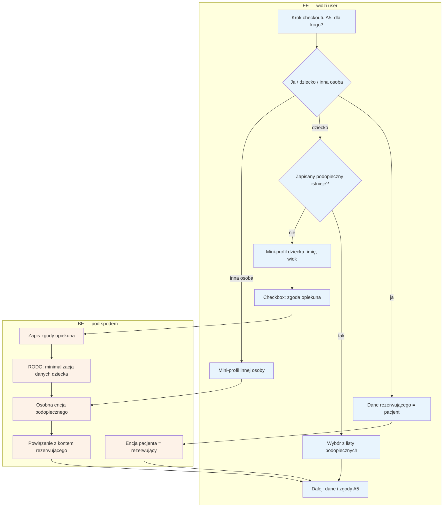

# B7 — Pacjent ≠ rezerwujący (podopieczny)

## Notatki
- ⚠️ Flaga 1: abstrakcja "podopieczny" (booker ≠ patient) od razu w core — fork weterynaryjny dostaje encję zwierzęcia tym samym mechanizmem, zero forka logiki.
- U logopedów przypadek domyślny: rezerwuje rodzic, pacjentem jest dziecko.
- Zakres pól mini-profilu — mapa nie definiuje; założenie minimalne: imię + wiek/rok urodzenia (minimalizacja danych, RODO dane dziecka).
- Zapisany podopieczny wielokrotnego użytku przy kolejnych rezerwacjach (S1: "zapis do przyszłych rezerwacji").
- "Inna osoba" (dorosła): podstawa przetwarzania danych osoby trzeciej / forma zgody — mapa nie rozstrzyga (zgoda opiekuna dotyczy dziecka), otwarta kwestia.
- Osobna encja pacjenta powiązana z kontem rezerwującego; tworzona w checkoucie razem z lekkim kontem (A5).
- Powiązania: A5 ([[a5-checkout]]), B8 (ankieta o dziecku), B9 (RODO self-service), CORE-STANY.
