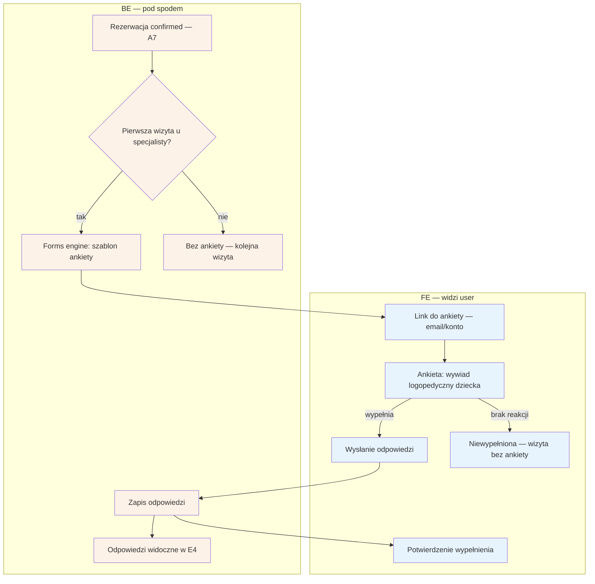

# B8 — Formularz przedwizytowy

## Notatki
- Priorytet P2 — po walidacji; ankieta wysyłana po potwierdzeniu rezerwacji (confirmed, A7), tylko przed 1. wizytą u danego specjalisty.
- Wywiad logopedyczny o dziecku → dane podopiecznego z B7; treść/pola ankiety definiuje forms engine (szablon per wertykal — założenie, mapa nie rozstrzyga).
- Kanał doręczenia linku — założenie minimalne: przez G1 (email) + dostępna z konta (B2).
- Brak wypełnienia nie blokuje wizyty (założenie minimalne); przypomnienia o ankiecie — mapa nie przewiduje.
- Odpowiedzi (dane zdrowotne dziecka!) widoczne dla specjalisty w E4 — dostęp powinien podlegać audytowi F10 (założenie, mapa nie łączy wprost).
- Powiązania: A7, B7, E4, G1, F10.
