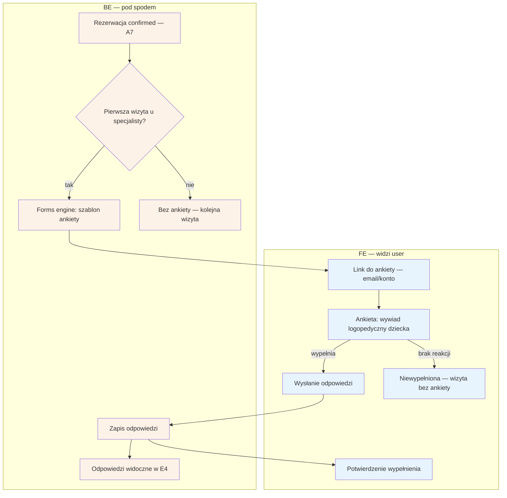

# B8 — Formularz przedwizytowy

## Notatki
- Priorytet P2 — po walidacji; ankieta wysyłana po potwierdzeniu rezerwacji (confirmed, A7), tylko przed 1. wizytą u danego specjalisty.
- Wywiad logopedyczny o dziecku → dane podopiecznego z B7; treść/pola ankiety definiuje forms engine (szablon per wertykal — założenie, mapa nie rozstrzyga).
- Kanał doręczenia linku — założenie minimalne: przez G1 (email) + dostępna z konta (B2).
- Brak wypełnienia nie blokuje wizyty (założenie minimalne); przypomnienia o ankiecie — mapa nie przewiduje.
- Odpowiedzi (dane zdrowotne dziecka!) widoczne dla specjalisty w E4 — dostęp powinien podlegać audytowi F10 (założenie, mapa nie łączy wprost).
- Powiązania: A7, B7, E4, G1, F10.

## Co opisuje ten diagram
Diagram opisuje ankietę przedwizytową — wywiad logopedyczny o dziecku. Po potwierdzeniu rezerwacji system sprawdza, czy to pierwsza wizyta u danego specjalisty; jeśli tak, wysyła pacjentowi (rodzicowi) link do ankiety. Wypełnione odpowiedzi zapisują się i są widoczne dla specjalisty w jego panelu przed wizytą. Brak wypełnienia nie blokuje wizyty — odbywa się ona wtedy bez ankiety.

## Powiązane diagramy
| ID | Diagram | Jak się łączy |
|---|---|---|
| A7 | [a7-potwierdzenie.md](../a-pacjent-public/a7-potwierdzenie.md) | trigger: ankieta wysyłana po potwierdzeniu rezerwacji |
| B7 | [b7-pacjent-podopieczny.md](b7-pacjent-podopieczny.md) | ankieta dotyczy danych podopiecznego (dziecka) |
| E4 | [e4-rezerwacje.md](../e-panel/e4-rezerwacje.md) | odpowiedzi widoczne dla specjalisty przy rezerwacji |
| G1 | [00-katalog-eventow.md](../00-core/00-katalog-eventow.md) | notification engine doręcza link do ankiety |
| F10 | [f10-audit-log.md](../f-backoffice/f10-audit-log.md) | dostęp do odpowiedzi (dane zdrowotne) powinien być audytowany |
| B2 | [b2-moje-wizyty.md](b2-moje-wizyty.md) | ankieta dostępna także z konta pacjenta |

## Słownik
| Pojęcie | Wyjaśnienie |
|---|---|
| Ankieta przedwizytowa | Formularz wypełniany przed pierwszą wizytą, żeby specjalista znał kontekst pacjenta. |
| Wywiad logopedyczny | Zestaw pytań o rozwój mowy i zdrowie dziecka, zbierany przed terapią. |
| Forms engine | Mechanizm systemu, który buduje ankietę z gotowego szablonu pytań. |
| Szablon per wertykal | Inny zestaw pytań dla każdej branży platformy (logopedzi, inne specjalizacje). |
| confirmed | Stan rezerwacji "potwierdzona" — dopiero wtedy wysyłana jest ankieta. |
| Dane zdrowotne | Szczególnie chronione prawem informacje o zdrowiu (tu: dziecka) — wymagają ostrożności i audytu. |
| Audit log | Rejestr, kto i kiedy miał dostęp do danych — ślad na potrzeby kontroli. |
