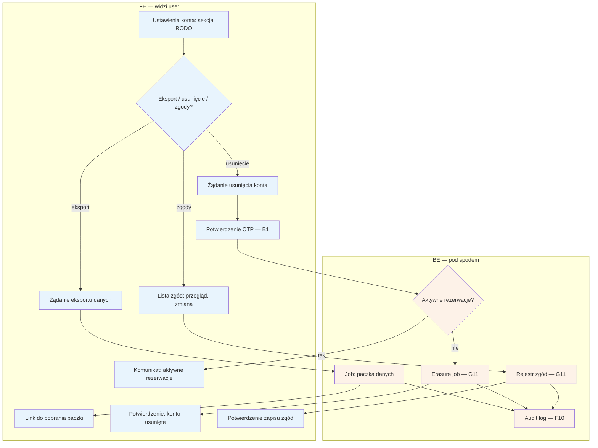

# B9 — RODO self-service

## Notatki
- P0 min.: trzy akcje samoobsługowe — eksport danych, usunięcie konta, zarządzanie zgodami; wszystkie operacje logowane w audit logu (F10).
- Re-auth OTP przed usunięciem konta — założenie minimalne (mapa nie rozstrzyga; operacja nieodwracalna, numer = tożsamość, B1).
- Usunięcie przy aktywnych (nadchodzących) rezerwacjach — założenie minimalne: odmowa/odroczenie do zakończenia wizyt; mapa nie rozstrzyga.
- Erasure job (G11): zakres usunięcia vs retencja wymagana prawem (rozliczenia, audit) — otwarta kwestia; usunięcie konta rezerwującego obejmuje też encje podopiecznych (B7) — założenie.
- Format i zakres paczki eksportu — mapa nie definiuje; założenie minimalne: dane konta + podopieczni + rezerwacje.
- Zarządzanie zgodami: zgody RODO z checkoutu (A5) + marketingowe (overlap z B10 — tam kanały i zgody marketingowe; tu pełny rejestr).
- Powiązania: G11, F10, F5 (obsługa wniosków RODO po stronie admina), B1, B7, B10.

## Co opisuje ten diagram
Diagram pokazuje samoobsługę RODO w ustawieniach konta pacjenta: trzy akcje — eksport danych, usunięcie konta i zarządzanie zgodami. Eksport uruchamia przygotowanie paczki danych do pobrania; usunięcie konta wymaga potwierdzenia kodem OTP i jest odmawiane, dopóki pacjent ma aktywne rezerwacje; zmiany zgód trafiają do rejestru. Wszystko wykonuje system automatycznie, a każda operacja zostaje zapisana w logu audytowym.

## Powiązane diagramy
| ID | Diagram | Jak się łączy |
|---|---|---|
| G11 | [00-katalog-eventow.md](../00-core/00-katalog-eventow.md) | joby RODO: erasure job i rejestr zgód |
| F10 | [f10-audit-log.md](../f-backoffice/f10-audit-log.md) | każda operacja RODO logowana w audit logu |
| F5 | [f5-uzytkownicy.md](../f-backoffice/f5-uzytkownicy.md) | admin obsługuje wnioski RODO poza samoobsługą |
| B1 | [b1-logowanie.md](b1-logowanie.md) | re-auth OTP przed usunięciem konta |
| B7 | [b7-pacjent-podopieczny.md](b7-pacjent-podopieczny.md) | usunięcie konta obejmuje też encje podopiecznych |
| B10 | [b10-preferencje-powiadomien.md](b10-preferencje-powiadomien.md) | zgody marketingowe to podzbiór rejestru zgód |
| A5 | [a5-checkout.md](../a-pacjent-public/a5-checkout.md) | zarządzane zgody pochodzą m.in. z checkoutu |

## Słownik
| Pojęcie | Wyjaśnienie |
|---|---|
| RODO | Przepisy o ochronie danych osobowych, dające m.in. prawo do kopii i usunięcia swoich danych. |
| Self-service | Samoobsługa — pacjent załatwia sprawy RODO sam z poziomu konta, bez pisania do obsługi. |
| Eksport danych | Wygenerowanie paczki ze wszystkimi danymi pacjenta (konto, podopieczni, rezerwacje) do pobrania. |
| Erasure job | Automatyczne zadanie systemu, które faktycznie usuwa dane po zatwierdzeniu żądania. |
| Rejestr zgód | Ewidencja wszystkich zgód pacjenta wraz z historią ich zmian. |
| Re-auth (OTP) | Ponowne potwierdzenie tożsamości kodem SMS przed nieodwracalną operacją. |
| Audit log | Rejestr operacji na danych — kto, co i kiedy zrobił, na potrzeby kontroli. |
| Retencja | Prawny obowiązek przechowywania części danych (np. rozliczeń) mimo żądania usunięcia. |
