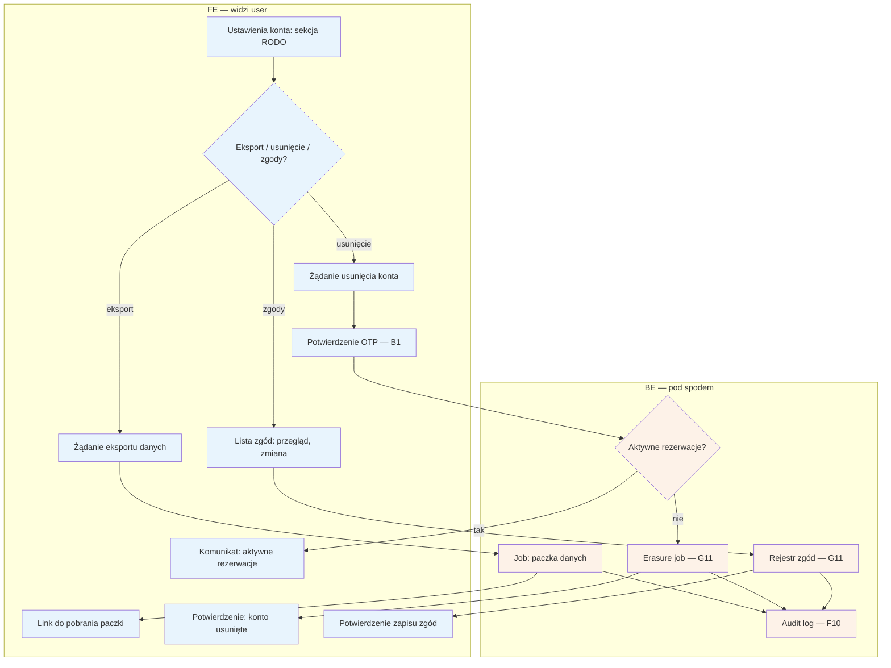

# B9 — RODO self-service

## Notatki
- P0 min.: trzy akcje samoobsługowe — eksport danych, usunięcie konta, zarządzanie zgodami; wszystkie operacje logowane w audit logu (F10).
- Re-auth OTP przed usunięciem konta — założenie minimalne (mapa nie rozstrzyga; operacja nieodwracalna, numer = tożsamość, B1).
- Usunięcie przy aktywnych (nadchodzących) rezerwacjach — założenie minimalne: odmowa/odroczenie do zakończenia wizyt; mapa nie rozstrzyga.
- Erasure job (G11): zakres usunięcia vs retencja wymagana prawem (rozliczenia, audit) — otwarta kwestia; usunięcie konta rezerwującego obejmuje też encje podopiecznych (B7) — założenie.
- Format i zakres paczki eksportu — mapa nie definiuje; założenie minimalne: dane konta + podopieczni + rezerwacje.
- Zarządzanie zgodami: zgody RODO z checkoutu (A5) + marketingowe (overlap z B10 — tam kanały i zgody marketingowe; tu pełny rejestr).
- Powiązania: G11, F10, F5 (obsługa wniosków RODO po stronie admina), B1, B7, B10.
