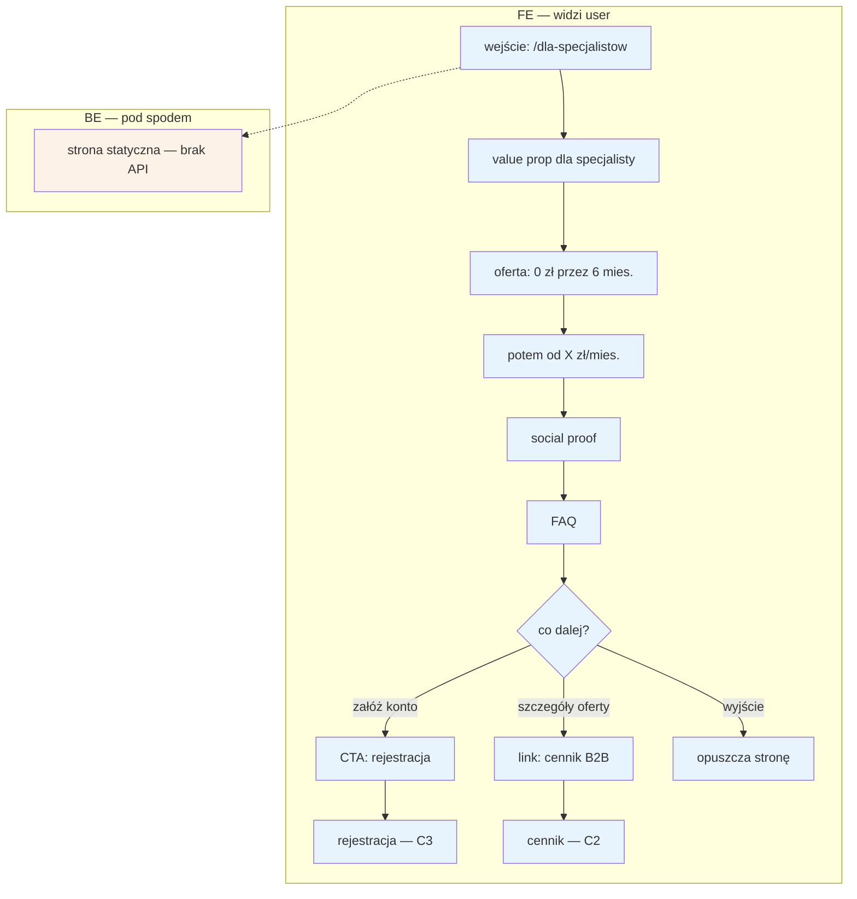

# C1 — Landing /dla-specjalistow

## Notatki
- Elementy FE wg mapy: value prop, oferta „0 zł przez 6 mies., potem od X zł/mies.", social proof, FAQ. Kolejność sekcji na stronie — założenie minimalne (mapa nie rozstrzyga układu).
- BE wg mapy: brak („—"). Subgraph BE zawiera jeden węzeł informacyjny „strona statyczna — brak API", żeby spełnić konwencję FE/BE z CLAUDE.md; hosting treści: P0 hardcode → P1 CMS (F7).
- CTA → [[c3-rejestracja]] wynika ze ścieżki E2E „Specjalista: od landing do 1. rezerwacji" (C1 → C3).
- Link do cennika → [[c2-cennik-b2b]] — założenie minimalne: landing linkuje do cennika B2B (spójna nawigacja B2B).
- Wartość „X zł/mies." nieustalona — model subskrypcji do rozstrzygnięcia w prompcie #2 (C2, E12, F6).
- Powiązania: C2, C3, F7; dalszy ciąg ścieżki: D1 → D2 → D3 → E2/E3.
